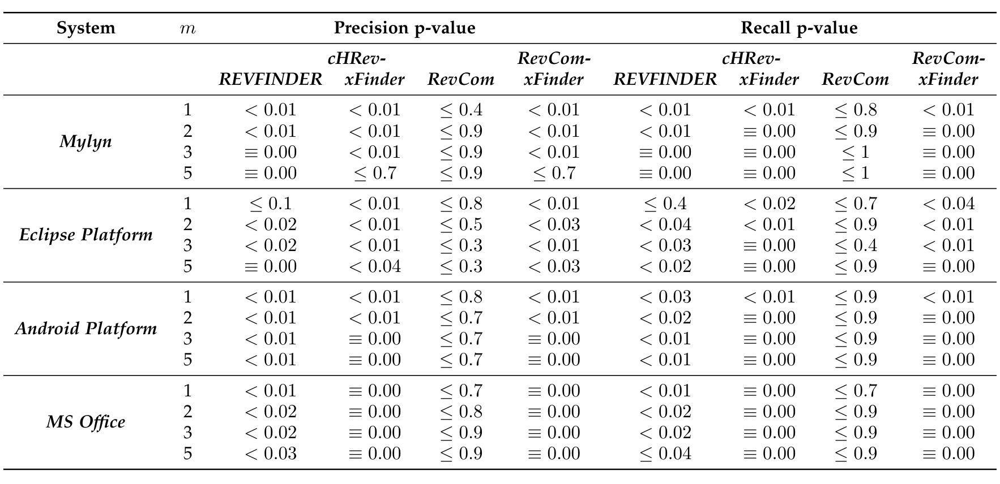
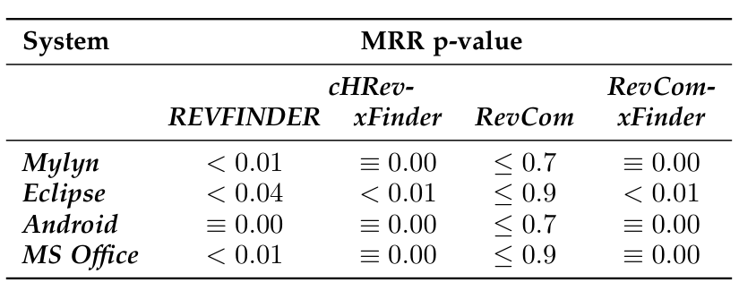

## TABLE 7
p-values from applying one way ANOVA on Precision@m and Recall@m values for each subject system.

## TABLE 8
p-values from applying one way ANOVA on MRR values for each subject system.

where precision was the lowest in both approaches. Nonetheless, cHRev is no worse than xFinder in this exceptional case. Therefore, we find support to reject Hypothesis H-2 in favor of cHRev. Note that the same cannot be said about the gains of REVFINDER over xFinder. REVFINDER did not register a single positive precision or recall gain over xFinder in Mylyn, which was the largest considered open source dataset.

In case of the comparison between cHRev and RevCom, a negative gain would indicate RevCom doing better than cHRev and a positive gain would indicate cHRev doing better than RevCom. Clearly, the gains (with the exception of Mylyn recall and F-score at m = 2) are positive. Contrary (and perhaps surprisingly) to many successful results from various combined approaches in other task studies, the combination of reviews and commits was not very effective. In fact, our results indicate that a combined approach could be detrimental (i.e., could lead to a drop in precision and recall). The statistical testing showed that the gains are not significant (p-values > 0.05). Nonetheless, the results show that the combined approach RevCom is no better than our approach cHRev. Therefore, we find support to accept Hypothesis H-3 in favor of cHRev.

Concerned with the potential drop in precision and recall, we continued our investigation of the research question RQ2. We did a similar analysis to compute the gains of RevCom over xFinder to ascertain that the combination would be more effective than xFinder. On a successful note, we found that all the gains are statistically significant (with the exception of Mylyn precision at m = 5). Therefore, RevCom outperforms xFinder. It is worth noting, however, that the gains of RevCom over xFinder could be lower than those of cHRev over xFinder. This behavior can be seen in the precision and recall results of Android Platform, Eclipse Platform, and MS Office. Our results suggest to exercise caution about treating the combination and review-based recommenders to be identical in performance. Overall, we find support to reject Hypothesis H-4.

> RQ2: cHRev performs much better than REVFINDER which is based on reviewers of files with similar names and paths and xFinder which relies on source code repository data, and cHRev is statistically equivalent to RevCom which requires both past reviews and commits.

### 4.7 Discussion
Here we discuss a few points that would help in our understanding of the rationale behind the improved performance with using reviews in cHRev. The reasons could be attributed to two-fold aspects.

First, unlike REVFINDER, cHRev includes the number of individual days that a reviewer provided feedback and also the time since the most recent review on each file. Both techniques use the number of past reviews on a changed file under current review to model expertise; however cHRev also uses the number of comments in each review, the number of days that a reviewer has made comments on a file under review (sometimes multiple workdays for one review) because prolonged examination of a source code file could indicate the increased level of expertise. Further, research has shown that expertise in an area of code dwindles with time [26] and thus we incorporate recency, the amount of time since the last review of a file by a potential reviewer, into our approach. Moreover, cHRev was able to recommend reviewers in an overwhelming majority of the cases at the file level.

Second, for all of the projects studied, we found many cases where reviewers provided quality feedback despite the fact that they had never made changes to the files or directories under review. We manually investigated reasons why these people might have the expertise to provide such feedback as reviewers.