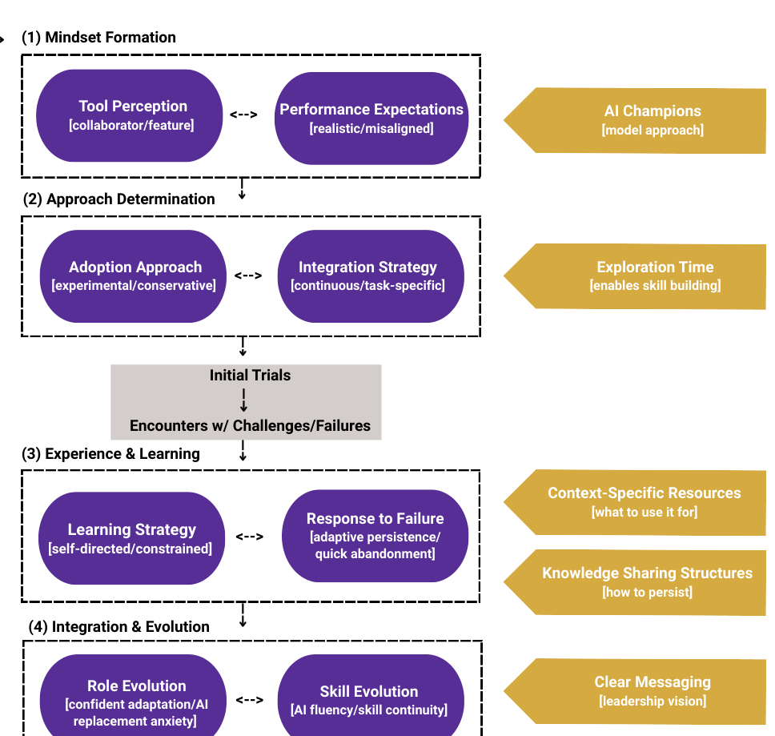

## “Maybe We Need Some More Examples:”
Individual and Team Drivers of Developer GenAI Tool Use

Courtney Miller,1 Rudrajit Choudhuri,2 Mara Ulloa,3 Sankeerti Haniyur,4 Robert DeLine,4 Margaret-Anne Storey,5  
Emerson Murphy-Hill,4 Christian Bird,4 Jenna L. Butler4  
1 Carnegie Mellon University, PA, USA. Email: courtneymiller@cmu.edu  
2 Oregon State University, OR, USA. Email: choudhru@oregonstate.edu  
3 Northwestern University, IL, USA. Email: mara.ulloa@u.northwestern.edu  
4 Microsoft, WA, USA. Email: sahaniyur, rdeline, emerson.rex, cbird, jennbu@microsoft.com  
5 University of Victoria, BC, Canada. Email: mstorey@uvic.ca

### Abstract

Despite the widespread availability of generative AI tools in software engineering, developer adoption remains uneven. This unevenness is problematic because it hampers productivity efforts, frustrates management’s expectations, and creates uncertainty around the future roles of developers. Through paired interviews with 54 developers across 27 teams – one frequent and one infrequent user per team – we demonstrate that differences in usage result primarily from how developers perceive the tool (as a collaborator vs. feature), their engagement approach (experimental vs. conservative), and how they respond when encountering challenges (with adaptive persistence vs. quick abandonment). Our findings imply that widespread organizational expectations for rapid productivity gains without sufficient investment in learning support creates a "Productivity Pressure Paradox," undermining the very productivity benefits that motivate adoption.

### 1 Introduction

The field of Artificial Intelligence (AI) has experienced several historic hype cycles where failed returns on investment led to AI Winters [42]. During the expert systems boom of the 1980s, global investments exceeded $2.5 billion [30, 68, 78], but when these systems failed to deliver the expected returns, funding was dramatically cut, precipitating the second AI Winter [78, 87]. Today, AI experts and some economists argue that the transformational promise of Generative AI (GenAI) will create significant lasting impact across industry sectors [19, 48]. GenAI’s ability to augment processes that were previously difficult to digitize has lead to widespread optimism and the rapid deployment of GenAI tooling by many organizations, often with minimal strategic planning and high expectations regarding productivity gains and subsequent cost savings [60, 63, 64, 88].

Like many others, the software engineering (SE) domain has been profoundly impacted by the introduction of GenAI tooling [22, 79, 83]. GenAI tools in SE show great potential, with some projections estimating productivity increases between 20% to 55% [19, 49, 73]. Yet despite these projections, studies report strikingly mixed outcomes in real-world usage [8, 40, 61]. While some developers achieve the promised productivity gains [82], others experience decreased efficiency when attempting to integrate these tools [13]. In the face of these challenges, a rapidly-evolving body of research focused on the adoption, usage, and integration of GenAI development tools has emerged in the past several years cataloging both enablers and barriers [5, 9, 54, 61]. Much of this work relies on individual-level models such as the Technology Acceptance Model

Figure 1: Conceptual theoretical framework. Purple ovals == individual factors, yellow arrows == external factors.

(TAM) [23] and Unified Theory of Acceptance and Use of Technology (UTAUT) [90]. While such lenses surface beliefs like perceived usefulness, they rarely hold constant the external realities — such as codebase complexity and management — that strongly shape tool adoption [13, 34, 57]. With the goal of understanding what differentiates developers who are frequent versus infrequent GenAI development tool users within the same team contexts, we begin by exploring the research question (RQ):

RQ1 What individual factors distinguish frequent and infrequent users of Generative AI development tools?

Early discussions revealed that team and organizational factors appeared to shape individual factors for some developers (cf. Figure 1), leading us to explore these emergent results with a second RQ:

RQ2 How do individuals report team and organizational factors influence their Generative AI development tool usage?

We utilize a paired interview design, conducting sequential semi-structured interviews with 54 developers representing 27 pairs from the same team matched on key factors—primary programming language, role, and seniority—but who exhibit contrasting