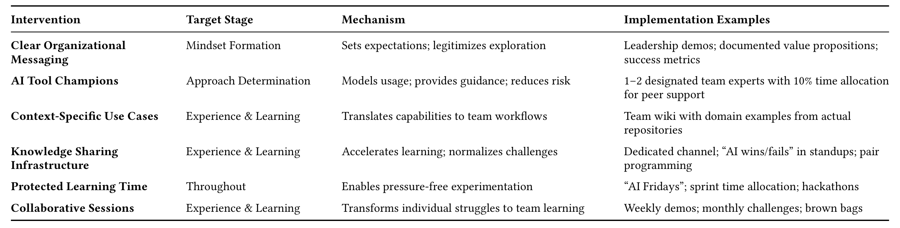

## Table 2: Evidence-Based Team Interventions for AI Tool Adoption

## Acknowledgments

Heartfelt gratitude is bestowed upon Chanel for braving a cross-country summer adventure in the name of continuing her ongoing work as a world-class canine researcher. Her brilliance, curiosity, and natural sense of wonder continue to propel the team toward progress. Meet Pudding, the canine researcher. He has had an ever-enthusiastic presence during this project and is super proud of the work. We thank the interview participants for generously sharing their expertise, perspective, and time with us; all insights in this work originated from them, and this work would not have been possible without them. Courtney Miller, Rudrajit Choudhuri, and Mara Ulloa performed this work during a summer internship at Microsoft. Margaret-Anne Storey contributed to this work while being a visiting researcher at Microsoft. Special thanks are given to Brian Houck, Ben Hanrahan, and Travis Lowdermilk for providing valuable guidance on the interview protocol and exploring the emergent results. We thank Eirini Nathan for providing valuable insights and resources that helped shape the discussion section and the key message of the paper. We also thank Nancy Baym and Syboney Biwa for helping us contextualize our findings in the broader context of related fields of study and find valuable connections between them that helped strengthen this work.

## References

[1] [n.d.]. GitHub Copilot. https://github.com/features/copilot. Accessed Jun. 2025.

[2] [n.d.]. HeyMarvin. https://heymarvin.com/. Accessed Jun. 2025.

[3] Saleema Amershi, Dan Weld, Mihaela Vorvoreanu, Adam Fourney, Besmira Nushi, Penny Collisson, Jina Suh, Shamsi Iqbal, Paul N. Bennett, Kori Inkpen, et al. 2019. Guidelines for human-AI interaction. In 2019 CHI Conference on Human Factors in Computing Systems. 1–13.

[4] Jessica Apotheker et al. [n.d.]. From Potential to Profit with GenAI. https://www.bcg.com/publications/2024/from-potential-to-profit-with-genai. Accessed: 2025-05-17.

[5] Leonardo Banh, Florian Holldack, and Gero Strobel. 2025. Copiloting the future: How generative AI transforms Software Engineering. Information and Software Technology 183 (2025), 107751.

[6] Victor R. Basili, Forrest Shull, and Filippo Lanubile. 2002. Building knowledge through families of experiments. IEEE Transactions on Software Engineering 25, 4 (2002), 456–473.

[7] Brett A. Becker, Paul Denny, James Finnie-Ansley, Andrew Luxton-Reilly, James Prather, and Eddie Antonio Santos. 2023. Programming is hard — or at least it used to be: Educational opportunities and challenges of AI code generation. In Proceedings of the 54th ACM Technical Symposium on Computer Science Education V.1. 500–506.

[8] Joel Becker, Nate Rush, Elizabeth Barnes, and David Rein. 2025. Measuring the Impact of Early-2025 AI on Experienced Open-Source Developer Productivity. arXiv preprint arXiv:2507.09089 (2025).

[9] Josiah D. Boucher, Gillian Smith, and Yunus Doğan Telliel. 2024. Is resistance futile?: Early career game developers, generative AI, and ethical skepticism. In Proceedings of the 2024 CHI Conference on Human Factors in Computing Systems. 1–13.

[10] Virginia Braun and Victoria Clarke. 2006. Using thematic analysis in psychology. Qualitative Research in Psychology 3, 2 (2006), 77–101.

[11] Craig Brod. 1984. Technostress: The human cost of the computer revolution. (No Title) (1984).

[12] Frederick P. Brooks. 1974. The mythical man-month. Datamation 20, 12 (1974), 44–52.

[13] Jenna Butler, Jina Suh, Sankeerti Haniyur, and Constance Hadley. 2025. Dear Diary: A randomized controlled trial of Generative AI coding tools in the workplace. In Proc. Int’l Conf. Software Engineering (ICSE).

[14] Sue Cantrell and Corrie Commisso. [n.d.]. Outcomes over outputs: Why productivity is no longer the metric that matters most. https://www.deloitte.com/us/en/insights/topics/talent/measuring-productivity.html

[15] Ruijia Cheng, Ruotong Wang, Thomas Zimmermann, and Denae Ford. 2024. “It would work for me too”: How online communities shape software developers’ trust in AI-powered code generation tools. ACM Transactions on Interactive Intelligent Systems 14, 2 (2024), 1–39.

[16] Rudrajit Choudhuri, Dylan Liu, Igor Steinmacher, Marco Gerosa, and Anita Sarma. 2024. How far are we? The triumphs and trials of generative AI in learning software engineering. In Proceedings of the IEEE/ACM 46th International Conference on Software Engineering. 1–13.

[17] Rudrajit Choudhuri, Bianca Trinkenreich, Rahul Pandita, Eirini Kalliamvakou, Igor Steinmacher, Marco Gerosa, Christopher Sanchez, and Anita Sarma. 2024. What Guides Our Choices? Modeling Developers’ Trust and Behavioral Intentions Towards GenAI. arXiv preprint arXiv:2409.04099 (2024).

[18] Rudrajit Choudhuri, Bianca Trinkenreich, Rahul Pandita, Eirini Kalliamvakou, Igor Steinmacher, Marco Gerosa, Christopher Sanchez, and Anita Sarma. 2025. What Needs Attention? Prioritizing Drivers of Developers’ Trust and Adoption of Generative AI. arXiv preprint arXiv:2505.17418 (2025).

[19] Michael Chui, Eric Hazan, Roger Roberts, Alex Singla, and Kate Smaje. 2023. The economic potential of generative AI. (2023).

[20] Juliet Corbin and Anselm Strauss. 2014. Basics of qualitative research: Techniques and procedures for developing grounded theory. Sage Publications.

[21] Daniel Crevier. 1993. AI: The tumultuous history of the search for artificial intelligence. Basic Books, Inc.

[22] Kyle Daigle and GitHub Staff. 2024. Octoverse: The state of open source and rise of AI in 2023. Technical Report. GitHub. https://github.blog/news-insights/research/the-state-of-open-source-and-ai/

[23] Fred D. Davis, Richard P. Bagozzi, and Paul R. Warshaw. 1989. Technology acceptance model. J Manag Sci 35, 8 (1989), 982–1003.

[24] Fabrizio Dell’Acqua, Edward McFowland III, Ethan R. Mollick, Hila Lifshitz-Assaf, Katherine Kellogg, Saran Rajendran, Lisa Krayer, François Candelon, and Karim R. Lakhani. 2023. Navigating the jagged technological frontier: Field experimental evidence of the effects of AI on knowledge worker productivity and quality. Harvard Business School Technology & Operations Mgt. Unit Working Paper 24-013 (2023).

[25] W. Edwards Deming. 2018. Out of the Crisis, reissue. MIT Press.

[26] Paul Denny, James Prather, Brett A. Becker, James Finnie-Ansley, Arto Hellas, Juho Leinonen, Andrew Luxton-Reilly, Brent N. Reeves, Eddie Antonio Santos, and Sami Sarsa. 2024. Computing education in the era of generative AI. Commun. ACM 67, 2 (2024), 56–67.

[27] Norman K. Denzin and Yvonna S. Lincoln. 2011. The Sage handbook of qualitative research. Sage.

[28] James R. Detert, Roger G. Schroeder, and John J. Mauriel. 2000. A framework for linking culture and improvement initiatives in organizations. Academy of Management Review 25, 4 (2000), 850–863.