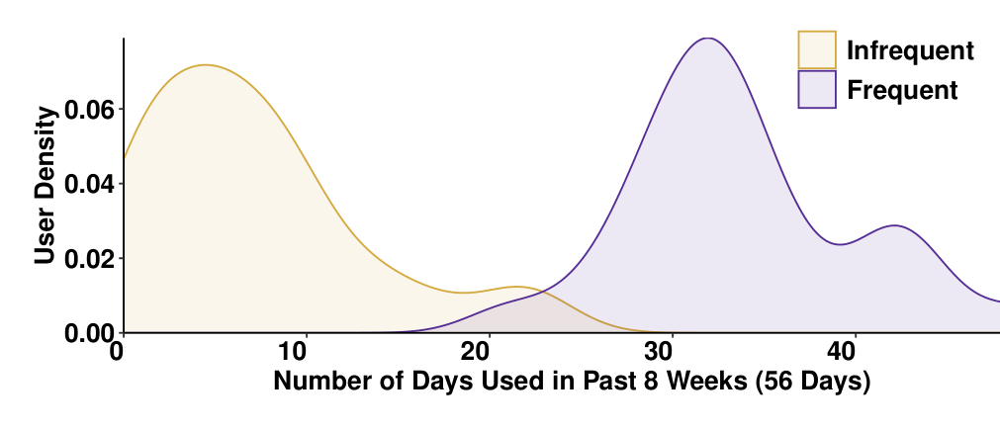
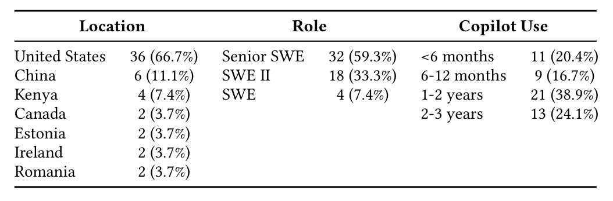

Figure 2: GenAI Tool Usage Distributions

differences in usage. Specifically, we selected pairs that had same primary programming language and a usage gap in the top third across all pairs (measured by the difference in days of GenAI tool usage between the pair’s frequent and infrequent user). Note our definitions of frequent and infrequent users are relative to their teams’ usage (not to all developers across the company). We use the terms “infrequent-AI users” and “frequent-AI users” to refer to the two groups of developers that represent the less frequent and more frequent users from each pair respectively. The median usage frequency for the infrequent and frequent groups was 5.5 days and 33 days during our observation window (cf. Figure 2).

Participant Recruitment. We recruited candidate pairs from engineering teams globally through an internal company chat; due to regulatory reasons we excluded pairs from Germany and Norway. We reached out to each developer individually, only interviewing developers from pairs where both agreed to participate.

### 3.3 Interview Protocol

Our interview protocol strategically leveraged the paired design. For each pair, we first interviewed the infrequent user to understand their perspectives, any barriers, and specific challenges they face. We then interviewed the corresponding frequent user from the same team, exploring how they may have navigated similar challenges and their broader experiences. This sequencing allowed us to probe the frequent users about context-specific barriers their teammates faced, revealing divergent responses and strategies they may have followed to overcome shared obstacles. The interview protocol evolved iteratively while maintaining consistency in core questions to ensure comparability across participants.1

Our interview protocol initially drew from the UTAUT framework [90], a well-established lens in prior technology adoption research [57,79,90]. UTAUT’s four core constructs—performance expectancy, effort expectancy, social influence, and facilitating conditions—provided a systematic foundation for understanding usage behaviors in organizational contexts.

We began with 30-minute interviews exploring these constructs through questions on perceived tool benefits (e.g., “What are your current expectations about how GitHub Copilot can help with your development work?”), ease-of-use and integration challenges, alongside team influences, and organizational support. However, early interviews revealed patterns beyond traditional adoption factors—differences in how the two groups conceptualized and approached AI tool usage. To explore these emergent themes, we extended interviews to 60 minutes and supplemented UTAUT questions with new probes about participants’ tool perceptions, integration strategies, learning approaches, and evolving skill perceptions.

### 3.4 Data Collection and Analysis

Table 1: Participant Demographics

The interviews took place over video conferencing. From 670 invitations, 315 developers agreed to participate. Of those that agreed, 152 were from 76 pairs where both members agreed. We scheduled interviews with pairs on a first-come, first-served basis once both developers had agreed to participate, but were limited by protocol scheduling logistics, busy developer schedules, and time zones. In total, we conducted 56 interviews (labeled PID1–56), with 54 participants (27 matched pairs) included in the final analysis. Two participants were excluded when their pair partners dropped out. We summarize the participant demographics in Table 1.

We qualitatively analyzed interview transcript data using iterative thematic analysis [10]. Our process was guided by Lincoln and Guba’s trustworthiness criteria [39], as described by Nowell et al. [69]. During this process, we followed a commonly recommended strategy [59]: throughout the process we switched between the different stages of analysis — jumping between exploring the rich transcripts, engaging with and analytically memoing the data [65], coding, searching for themes, and refining the codes and coding framework. While UTAUT guided our interview questions and early memoing to organize emerging barriers, our actual coding framework was developed through iterative inductive analysis.2

To leverage contextual richness, we coded both interviews from each pair in the same session, following the interview sequence (infrequent user first, then the frequent user). This paired approach allowed us to track how developers from closely similar team contexts responded differently to similar challenges. The analysis began with the first author performing open-ended inductive coding of each interview as data collection progressed. After eight interviews, all authors came together and performed an in-depth analysis of the codes and coding framework. Iterative adjustments to the coding framework and interview guide were made as necessary. Once the framework stabilized, the first author re-coded all transcripts, with uncertain cases being reviewed with another author’s assistance. We used HeyMarvin for qualitative analysis, facilitating code organization and pattern evolution tracking [2]. We ended the interviewing process when we reached our saturation criterion [32], which we defined as two consecutive interview pairs without learning any new major insights (i.e., 4 interviews). For higher-level theme

1 The complete interview guide is available in the supplementary material.

2 The complete coding framework and manual are available in the supplementary material.