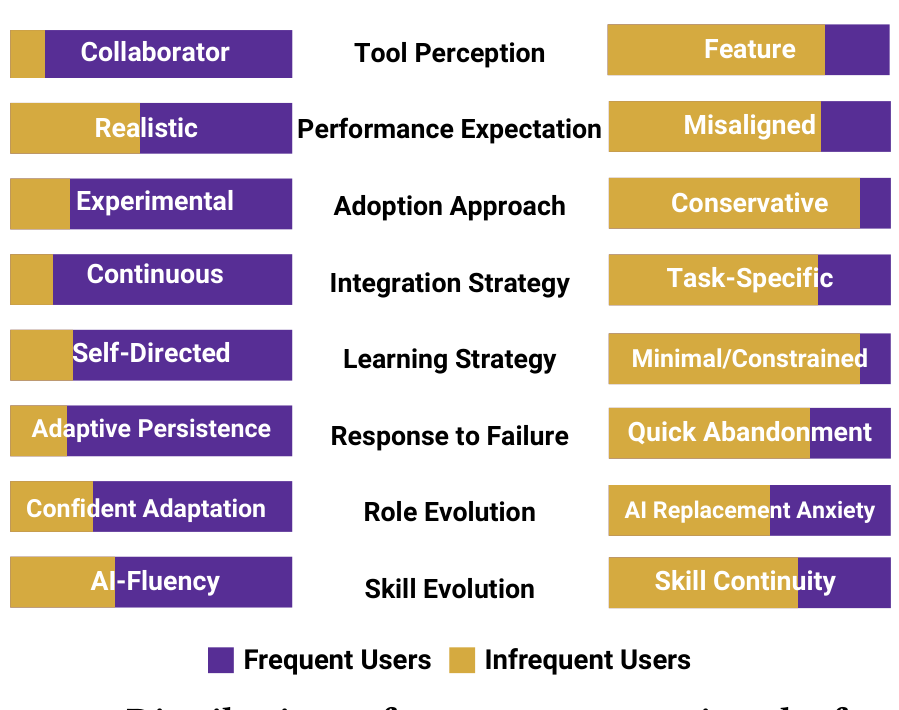

identification, we shifted focus from individual pairs to patterns distinguishing the two broader groups—frequent and infrequent users. This analytical pivot allowed us to identify systematic differences in how developers perceive, approach, and respond to AI tools despite shared organizational contexts, revealing individual factors that transcend team-specific circumstances. We report qualitative findings organized into emergent categories. We avoid discussing frequency counts or percentages in line with established guidance against quantifying qualitative data [27].

### 3.5 Member Checking
Following data analysis, we validated our findings through member checking with interviewees to ensure our interpretations accurately reflected their perspectives and experiences [20]. We sent all interviewees a draft of the paper’s introduction, methods, results and discussion along with a list of questions asking for their extent of agreement with and/or the relevance of the findings, alongside additional thoughts and feedback. Participant feedback confirmed our findings, with some providing additional clarifications, but no new insights or disagreements emerged, e.g., “I think it accurately reflects my experiences” (PID34).

### 3.6 Limitations
Our interview study is affected by several limitations commonly experienced in interview research. The transferability of our findings may be influenced by self-selection bias among participants [62, 76], as there could be differences between those invited and those who participated. All participants were engineers at a large software company vocally committed to AI adoption, with GitHub Copilot as the only officially sanctioned tool. This limits generalizability to engineers at smaller or larger companies without AI promotion, or to open source development contexts. Despite this limitation, we argue our findings are still of value to the broader community because historically, it has been shown that single-case studies can provide meaningful contributions to scientific discovery [31], and are an essential type of research in addition to research that studies broader populations as championed by Basili [6]. A limitation to construct validity is that we measured AI tool usage through GitHub Copilot invocations only. Engineers using general-purpose AI tools (e.g., internal OpenAI models) or non-compliant tools (e.g., Cursor, Windsurf) could be classified as infrequent users despite potentially heavy AI usage elsewhere. As discussed in Section 3.1, the company’s strong pro-AI culture may have influenced participants’ responses. Finally, throughout this discussion, we occasionally use causal language (e.g., ‘leads to’) for clarity and readability. These phrasings should not be interpreted as statistical causal claims, as our qualitative design does not support formal causal inference.

## 4 RQ1: What Distinguishes Frequent and Infrequent GenAI Development Tool Users
During our analysis, we identified distinct patterns in how frequent and infrequent users perceive, approach working with, and respond to challenges using GenAI development tools—even among developers in similar organizational contexts (cf. Figure 3). Figure 1 illustrates our conceptual framework showing how individual tool integration progresses through distinct stages, with external factors influencing this process throughout (note that while arrows

Frequent Users  Infrequent Users  
Figure 3: Distributions of user type proportions by factor.

connect to specific stages for visual clarity, external factors impact the entire adoption journey).

### 4.1 Mindset Formation: Initial Perceptions Shape Usage Patterns
We observed two primary diverging patterns in tool perception that appeared to influence subsequent usage behaviors.

#### 4.1.1 Tool Perception: Collaborator vs. Feature.
Many frequent-AI users described their interactions with the tooling using collaborative language and partnership framing, using terms like “teammate,” “collaborator,” or “assistant.” e.g., “I use GitHub as a colleague to discuss, ‘OK, this is what I’m trying to look at, this is the high level task, these are the plans to go about implementing this feature, do you see any gaps in that?’” (PID2). This tool-as-collaborator perception appeared to encourage deeper engagement as they invested time understanding its capabilities and strengths, as they would when onboarding a new team member. Infrequent-AI users more often described these tools as enhanced features such as advanced code completion or search functionality, e.g., “I’m not going to say that I find it completely without value, but it’s about as useful to me as a stack overflow search.” (PID7). This utility framing appeared to limit engagement patterns—these developers tended to approach the tool with transactional expectations rather than collaborative ones. The limiting nature of the utility framing is evident when comparing PID7 with their teammate PID23, who despite facing similar technical challenges, developed a more engaged usage pattern, e.g., “we have to write a lot of thorough tests that we can run on our gates periodically. So setting up those tests, writing the basic framework for them is just a lot of boilerplate code that GitHub Copilot helps me come up with... So that’s one of the places I use it.” (PID23).

#### 4.1.2 Performance Expectations: Realistic vs. Misaligned.
Perception also appeared to influence performance expectations. Frequent-AI users who viewed the tool as a collaborator often expressed realistic expectations, expecting assistance rather than replacement, similar to a junior colleague who provides value yet requires oversight: “I just have to type what I’m trying to do and then it gets me like 90% of the way there and I have to just change a couple things.” (PID16). Infrequent-AI users who viewed it as a feature often held misaligned expectations, either anticipating minimal