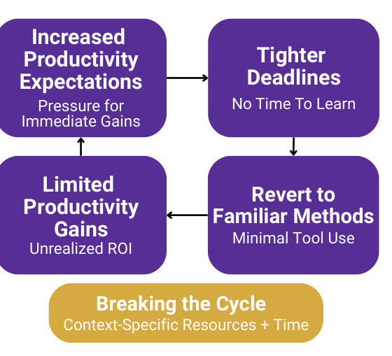

Figure 4: The Productivity Pressure Paradox.

A common theme among participants was experiencing increased productivity expectations from management because they have access to these tools, e.g., “I know that management is expecting us to produce code faster. And I know that the bar is gonna be raised every year because now, even though it’s true or not true, [they] think that we should be much, much more productive because we have these tools.” (PID20). Some managers appeared to assume tool access automatically enabled rapid effective integration into existing workflows and immediate productivity gains, overlooking the significant learning effort and time investments required. Many developers reported experiencing a circular challenge: “There’s a skill gap among all of us about prompt crafting. The impression is that if I get better at prompt crafting then the Copilot could increase my productivity. But how do I get to that? How much productivity do I need to put into prompt crafting in order to increase productivity in my workflow? So there’s a chicken or egg problem.” (PID46).

Increased productivity expectations, which often translated into tighter deadlines, prohibited many developers from doing the exploration necessary to learn how to use the tools effectively, instead falling back on their tried-and-true methods, e.g., “I do really feel the pressure of deadlines and trying to get stuff out and so feel less of the freedom to explore... The few times I’ve tried it, being discouraged, I’m like, OK, well, let me just get this done and then I’ll get to it. That’s been the hindrance.” (PID6). Without time for exploration, many developers felt they couldn’t understand the tool’s full capabilities or how to use it most effectively: “we don’t have so much time to learn about it because we are already overburdened with the tasks that we need to do” (PID44).

These contradictory experiences—heightened productivity expectations, significant learning time requirements, pressure-induced reversion to familiar methods, and limited support—formed a consistent pattern across many developers, suggesting systemic challenges in how some organizations approach GenAI tool integration.

> Key Insights: When organizations expect immediate gains from AI without learning support, the resulting pressure blocks the desired productivity benefits.

## 6 Discussion and Implications

### 6.1 The Productivity Pressure Paradox

Many organizations invest in GenAI development tools expecting productivity returns [4, 19] while simultaneously treating adoption and integration into existing systems as an individual responsibility [60, 63, 64, 88]. Yet within the context of knowledge work, the evolving capabilities of these tools create a “jagged technological frontier,” where they improve certain workflow tasks but can harm performance when applied to other seemingly comparable tasks [24]. Many organizations are implicitly asking developers to navigate this jagged edge on their own while maintaining or increasing their productivity.

This contradictory set of experiences—where developers must simultaneously maintain velocity, learn new tools, determine integration strategies, and navigate tool capability boundaries without systematic support—creates what we term the Productivity Pressure Paradox. This paradox creates a self-perpetuating organizational dynamic (cf. Figure 4): increased productivity expectations hinder the skill development investments needed to achieve those very gains through effective workflow integration, a challenge many participants faced (Section 5.4). Cognitive science reveals the underlying mechanism: time pressure fundamentally shifts individuals from flexible exploration to rigid exploitation patterns [96], leading many developers to default to familiar approaches rather than discovering optimal integration strategies (Section 4.3).

The paradox appears to operate bidirectionally: first, productivity pressure prevents the temporary productivity dip necessary for learning; second, this approach places burden on individuals to solve organizational optimization challenges.

### Increasing Productivity: From Systems to Individual Burdens

The Productivity Pressure Paradox exemplifies how the knowledge sector uniquely places “onto the individual worker the burden of improving output produced per unit of input” [67, 74] – a departure from established principles regarding productivity optimization which demonstrate that productivity improvements come from optimizing systems, not individual heroics [25, 43, 86]. Henry Ford did not expect workers to individually discover how to build cars faster; he systematically redesigned the entire production process, investing significant time and effort into pioneering a reimagined system and building new tools to make it happen. The continuous-motion assembly line wasn’t an incremental improvement from worker tinkering but a comprehensive system redesign that allowed individuals to focus on execution within an optimized workflow. Workers were largely uninvolved in the optimization process; their productivity increased as a consequence of systemic change.

While the labor involved in pre-industrial automotive factories differs significantly from knowledge work like software engineering, this same principle is echoed in canonical software engineering literature. In The Mythical Man-Month, Fred Brooks argues that adding developers to a late project does not speed it up but rather slows it down by adding layers of complexity [12]. To gain efficiency, better systems are needed. Brooks recognized that productivity improvements on a systematic level require systematic approaches rather than simply adding resources. The parallels become clearer when examining how many organizations approach GenAI integration today. Just as adding developers to a late project increases complexity without corresponding capability, adding GenAI without systematic support creates new coordination challenges and learning requirements (Section 4.3). Yet many organizations expect individual developers to navigate this complexity while maintaining delivery velocity, precisely the individualized approach to productivity that has proven ineffective across domains [14, 41, 52, 58]. We