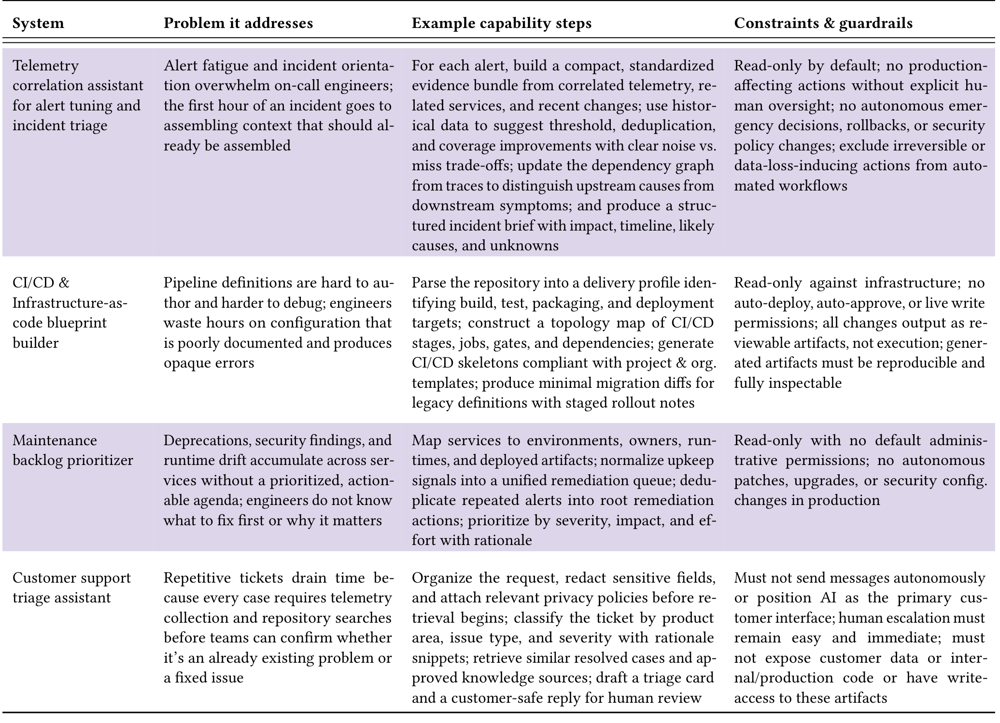

## Table 5: Systems developers want built: Infrastructure & Ops (N=101).

arrive from multiple scanners without a prioritized agenda—often as duplicated alerts, without saying what to fix, why it matters now, or who owns the missing context. Respondents wanted a system that consolidates these signals into a maintenance agenda already annotated with the context needed to act: “What to do / Why I’m doing it (short) / How to do it, in fine detail / Why I’m doing it (long) / Who to bother if something doesn’t line up.” (P476).

Respondents did not want AI to execute patches, upgrades, or configuration changes in production automatically, hold administrative permissions, or modify security configurations without human authority. Recommendations had to be reviewable with evidence; rubber-stamp approval workflows were exactly the kind of oversight erosion they were guarding against.

### 4.4.4 Customer support triage assistant. 11.9% described that customer support teams lost time twice: first deciding which category a ticket belonged to, then repeating the same telemetry lookups and knowledge-base searches for patterns they had already handled. “If an AI agent could actually look at support request text and logs and make screening, bucketing, and triage decisions based on the content, that would be super helpful” (P92).

“We got a lot of repetitive customer questions, like permission issues. I hope AI can detect patterns of our customer request triaging” (P117).

They wanted a system to organize incoming tickets, match them to known issue patterns, run only pre-approved telemetry lookups, and produce a triage card plus a customer-safe response draft for the human to review and send.

Participants emphasized that customer data, proprietary code, and sensitive information required strict privacy protection and least-privilege access. Human escalation had to remain easy and immediate: “As a customer, being forced to an AI is frustrating. I would prefer the AI tooling to be passive, but provide me (as the person providing customer support) prompts on suggested resolutions or ways forward” (P2).

> Takeaway. The shared problem is a representation gap: the right information exists, but not in the required form. Each system bridges that gap, translating artifacts into aligned documentation, personalized ramp-up paths, audience-calibrated communications, or structured option spaces. In every case, the system drafts; the human decides.