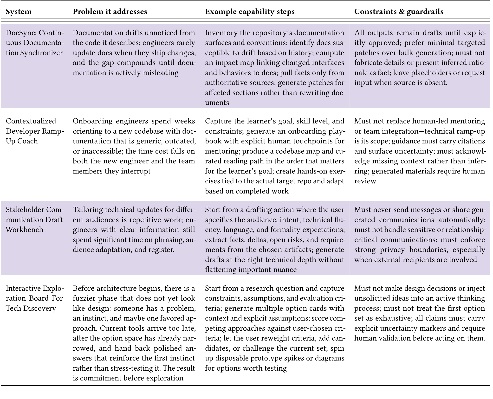

### Table 6: Systems developers want built: Meta-Work (N=157).

## 4.5 Meta-Work: Documentation, Knowledge, Collaboration (N=157)

157 of 532 block completers answered the open-ended questions substantively. Their primary ask was for AI to absorb the overhead surrounding engineering work to mitigate documentation drift, reduce onboarding time and communication overhead, and help with early-stage research. The distinction respondents drew consistently was between logistics, which they were willing to hand over, and judgment, learning, and voice, which they were not.

#### 4.5.1 DocSync: continuous documentation synchronizer.

45.9% of respondents wanted help keeping documentation from drifting from the code it described. "I think the biggest role that AI can assist in is maintaining documentation to be accurate and up-to-date. Missing, incomplete, or outdated documentation is arguably the biggest pitfall of development" (P129).

They wanted systems that monitor code changes, detect which documentation is affected, and propose precise updates grounded in the modified code, tests, and schemas. As one noted, "Unfortunately, I think right now the focus is on just generating a bunch of AI slop that nobody will ever read or maintain, which just makes all the documentation problems we have now even worse" (P456).

Developers emphasized that all outputs must remain drafts pending explicit human approval. These systems should not fabricate details when evidence is missing or present inferred rationale as fact; they should leave placeholders or request input: "Autodocumentation of ’what’ would be great. AI models aren’t smart enough to completely explain the ’why’s yet" (P171).

#### 4.5.2 Contextualized developer ramp-up coach.

30.6% wanted help accelerating the onboarding process for new engineers. P380 described: "It would be helpful if AI could take a new engineer’s goals and skill level and generate a structured onboarding path, rather than leaving them to piece it together from outdated docs" (P380). They wanted a system that captures the learner’s goal, skill level, and time constraints, then composes a role-specific ramp-up path from