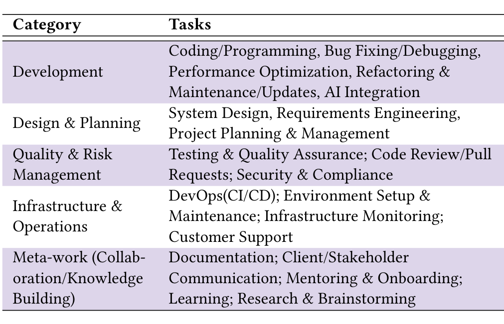

## 2 Related Work

As AI increasingly absorbs routine coding work, developers are left to navigate the broader software lifecycle (e.g., design, architecture, planning, compliance, and operations)—areas where AI support remains relatively sparse and poorly understood [8, 29]. Understanding where support is most needed, and what it would take to build it, has therefore emerged as a focal research topic.

Prior studies have examined factors shaping AI adoption in software engineering (SE) [7, 13, 17, 36, 44]. Workflow compatibility has been shown to predict early adoption strongly: tools that fail to align with developers’ existing practices are often abandoned regardless of their capabilities [44]. Trust further shapes usage, influenced by both system characteristics and individual dispositions toward AI [15, 17, 26, 50]. In particular, reliability, transparency, goal maintenance, and provenance are critical for developers’ trust, yet remain insufficiently supported in available tools [18, 25].

More recent work has shifted to task-level analyses of AI use [28, 29, 41], revealing that developers use AI for implementation tasks while retaining judgment in architecture and review [8, 27]. They also identify unmet demand concentrated in testing, debugging, documentation, and compliance [28], and link toil-heavy tasks to reduced developer satisfaction and productivity, highlighting them as promising targets for AI support [29]. Complementary findings indicate that developers are more receptive to AI for artifact manipulation and information retrieval [31], and less so for collaborative or creative work [41].

The survey underlying this paper, reported in Choudhuri et al. [16], provides the first empirically validated mapping of developers’ daily work experiences to their AI adoption patterns and priorities for Responsible AI support. Using cognitive appraisal theory [32, 43] across a large-scale survey of developers, the study showed that perceived task value, accountability, and demands increase both openness to and use of AI. At the same time, identity alignment produces a dual effect: lower openness but higher usage when AI complements developers’ sense of meaningful work. The work further introduced an AI openness vs. usage landscape that highlights an opportunity space for tooling investments.

What this work established was where developers want AI support and why. Yet, it left open a critical question: what should be built? In this study, we address this gap through a parallel qualitative analysis of developers’ free-text responses from the same survey. From this analysis, we derive a grounded set of AI systems developers want built, and the constraints they place on those systems for them to be acceptable in practice.

## 3 Method

To address our RQ, we surveyed software developers at Microsoft. With over 60K developers spanning domains, roles, processes, stakeholder contexts, and geographies, and with sustained exposure to both mature and emerging AI tools, the organization provided a rich and diverse setting for this study.

### 3.1 Source Survey

The data for this study comes from an IRB-approved survey of 860 Microsoft developers conducted in July 2025 [16]. The survey captured how developers cognitively appraise their work and how these appraisals relate to their AI adoption patterns and Responsible AI (RAI) priorities across SE tasks. It also included two open-ended questions per task category (see Tab. 1), asking where developers most wanted AI support and where they did not. The companion paper analyzes these responses to explain why developers seek or limit AI, using cognitive appraisals as the explanatory framework.

This paper addresses a complementary question: what, concretely, should be built? We conduct a parallel qualitative analysis of the open-ended responses to derive a grounded set of systems developers want built.

### 3.1.1 Survey Design

The survey used a grounded taxonomy of software engineering tasks (Table 1), constructed by integrating work-week studies of developer activities [29, 35] with large-scale surveys on AI adoption [17, 28], and refined through pilot sessions with developers and SE researchers outside the research team.

Table 1: Grounded taxonomy of SE tasks [17, 28, 29, 35]

Participants selected 2–3 task categories that best reflected their current work and answered questions for those categories. To reduce fatigue, the meta-work category (applicable to all developers) was excluded from the initial selection and shown only if a participant selected two categories; thus, no participant completed more than three category blocks.

Within each selected task category, participants completed Likert-scale items on task appraisals (value, identity, accountability, demands), AI openness, and RAI priorities (reported in the companion study [16]), followed by two open-ended questions:

(1) Opportunity: “Where do you want AI to play the biggest role in [task-category] activities?”

(2) Constraint: “What aspects do you not want AI to handle in [task-category] activities and why?”

These questions elicit desired capabilities and unmet needs (opportunity), as well as boundary conditions (constraints), and constitute the primary data for this paper. The unit of analysis is a single respondent’s answer to one question within a task category; responses could be assigned multiple codes.

### 3.1.2 Data collection

The survey was distributed via email to 8,000 developers, sampled across product groups, roles, and geographies. One reminder was sent after one week. Participation was voluntary and anonymous.