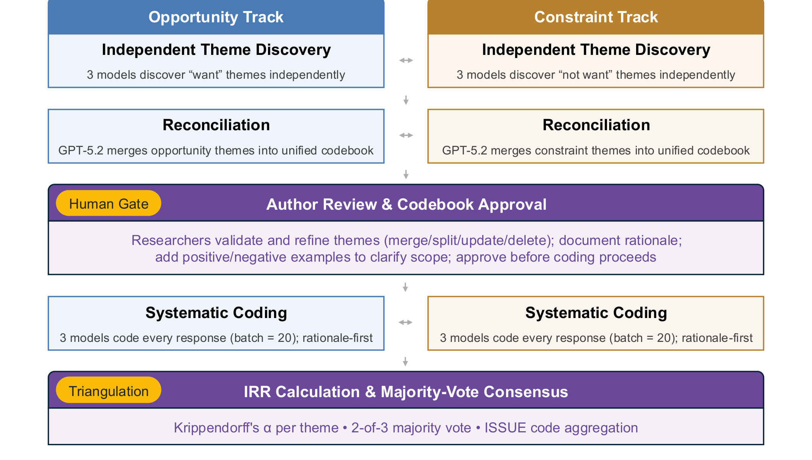

Figure 1: Analysis pipeline overview. Three frontier models independently discover themes from developers’ open-ended survey responses across two tracks. A reconciliation step produces a unified codebook per track. Researchers validate and refine themes before systematic coding proceeds. All three models then code each response against the approved codebook, providing a rationale before assigning codes. Inter-rater reliability is computed per theme using Krippendorff’s 𝛼 [23]; final assignments use 2-of-3 majority vote.

### 3.2.5 Stage 5: Inter-rater reliability and consensus.
We assessed inter-rater reliability (IRR) among three models using Krippendorff’s 𝛼 [23], complemented by pairwise Cohen’s 𝜅 [22] for each model pair (GPT–Gemini, GPT–Opus, Gemini–Opus) and three-rater percent agreement per theme. 𝛼 captured overall agreement corrected for chance; 𝜅 revealed whether alignment was uniform across pairs or concentrated in one; percent agreement identified full consensus. Across themes, IRR values ranged from 0.81 to 0.97 (mean = 0.94), indicating high reliability [23]. Themes below the threshold were flagged for review and subsequently refined, merged, or excluded through team consensus. Final theme assignments used majority vote: at least 2 of 3 models had to agree for a theme to be assigned to a response, applied independently per response and per theme.

Responses were excluded from analysis if two or more models flagged any ISSUE_* code, preventing over-filtering by any single model while still capturing systematic data-quality issues. Furthermore, two researchers spot-checked assignments against model rationales to ensure fidelity to the finalized codebook.

Finally, we synthesized related themes into system descriptions by consolidating, for each proposed system, the problems developers described, the capabilities they expected, and the constraints

they imposed on its behavior, supported by representative participant quotes (see [1]).

Reflexivity Note. This pipeline is designed to augment, rather than replace, qualitative analysis. Models discover candidate patterns; researchers interpret and validate them. The resulting themes and system descriptions are grounded in verbatim responses that readers can inspect throughout Sec. 4. We discuss the methodological implications of AI-assisted qualitative coding in Sec. 5.2.

### 3.3 Limitations

Construct validity. We report stated preferences rather than predicting adoption. Developers may describe capabilities they would not sustain in practice. We treat this as motivation and a direction for future work: claims about system value should be empirically validated, and the constraints developers articulated provide testable criteria for doing so.

The use of LLMs as coders introduces the risk of identifying plausible themes that do not fully reflect participant intent. Our design addresses this in multiple ways. Each model proposed themes with supporting participant IDs, anchoring every candidate in specific responses. Three models from distinct providers independently discovered themes; only those corroborated across models and sufficiently evidenced in the data were retained. Two researchers then