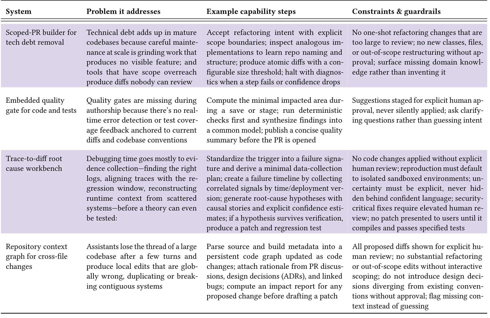

## Table 2: Systems developers want built: Development (N=353).

of a codebase after a few turns, producing edits that were locally plausible but globally wrong. “We want/need to do a MUCH better job of analyzing a current codebase, architecture, and structure so it can understand how/where to add/extend. Today it loves to duplicate code, and even break existing functionality” (P208).

Respondents wanted a persistently maintained map of the code, tests, and historical discussions, so they could ask “where should this change go?” and “what breaks if I touch this?” before any edits were made. To do this, the system has to infer conventions from the existing codebase and attach rationale from PR discussions, ADRs, and linked bugs, recovering context that never made it into a commit message. Participants noted that this was harder than retrieval-augmented generation (RAG): structural understanding of the codebase and historical reasoning about its design are both required. Impact analyses have to be specific enough to act on without being so exhaustive that they are ignored.

Scope constraints followed directly: no modifications outside the approved task, no substantial structural changes without interactive scoping, no design decisions that diverged from existing conventions without approval, and when evidence is insufficient, the system must surface the gap and ask rather than invent context.

> assemble and maintain local, history-laden tacit knowledge (e.g., repository conventions, diff intent, failure evidence) that available tools either lose between turns or never acquire.

## 4.2 Design and Planning (N=223)

Of 548 developers who completed this block, 223 wrote substantive open-ended responses. They wanted AI to assist with the exploratory overhead surrounding design work while keeping the actual decisions firmly with them: “AI’s system design solutions bias toward old known solutions rather than a modern solution that solves the problem better” (P195).

### 4.2.1 Design-To-sprint workbench. 30.5% of respondents wanted a full-cycle AI workbench that absorbs the planning and coordination overhead that follows once a design is settled. For example, P380 said: “It would be helpful if AI could take high-level features and break them down into discrete implementation tasks, and then plan those tasks out” (P380). The system they wanted would take an approved plan and produce a first-pass execution package—hierarchical work items, dependency mapping, estimates inferred from comparable historical tasks, and a draft sprint sequence for human review—then, once the team edits and accepts them, it would sync approved deltas into the tracker and synthesize status digests from tracker activity, CI signals, and open blockers.

> Takeaway. The shared need across all four systems is context representation and appropriate scoping: each requires the AI to