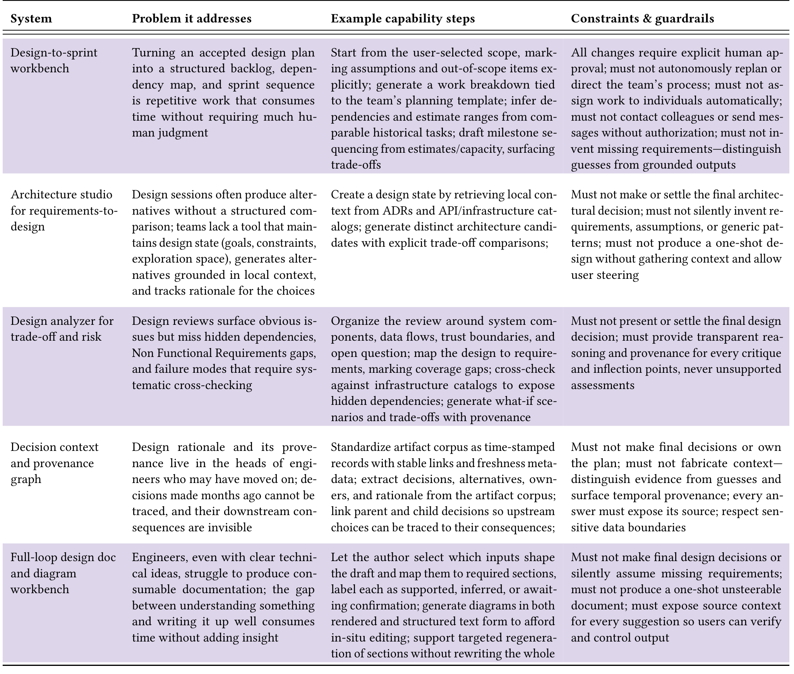

Table 3: Systems developers want built: Design & Planning (N=223).

The constraint respondents drew most consistently was that the system should not own the plan: "I want to use AI to help distill and gather information... the end decision and plan should be my responsibility" (P11). It should not create or modify work items without preview and explicit human approval, assign work to individual developers, contact colleagues, send status messages without explicit authorization, or invent missing requirements.

### 4.2.2 Architecture studio for requirements-to-design.
"I want AI to assist with exploring design alternatives, identifying edge cases, and helping align architecture with evolving business goals. It should act as a thoughtful collaborator, not just a generator" (P249). 27.8% of participants wanted such an interactive design partner that maintains explicit design state—goals, open questions, history of exploration space—while generating multiple, materially different architectures grounded in local context (e.g., ADRs, infra-catalogs), asking clarifying questions when missing information affects the design, and tracking why each option was introduced or discarded.

The hardest part is grounded context. Participants observed that systems relying on generic patterns were of limited usefulness: "AI would probably fall back to using the same known pattern regardless of the design particularities. That makes the designs inefficient" (P359). More concerning were hallucinations, which undermine trust: "I don't trust the AI to design anything; it hallucinates" (P456).

Participants emphasized retaining agency in making architectural decisions. "AI should not settle the final decision. Because this is the part that people should be accountable for" (P774). Additionally, they did not want systems to produce one-shot designs without sufficient context and guidance.

### 4.2.3 Design analyzer for trade-off and risk.
20.6% wanted AI to analyze a proposed design the way a careful reviewer would: "If