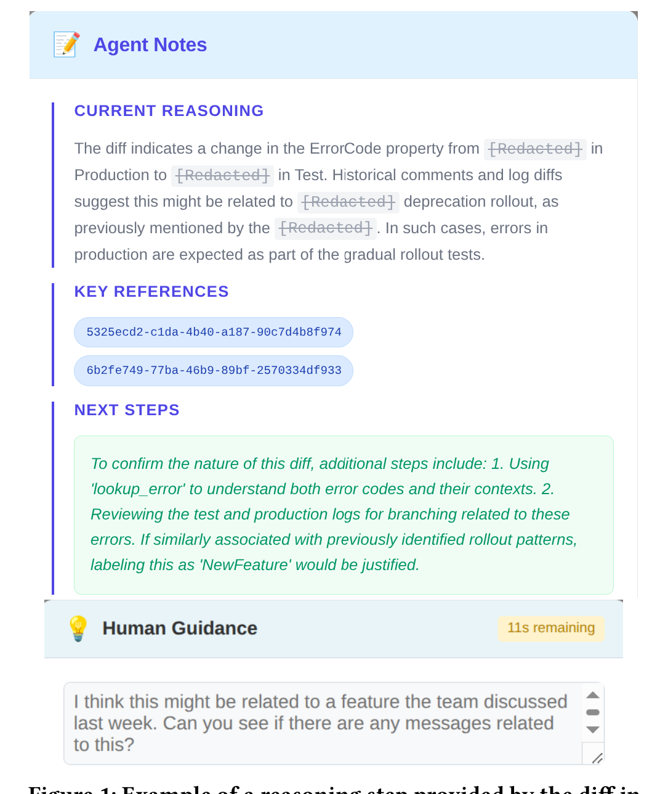

Figure 1: Example of a reasoning step provided by the diff investigator agent’s notes (top) and the human input provided by the user in response (bottom).

to provide notes documenting what new information it had uncovered, how that information updated its beliefs about the root cause, and what next steps it planned to take. To ensure traceability to specific software artifacts, we labelled each piece of information with a UUID when providing it to the agent and we required the agent to include the relevant UUIDs when providing its reasoning. These notes were presented to the user in real time, with each reference presented as a clickable link to the details of the associated artifact (see Figure 1).

Once the agent had recorded its notes, we provided an optional space for the user to give input to the agent. This allowed them to redirect the agent when it began heading down unproductive paths, or to strengthen the agent’s investigation with human expertise. This synchronous form of communication complemented the asynchronous team knowledge by pairing real-time human guidance with knowledge distilled from past human communication.

## 2.2 Challenges

While the initial prototype was a step toward uniting agent and human knowledge, we encountered several challenges that prompted us to consider a broader design vision for the solution.

### Challenge 1: Accuracy/Transparency Trade-offs

Although the agentic approach provided contextual information and reasoning, we found that it sacrificed some of the high accuracy achieved by a GPT-4 model fine-tuned to classify diffs as noise, features, or regressions [23]. This likely occurs because the fine-tuned model, trained on a large volume of data, can identify patterns that are not apparent when examining only a few examples, but these patterns are difficult to use because we cannot interpret what the model has learned. Although we did provide the agent with access to past examples, supplying enough examples to fully recognize the same patterns as the fine-tuned model would exceed the context window limit. Instead, the agent often over-relied on spurious patterns found in the provided examples.

### Challenge 2: Knowledge Retention and Reuse

Engineers improve at tasks such as differential testing through practice as they recognize common patterns that emerge over time. However, in the current implementation, the agent had to perform the process from scratch without leveraging prior work. One approach to utilize past attempts is through fine-tuning an LLM [23], but there are also use cases where information from one investigation might be useful at a human-interpretable level for future tasks. For example, when a similar diff appears, it might be sufficient to reference previous reasoning rather than re-running the agent. Alternatively, the information might be relevant outside the current task entirely, such as when code files identified during a "new feature" diff investigation prove useful for change impact analysis of that same feature. A mechanism is needed to efficiently store and leverage task knowledge for downstream applications.

### Challenge 3: Managing Information Scale and Context

The amount of information relevant to the task (e.g., code files, logs, commits) quickly blows out the context window. One way to reduce context is through summarization [24], while another is to offload some of the context to an agent that can specialize in it [28]. However, both approaches risk information loss where important details may not reach the primary agent, and both involve additional computational steps that slow down the overall process. This created a constant challenge of balancing information completeness with efficiency.

### Challenge 4: Routine Steps vs. Flexible Problem-Solving

Granting the agent freedom to make tool calls based on current information allowed it to build on previous findings and focus sequentially on specific pieces of information. However, this flexibility came at significant cost: tool calls could not be parallelized, slowing the overall process, and the agent sometimes made unnecessary tool calls. This contrasts with how human experts approach investigations. Engineers often have predefined steps they perform in certain contexts (e.g., start with comparing error codes, or examine specific log sections). This recipe-based approach works well as a starting place when ambiguity about the cause is high. However, as new information emerges, experts might diverge to new plans that are no longer formulaic, requiring flexible adaptation based on their findings. To accelerate the process, we needed to mirror this approach by identifying routine steps that could be performed through predefined workflows, versus those that would benefit from full autonomy.

### Challenge 5: Tacit Knowledge Transfer

We found that some of the human experts’ knowledge about the decision-making process was tacit, making it difficult to convey to the agent. This unspoken expertise includes intuitions about which information sources are most reliable, how to interpret ambiguous signals, and when certain patterns indicates specific types of problems. We needed a way to transfer this implicit