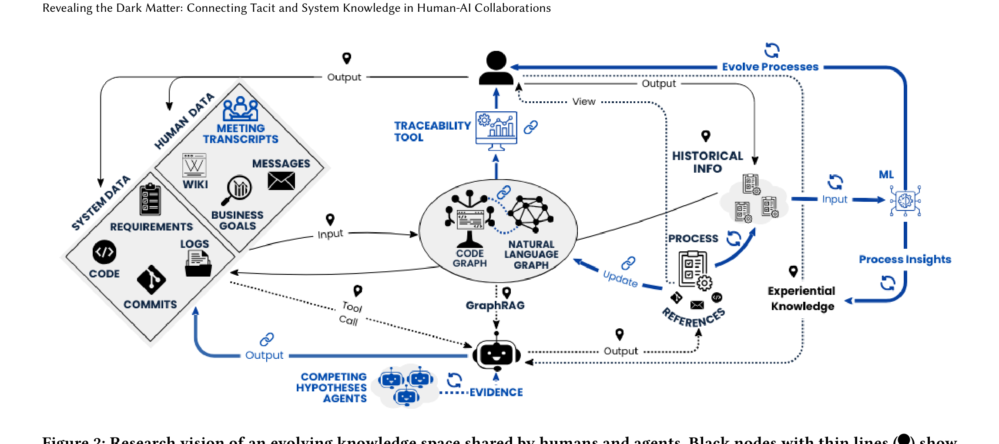

Figure 2: Research vision of an evolving knowledge space shared by humans and agents. Black nodes with thin lines (*) show the initial prototype; blue nodes with thick lines represent the next phase. Dotted lines indicate synchronous communication, solid lines asynchronous. The (cid:18) marks “Dynamic Relationships,” and the L marks “Process Analysis & Evolution.”

expert knowledge to the agent so that it could perform more efficient, successful investigations. Team messages and wiki pages helped alleviate part of this challenge by capturing some of the expertise, but other forms of communication (e.g., meetings) also conferred important knowledge, and some expertise was never articulated at all. Interestingly, this represents almost the reverse of Challenge 1, where patterns learned by the fine-tuned model were unable to be communicated.

### Challenge 6: Confirmation Bias and Hypothesis Anchoring

We observed that LLM agents exhibited strong confirmation bias. Once they found any early evidence supporting a particular label, they would rarely stray from that interpretation despite contradictory evidence encountered later. This anchoring effect is particularly problematic in differential testing where incomplete or misleading initial information can misdirect entire investigations. Unlike humans who can reconsider assumptions when prompted, LLMs remain committed to their early conclusions.

## 3 Research Vision

Underlying each of these challenges are fundamental barriers to knowledge transfer, whether between recipients (humans vs. AI), contexts (different tasks), or timeframes (past to present). Our vision (Figure 2) aims to overcome these challenges by surfacing this “dark matter” knowledge through a unified knowledge network that connects diverse software artifacts. Such a network would evolve alongside the system and provide deeper insight into software processes themselves.

### Starting Point: Prototype (*)

Our initial prototype established the foundation for this vision, incorporating not only system-generated artifacts but also human-generated communications such as message exchanges between team members. These asynchronous communications provide insight into knowledge that may not be explicitly captured in traditional system artifacts. The prototype also supported synchronous human input collected at runtime, allowing experiential knowledge to be conveyed throughout the investigation. Additionally, past knowledge was transferred by supplying the agent with examples of similar, previously labeled data when requested. Conversely, communication from the agent to humans occurred primarily through note-taking, where the agent documented its reasoning and explicitly referenced project data for review. These initial communication mechanisms establish the foundation on which the broader vision can be built.

### Building: Dynamic Relationships (cid:18)

This starting point brought together a variety of software artifacts and human communications, with some initial connections based on semantic similarity and AST information. However, this still falls short of conveying a complete picture of how different artifact types relate to one another. Semantic similarity is inherently limited in the types of relationships it can identify [16, 25], while AST information captures structural details without revealing how artifacts connect within the broader system. Building a more comprehensive network would create a knowledge base that enables deeper system understanding, maintains connections that persist across different contexts (Challenge 2), and minimizes the need to search through vast information spaces (Challenge 3). Importantly, this expanded knowledge network could begin to address Challenge 5 by integrating a wider range of artifacts, incorporating team communications such as meeting transcripts or past human interventions alongside more traditional sources.

A complementary path for discovering meaningful relationships is through the natural interactions that occur when completing a task [9]. As agents perform tasks and identify relevant data sources, these interactions can be recorded, forming links between diverse artifacts and contexts. Such links can evolve over time as agents revisit and refine earlier relationships, while connections that prove unhelpful can be weakened or removed. This enables the construction of knowledge networks that are continuously updated and improved through ongoing use.

As the network evolves, humans can engage with the links