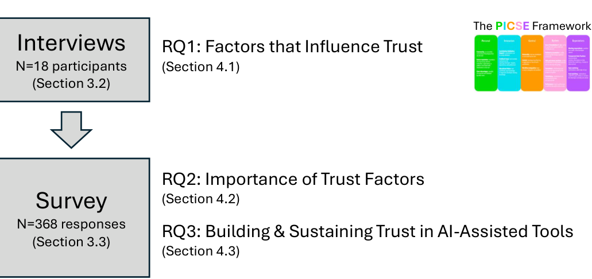
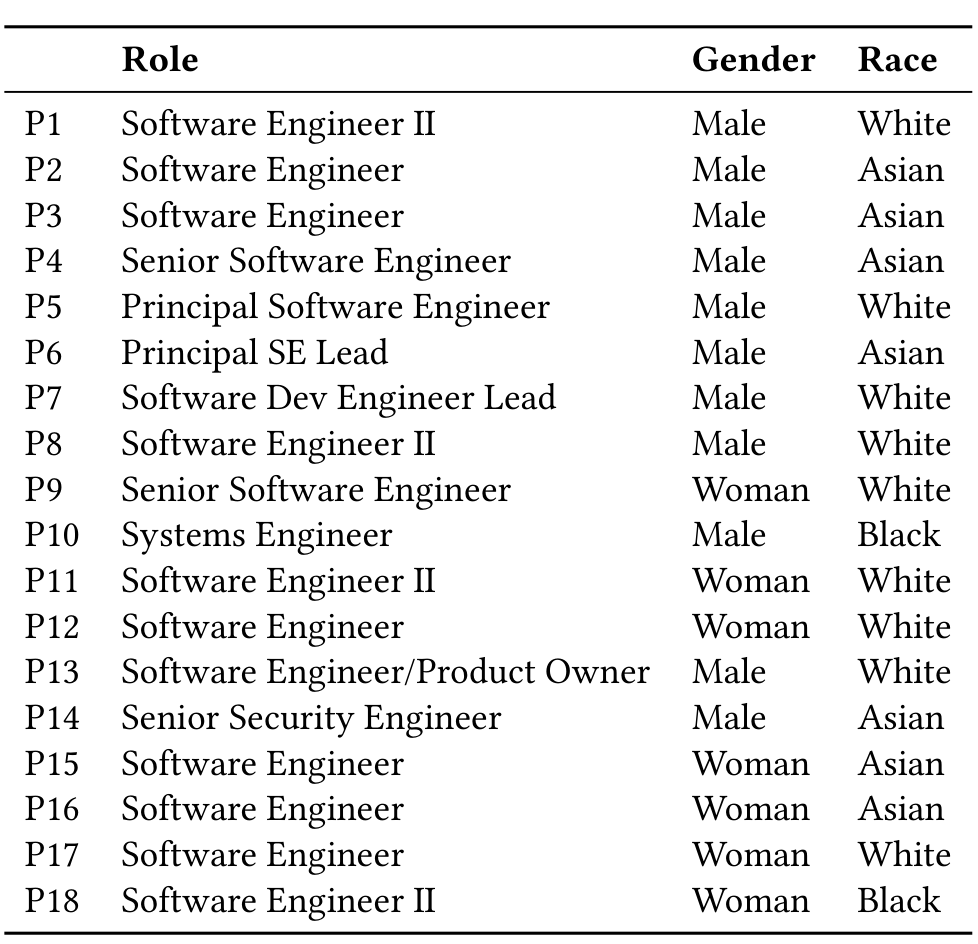
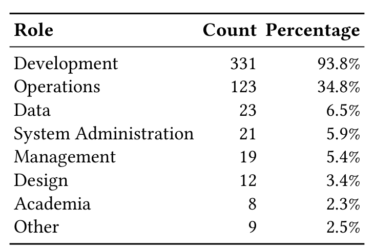
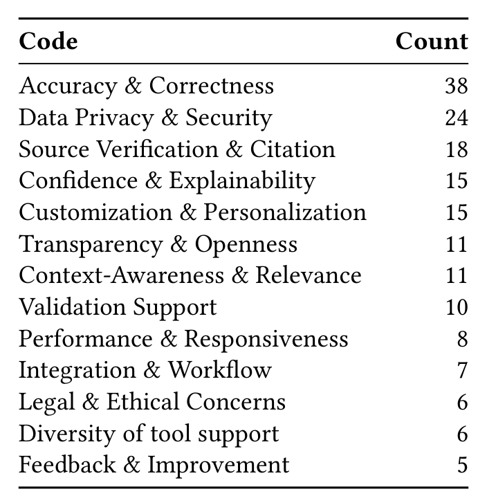
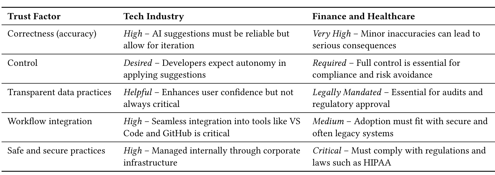

## Facilitating Trust in AI-assisted Software Tools

Brittany Johnson, George Mason University, USA  
Christian Bird, Microsoft Research, USA  
Denae Ford, Microsoft Research, USA  
Ebtesam Al Haque, George Mason University, USA  
Nicole Forsgren, Microsoft Research, USA  
Thomas Zimmermann, University of California, Irvine, USA

The day to day of a software engineer involves a variety of tasks. While many of these tasks are collaborative, it is not always possible or feasible to engage with other engineers for task completion. Software tools, such as code generators and static analysis tools, aim to fill this gap by providing additional support for developers to effectively complete their tasks. With a steady stream of new tools emerging to support software engineers, including a new breed of tools that rely on artificial intelligence (AI), there are important questions to answer regarding the trust engineers can, and should, put into their software tools and what it means to build a trustworthy tool. To this end, this paper presents findings from a mixed methods investigation of the factors that contribute to trust in traditional and AI-assisted software tools. First, we introduce the PICSE (pronounced “pixie”) framework for trust in software tools that we developed based on a set of 18 interviews with software practitioners internal and external to Microsoft. We then discuss insights from a survey with 368 internal Microsoft responses on the relevance and importance of the factors in our framework with respect to traditional and AI-assisted tools.

CCS Concepts: • Software and its engineering → Software notations and tools; • Human-centered computing → Empirical studies in HCI.

Additional Key Words and Phrases: software tools, artificial intelligence, trust, AI tools

ACM Reference Format:  
Brittany Johnson, Christian Bird, Denae Ford, Ebtesam Al Haque, Nicole Forsgren, and Thomas Zimmermann. 2025. Facilitating Trust in AI-assisted Software Tools. 1, 1 (October 2025), 34 pages. https://doi.org/10.1145/nnnnnnn.nnnnnnn

## 1 INTRODUCTION

Engineers rely on tools to support the completion of their day to day tasks, as evidenced by the rapid and consistent increase in available tooling. In fact, the software engineering research community has long encouraged and celebrated new techniques that can help engineers solve new problems or old problems better than before (hence the emergence of tracks such as New Ideas and Tool Demos).

Authors' addresses: Brittany Johnson, johnsonb@gmu.edu, George Mason University, Virginia, USA; Christian Bird, christian.bird@microsoft.com, Microsoft Research, USA; Denae Ford, denae.ford@microsoft.com, Microsoft Research, USA; Ebtesam Al Haque, ehaque4@gmu.edu, George Mason University, USA; Nicole Forsgren, niforsgr@microsoft.com, Microsoft Research, USA; Thomas Zimmermann, tzimmer@uci.edu, University of California, Irvine, USA.

---

Despite the enthusiasm for creating and disseminating new tools, we still struggle with building bridges between new tools and the engineers they are intended to support. Research suggests that many tools may go unnoticed and unused in practice [16, 26].

As we continue to struggle with tool adoption and use in practice, the tool landscape continues to evolve with technology. With the advent of huge amounts of data and increasingly powerful artificial intelligence (AI) models, new types of software tools are being created that rely on AI for decision-making and recommendations [28, 46]. Most notably is GitHub Copilot [2], an AI-assisted software tool that uses code models to generate code snippets and subprograms that engineers can adapt and integrate into their codebases.

There have been numerous efforts aimed at both improving the techniques and models that power software tools (both AI-assisted and traditional) and exploring what tasks they can support [4, 22, 43, 44]. However, there is a dearth of understanding about how to build and deploy these tools such that they will be adopted and then effectively used beyond adoption. We know from prior work that developers only use tools that they trust [36]; however, we know much less about how trust is formed and what factors affect its evolution over time in the context of software tools. We know even less about the relationship between trust, adoption, and use when it comes to AI-assisted software tools.

To help fill this gap, we conducted a mixed methods investigation to better understand the key components of trust formation and evolution when adopting and using both traditional and AI-assisted software tools. Previously, we interviewed 18 engineers across and external to the Microsoft organization to answer the research question “What factors influence engineers’ trust in software tools?” [25]. Our findings identified important factors, along with concrete examples, and serve as guides for those seeking to foster trust around their tools.

Based on these findings, we proposed the PICSE framework which organizes factors into five high-level categories: Personal, Interaction, Control, System, and Expectations. In this paper, we report findings from an extension of our previous work where we further investigate our PICSE framework. To better understand the importance of the various factors in our framework, and how that may differ with respect to AI-assisted tools, we administered a survey to Microsoft employees. Their responses indicate that there are indeed differences in factor importance and between factors that most affect trust in traditional versus AI-assisted software tools. More specifically, our findings suggest that the factors across our framework may be collectively important when building trust in AI-assisted tools. Our findings suggest the biggest difference lies in the influence that factors such as accuracy, context/goal matching, and control over application of recommendation have on traditional and AI-assisted tools.

The main contributions of this paper are as follows:
- We contribute a conceptual framework, called the PICSE framework, that outlines factors that impact the formation and evolution of trust in software tools (Section 3).
- We provide practitioner perspectives and quantitative insights into the relative importance of the various factors in our proposed framework for both traditional and AI-assisted tools.
- We outline guidance on considering and applying the PICSE framework in practice to build, sustain, and evolve trust (Section 4).

## 2 METHODOLOGY

The goal of our research is to better understand what factors influence developers’ trust in the tools they use to develop software and to what extent. We are particularly interested in the differences and similarities in trust when dealing with AI-assisted versus traditional software tools. For the purpose of this research, we define a software tool as any

Manuscript submitted to ACM

---

> **Image description:** A simple flow diagram showing the study’s mixed-methods pipeline: a top gray box labeled “Interviews” (N=18 participants, Section 3.2) points via a downward arrow to a second gray box labeled “Survey” (N=368 responses, Section 3.3). To the right, the diagram links the interviews to RQ1 (“Factors that Influence Trust,” Section 4.1) and links the survey to RQ2 (“Importance of Trust Factors,” Section 4.2) and RQ3 (“Building & Sustaining Trust in AI-Assisted Tools,” Section 4.3). A small thumbnail of the PICSE framework sits in the top-right, indicating the interviews produced the PICSE categories that were then evaluated and quantified in the larger survey. Overall, the figure concisely summarizes how qualitative findings informed the framework and how a follow-up survey measured its importance and dynamics.

Fig. 1. The research methodology. Through qualitative interviews we identified factors that influence trust (RQ1) and designed the PICSE framework. With a survey, we identified the relative importance of trust factors (RQ2) and how trust is built and sustained in AI-assisted software tools over time (RQ3).

technology that supports software engineering. For example, this can include an integrated development environment (IDE), an issue tracker, or even Notepad.

To achieve these goals, we conducted our research in two phases (see Figure 1 for an overview). The first phase was an interview study aimed at collecting and organizing relevant trust factors into a unified framework, called PICSE [25]. Insights from our first phase suggested both similarities and differences in how practitioners think about trust in traditional versus AI-assisted software tools. In the second phase, given the growing availability of AI-assisted software tools and the potential benefits, we administered a survey to acquire relative importance and relevance of the various factors in the PICSE framework with respect to AI-assisted and traditional tools as well as how trust is built and sustained over time. Measuring trust through surveys and interviews presents known challenges [30], particularly around self-reporting biases and varying contexts, that we discuss in our threats to validity section (Section 5). Below we describe our methods for conducting this research.

### 2.1 Research Questions

We designed our study to explore trust in software tools through both qualitative interviews and a survey. Our overarching goal was to understand the factors that shape engineers’ trust in software tools, especially AI-assisted tools. In particular we focused on the following research questions:

- RQ1: What are the key factors that influence engineers’ trust in software tools? This research question was addressed through qualitative interviews with engineers. Our goal was to identify the considerations that engineers take into account when determining their trust in both traditional and AI-assisted tools.
- RQ2: What is the relative importance of trust factors in AI-assisted software tools? Building on the insights from the previous question, we asked in a survey about the relative importance of the trust factors in the context of AI-assisted tools, with a focus on identifying nuances and unique challenges developers face when interacting with AI-based systems.
- RQ3: What strategies can AI-assisted tools implement to build and sustain trust from developers over time? Based on both the survey data, this question examines how AI-assisted tools can evolve to maintain and enhance trust over prolonged use. Our findings explore mechanisms such as transparency, accuracy, and feedback loops to support long-term trust building.

Manuscript submitted to ACM

---

Table 1. Participant Demographics

> **Image description:** This table enumerates the 18 interviewees (P1–P18) with three columns: Role, Gender, and Race. Most entries are software-engineering roles at varying seniority (e.g., Software Engineer II, Senior Software Engineer, Principal SE Lead, Systems Engineer, Senior Security Engineer, and Software Engineer/Product Owner). As reported in the paper, the sample comprises 11 males and 7 women, and by self-identification includes 7 Asian, 2 Black, and 9 White respondents (the text also notes P12 identified as a White woman of Hispanic/Latino descent).

## 2.2 Interviews

We conducted interviews to answer RQ1. As with prior studies that aim to leverage and simplify interview data for practical insights [27, 33, 45], we used thematic analysis to consolidate our findings into a conceptual framework. Below we outline our sample of interviewees along with our data collection and analysis approaches that led to the creation of our PICSE framework.

### 2.2.1 Interviewees

We recruited software engineers internal and external to Microsoft. To recruit internal engineers, we reached out to individual engineers using Teams. We found engineers to contact on tool distribution lists and in relevant Teams groups. We also got help recruiting interviewees from other engineers who advertised our study in their respective circles. To recruit external engineers, we posted advertisements for our study on Twitter and LinkedIn.

Each potential interviewee was required to provide consent and sign up for an available interview slot via a pre-interview survey. We also used this survey to collect basic demographic information from interviewees. Our recruitment efforts yielded a total of 19 interviewees. We conducted the first interview as a pilot run to test our interview script and catch any issues we may have missed. The results reported in this paper are from the 18 interviews that followed.

Our final set of interviewees is listed in Table 1. Our final sample included 12 Microsoft employees and 6 non-Microsoft employees. Eleven of our interviewees identified as male and seven identified as female. Most of our interviewees were located in the United States, with the exception of one who was located in the United Kingdom and one located in Canada. Two interviewees self-identified as Black or African American, seven self-identified as Asian, and the remaining self-identified as White. P12 identified as a White woman of Hispanic or Latino descent. Most engineers in our sample are software engineers, but we also interviewed security, systems, and lead engineers. Interviewees’ years of professional software development experience range from 1 year to 15 years, and of the 18 interviewees included in our final data set, six consider themselves to also be open source developers.

Manuscript submitted to ACM.

---

### 2.2.2 Data Collection.

To answer RQ1, we conducted semi-structured interviews. The interview was divided into three main portions: background, trust in other engineers, trust in software tools. The interview guide can be found online in the supplemental materials [24].

We designed the background portion of the interview to gather insights on the day-to-day tasks and interactions for each interviewee. This also helped set the stage for the questions to follow on their trust in the individuals and tools they interact with. We asked questions such as “What project or team do you currently work on?” and “What are the typical activities or tasks you typically work on in your current role?”.

We designed the second portion of our interview to gain insights into our interviewees’ thoughts about trust when developing and maintaining software with other engineers. We added this portion to help situate our participants in a familiar way of thinking about trust before asking about trust in software tools, which may not have been something they have put explicit thought into prior to our interviews. Additionally, with tools like Copilot being marketed as “pair programmers” (a traditionally human role), we wanted to better understand the extent to which factors that influence trust in others align with factors that influence trust in software tools.

We first asked them to define trust when it comes to collaborators on software projects. To determine if there are nuances to trust in different contexts, we asked a series of follow-up questions on trust when coding with and learning from other engineers.

The third portion of our interview shifted the dialogue from humans to tools. We again asked interviewees to first define trust, but this time in the context of tools they use to develop and maintain software. The follow-up questions in this portion mapped explicitly to tasks developers could use tools for: writing code, generating tests, finding bugs, and fixing bugs. We concluded the third portion of the interview with an opportunity for interviewees to share any ideas they had for creating or improving software tools that aid in the completion of their day-to-day tasks. Following the third portion of the interview, we opened the floor for interviewees to share any additional insights or thoughts they had on trust in software tools, or specifically AI-assisted software tools.

Each interview lasted approximately 1 hour and took place on Teams. We recorded both audio and the screen for the duration of each session. Following each session, we compensated interviewees with a $50 Amazon.com gift card. Each interview video was transcribed using a transcription company.

### 2.2.3 Data Analysis.

To analyze our data, we conducted a mixed qualitative coding approach led by the first author. Given we conducted this research with a partially distributed research team, all discussions regarding data analysis occurred virtually.

We followed a combination deductive and inductive coding approach, which means that we first created an initial codebook for coding our interviews (deductive) [5]. We derived the categories and codes for the initial codebook based on the questions we asked our interviewees and the information we intended to collect from those questions. For example, the first category in our codebook was “Background” given we designed the first portion of our interview to collect background information. Codes in this category include background-project (what project or team the interviewee works on), background-daytoday (typical tasks or activities interviewees complete in their current role), and background-tooluse (tools interviewees use in their day-to-day). Our initial codebook included fourteen codes across the six categories (background, human trust, tool trust, AI tools, tool ideas, and other).

After deriving our initial codebook, we began coding our transcripts using ATLAS.ti [1]. As we came across data that suggested the need for a new code (e.g., a commonly used sub- or follow-up question), we added new codes to our codebook (inductive) [5]. Once the first author finished coding all 18 interviews and refining the codebook, we

Manuscript submitted to ACM

---

> **Image description:** Photograph of an open card‑sort used to elicit PICSE categories showing handwritten yellow sticky headers with printed white cards clustered beneath them. Top-left header reads “Tool does what expect/want” with cards: Meeting expectations; Goal matching; Style matching; Data Visibility. Top-right header “Tool properties” groups Performance; Correctness; Consistency. Bottom-center handwritten header (about developer power over tool) groups Ease of use (workflow integration); Autonomy; Ownership, while the bottom-right “Dev↔tool interaction” cluster contains Feedback loops; Contribution Validation Support; Educational Value. A single detached card “Visible benefits: benefits of using the tool validated by other users” is also visible; the photo documents how interview themes were organized into the PICSE framework categories.

Fig. 2. Snapshot of the open card sort conducted to elicit final set of categories for the PICSE framework.

Conducted validation tasks to improve the trustworthiness of our findings. Following guidelines by Lincoln & Guba [29], we invited an outside auditor to review our methodology and developing codebook. Our external auditor is an empirical researcher that is external to Microsoft, an expert in qualitative work, and has published qualitative work in top-tier venues. They have knowledge of the space in which we are collecting data (human factors and software tools).

We provided the auditor with samples of raw, coded data along with the coding process and codebook used. We gave instructions to confirm that the initial codebook was in fact driven by the interview script, the emergent codes were properly documented, and that the inferences from the data made sense. We discussed and revised codes based on this person’s feedback, but there were no disagreements in our coding and categorizing the data. Under their advice regarding our code and category descriptions, we updated code and category descriptions, as well as corresponding examples when necessary. Our final codebook, which includes 31 codes across six categories, can be found in the supplemental materials [24].

Once we determined our final set of codes, the final step in our data analysis was to conduct a thematic analysis of the resulting codes and categories [11] to determine the high-level themes that would form the PICSE framework. This process was also led by the first author, who started by creating code groups in ATLAS.ti in order to narrow data analysis to quotations that map to trust in software tools. For example, our analysis yielded a total of 8 code groups (Background-Job, Background-Tools, Humans & AI, Tool Ideas, Traditional vs. AI-Assisted Software Tools, Trust in AI-Assisted Software Tools, Trust in Humans, and Trust in Traditional Software Tools), only two of which were specific to trust in tools.

In the first iteration through these relevant code groups, the first author went through each of the quotations and documented the higher-order themes as they emerged across quotations and groups. For example, across code regarding initial trust and building trust emerged the theme community where participants often discussed the importance of a user community surrounding a given software tool. After going through all the quotations that mapped to trust in tools, the first author made a second pass through the emergent themes to identify any potential overlap across themes.

Manuscript submitted to ACM

---

Table 2. Development areas of the participants. The participants could report multiple development areas. The percentages are reported relative to the total number of participants (353) who answered this question.

> **Image description:** A table of roles reported by survey participants with counts and percentages: Development 331 (93.8%), Operations 123 (34.8%), Data 23 (6.5%), System Administration 21 (5.9%), Management 19 (5.4%), Design 12 (3.4%), Academia 8 (2.3%), Other 9 (2.5%). These figures come from the 353 respondents who answered the development-area question (participants could select multiple areas), so percentages sum to more than 100%. The table highlights a sample heavily concentrated in software development roles, with substantial secondary representation in operations and much smaller representation from data, system administration, management, design, and academia.

We iteratively discussed as a group each round of themes until we determined a final set of unique themes from our findings. These unique themes together provided the list of 19 factors in our framework.

To form the high-level categories of the PICSE framework, the second author conducted an open card sort on the final set of unique themes. Figure 2 depicts the initial themes and categories. The second author shared the initial categories with the research team for discussion. This discussion led to the renaming and clarification of some of the themes and categories, resulting in the final categories and themes that make up the PICSE framework (Table 3). For instance, the “Dev<->Tool Interaction” category shown became the “I” in PICSE for “Interaction.”

### 2.3 Survey

To acquire more clarity on our interview findings, and answer RQ2 and RQ3, we designed and administered a survey that centered specifically on our PICSE framework and trust in AI-assisted tools. More specifically, our goal was to glean insights on the importance of each of the factors outlined in the PICSE framework and better understand perceptions and use of AI-assisted software tools. Below we describe our respondents and methods for collecting and analyzing our survey data. Our survey is available in supplemental materials for reuse and replication [24].

#### 2.3.1 Respondents

We administered our survey internally to Microsoft employees. Our survey reached 372 potential respondents, 368 of which opted in for participation. Since many questions were optional, the number of responses varied across the questions in the survey, including demographic, background, and experience questions. Nevertheless, we provide the data that was given to provide insights into our sample of practitioners.

The distribution of development areas covered by our respondents' work is shown in Table 2. Of the 368 that opted in, 353 provided responses regarding the development area(s) they work in. While most respondents reported working in a single development area (209), many reported working in multiple areas (135). Most of our respondents worked in development (93.8%, e.g., frontend/backend, mobile), followed by operations (34.8%, e.g., DevOps, cloud infrastructure). Participants worked less frequently in data (6.5%, data scientist or analyst), system administration (5.9%, e.g., database and system administrators), management (5.4%, e.g., product and project managers), design (3.4%, e.g., designers), and academia (2.3%, e.g., students and academic researchers). Practitioners in our sample had an average of 15 years of programming experience and 11 years of professional software development experience.

Of the 368 participants, 254 respondents provided responses to the optional demographics questions at the end of the survey. While not all respondents provided their gender, the trend in the numbers for those who did report suggest the majority of our responses may have come from individuals who identify as men (200; 78.7%), followed by those

Manuscript submitted to ACM

---

who identify as women (31; 12.2%). Similarly, not all respondents reported their ethnicity/origin. Most of our sample reported being White (100; 39.3%) or Asian (118; 46.5%), with the majority of the rest identifying as Black (5; 2.0%) or Hispanic/Latinx (17; 6.7%). Most of our respondents who reported their age were between 25 and 44 years of age (188; 74.0%), though we did receive responses from those 18–25 years of age (18; 7.1%) as well as 45 and older (39; 15.4%). Some noted their preference to not answer this question as well (9; 3.5%).

### 2.3.2 Survey Design

Our survey included four sections. The first section collected background information on our respondents’ careers and experience in software engineering. We then asked a series of questions in the next section to explicitly validate the relevance and importance of each of the factors in our proposed PICSE framework. We asked respondents to rate the influence of each factor when it comes to traditional tools and AI-assisted tools separately to better understand similarities and differences between the two. The next section focused on gathering insights on our respondents’ experiences with and perceptions of existing AI-assisted tools. Many of these questions focused on trust building. Lastly, the final section asked demographic questions for further contextualizing our sample.

### 2.3.3 Survey Pilot

Before administering our survey broadly, we piloted it amongst a small group of software engineers at Microsoft. The goal of our pilot was to ensure the questions we ask are clear and that the survey is reasonable in content and length. Based on the feedback provided by our pilot participants, we updated our survey in preparation for a wider dissemination.

### 2.3.4 Data Analysis

The goal of our survey was to better understand developer trust in and engagement with AI-assisted tools (RQ2 and RQ3). To answer RQ2 we analyzed responses to questions on the survey that mapped to the various components of our PICSE framework to elicit relative importance of each factor. We report descriptive statistics from each question to provide context on the importance of each factor. This also involved a comparison of factor importance with traditional tools and AI-assisted tools. We also used regression models to investigate demographic differences in the factors that affect trust and to what extent.

To answer RQ3 we analyzed responses to the open ended questions pertaining to AI-assisted tool use. More specifically, we analyzed responses to the following questions:

- We’re interested in understanding what concerns users have when encountering and using an AI-assisted tool for the first time. If you have had experience with one or more AI-assisted tools, can you share any concerns, reservations, hesitancies, etc., that you had prior to using them?
- With respect to AI-assisted tools, in what ways has your trust changed from first use to now? How has it been reshaped? What has influenced that change in trust?
- What changes would you like to see to existing AI-assisted tools that would help build initial trust and lead to prolonged use?

We employed large language models (LLMs) to assist in analyzing responses to the open-ended survey questions. While this is not yet a commonly used methodology, prior work suggests value and validity in leveraging LLMs as complementary tools for supporting and streamlining qualitative research [3, 14, 18, 49]. To begin, we extracted the responses for each question into individual spreadsheets for easier handling. We then used the 32K token context window of the GPT-4 model1 (version 0314) to generate an initial set of codes for the coding process. The following prompt was used to guide the model in generating the codes:

1 https://platform.openai.com/docs/models

Manuscript submitted to ACM

---

Table 3. The PICSE framework for trust in software tools.

> **Image description:** A tabular summary of the PICSE framework that groups 19 trust-related factors into five high-level categories: Personal (Community; Source reputation; Clear advantages), Interaction (User-facing validation support; Feedback loops; Educational value), Control (Ownership; Control over application; Workflow integration), System (Ease of installation/use; Polished presentation; Safe and secure practices; Correctness; Consistency; Performance), and Expectations (Meeting expectations; Transparent data practices; Style matching; Goal matching). Each factor is accompanied by a one-line definition describing how it affects developers’ trust judgments (for example, “transparent data practices” means documentation of licenses and data sources). In the paper this table is presented as the distilled output of the interviews and is used to explain how Personal and System factors often influence initial adoption, while Interaction, Control, and Expectations shape ongoing trust and use of AI-assisted tools.

> *I'm qualitatively analyzing responses in a survey about AI-assisted SE tools. I need help with codes for initial labeling provided responses. Please provide up to 10 labels that categorize these responses (may fall under more than one). Output both label and short description of what label represents (codebook) in JSON format <example of format>.*

The model returned a JSON file containing a list of codes. Each code included a label and a corresponding description. All anonymized survey responses easily fit within the context window of the model, allowing for effective analysis.

For each survey question, two raters were assigned to independently code the responses using the GPT-4-generated codes as a starting point. Each response could be assigned one or more codes. Throughout this process, we refined the initial set of codes to better capture the nature of the responses. This refinement included removing irrelevant codes, merging similar codes, and introducing new codes that emerged from the data.

Once both raters completed their initial round of coding for a given question, they met to discuss and finalize the set of codes for that specific question. The raters then conducted a second pass, coding the responses again using the updated codebook. After both passes were completed, we held a final meeting to merge the codings and reach a consensus on the final coding for each question. The final codebook is available in supplemental materials [24].

Manuscript submitted to ACM

---

## 3 FINDINGS

In this section, we present the key findings from our analysis of both interview and survey data. Our goal was to uncover the factors that influence engineers’ trust in AI-assisted software tools, as well as to identify the ways in which trust is built, maintained, and evolved over time. We examined these factors within the context of the PICSE framework, which provided a structured lens through which we analyzed how developers evaluate tools for trustworthiness.

The findings are organized around the major themes that emerged from our coding process, which include accuracy and correctness, data privacy and security, source verification and citation, confidence and explainability, and customization and personalization. Each of these themes reflects a unique aspect of how engineers perceive trust in AI-assisted tools, with varying degrees of importance depending on the context of the tool’s use. We begin by detailing the factors that influence initial trust, followed by insights into how these factors evolve throughout the lifecycle of tool adoption and use.

### 3.1 Factors That Influence Trust (RQ1)

Our interviews gathered insights on how engineers think about trust in the context of software development. Table 3 summarizes the various factors that engineers may consider when determining initial trust and working to build, or rebuild, trust before and during use.

Based on the interviews we conducted with software engineers, the following categories emerged to form the PICSE framework of trust in software tools:

- Personal: internal, external, and social factors that impact trust
- Interaction: various aspects of engineers’ engagement with the tool that impact trust
- Control: factors that impact trust as it pertains to engineers’ power and control over the tool and its usage
- System: properties of the tool that impact trust
- Expectations: meeting engineers’ expectations that they have built impacts trust

Below we outline each of the categories in the PICSE framework and factors within them. It is important to note that each factor can be impacted by (or have impact on) different users and stakeholders; no one person can make sure all components are considered. We discuss ways in which practitioners can attempt to make use of the PICSE framework in Section 4.1.

#### 3.1.1 Personal Factors

Personal factors in the PICSE framework represent the intrinsic, extrinsic, and social aspects of tool adoption and use that impact trust. Based on our findings, this includes community, source reputation, and clear advantages.

**Community.** We found that one aspect of a tool that can impact trust is the community of users (or lack thereof) behind a given tool.

For some, like P5 who polls collaborators and co-workers about tools they should trust, the community of users should be in their own circles. For others, like P14, community can be more broad and a part of that trust is knowing whether others are adopting or avoiding the tool.

> “I’d say stability of the tool, ... but also popularity within the community. Are other people obviously using it or obviously avoiding it?” (P14)

Manuscript submitted to ACM

---

P17 compared tool adoption and use to that of social media platforms, stating, “Even if I trust the brand, nobody else is on there... I wouldn’t download the app, the social media. If there is no network, why would I use it?” Having a community of users publicly available also provides current and potential users with a way to easily ascertain use cases, success stories, failures, and other relevant information regarding the tool. According to P3, “if a lot of people think it’s a good idea, then I would probably follow and assume it may be a good idea... that I should try it out.” He goes on to explain the value of community around tools, noting that he especially relies on the discussions happening around “sketchy” or less than favorable things regarding the tool.

### Source Reputation

Another way engineers may form and build trust is through the reputation of (or familiarity with) the individual, organization, or platform associated with their introduction to the tool.

The most prominent aspect of this factor among engineers in our study was the individual that they learned about the tool from. This factor can be impacted by users seeking or acquiring insights regarding the tool from others they know. Our findings suggest that for some engineers it is intentional that they seek the input of reputable individuals when looking for or considering using a tool. For others, they do not necessarily seek out reputable sources for recommendations, but their familiarity with and the reputation of the individual(s) they associate with the tool “carries weight”.

While most of our interviewees were in agreement that the reputation of or familiarity with an individual is an influential factor, our data suggests engineers may be split on how much weight other source-related attributes carry, such as brand name or company. For some engineers, like P17, the company or brand name behind the tool has a definite impact on trust.

> “We would still use GitHub because it’s such a massive brand, everybody uses GitHub.” (P17)

For others, like P9, while a tool coming from a “reputable company” can impact trust, it may not weigh in as much as others given the fact that “there’s so many companies that do put out good tools.”

### Clear Advantages

According to our interviews, the ability to clearly see the potential benefits that come with using a given tool has an impact on trust. For most interviewees in our study, determining the advantages or disadvantages of using a tool involved gauging benefits claimed by other users. Some, like P5, search for “anything online which says that for this application, this tool is good.” Others rely on personal or professional contacts for this information. When discussing how he became an avid VS Code user, P10 noted that when some co-workers gave a presentation on the tool, “it was a combination of [...] seeing how powerful it was and how easy it was.”

For some engineers in our study, it is not enough to hear what others’ experiences are like. They need to see the benefits themselves. P7 described his thoughts on this matter using the analogy of autonomous vehicles:

> “But as more and more people use it, and while I’m in that car and AI is doing the right thing, I’ll see it actually stopped the right car. It actually identified that someone crossing the road and all those small nitpick details. Then that trust will build up and I can rely on AI, okay.” (P7)

### 3.1.2 Interaction Factors

Interaction factors pertain to considerations engineers make regarding the kind of support and outcomes they expect from their interactions with the tool. The factors from our study that fall into this category

Manuscript submitted to ACM

---

include user-facing validation support, feedback loops, and educational value.

### User-Facing Validation Support

Engineers in our study have increased trust in a tool that supports quick and easy validation of the tool’s contributions or recommendations. This factor speaks to the provision of mechanisms for confirming aspects of a contribution such as its correctness, fit, or quality. For P3, this is especially important because the process of validating tool contributions can “create a lot of annoyances” and comes with a time cost. P8 was especially particular about this factor when it comes to AI-assisted tools that produce outcomes he “wouldn’t have come to naturally.”

> “When that’s the case, I think there’s even more expectations around being able to validate that it’s actually valid and correct.” (P8)

Our interviewees highlighted that an important part of providing validation support is providing rationale for the contributions or recommendations being made. For engineers like P12, tools are like human collaborators and should be able to explain contributions made:

> “It’d be great if they could explain to me the rationale behind its change, because I think just reflecting on what I’ve been saying, it sounds to me like I’m treating these things as if another person wrote them, and as I said before, when I’m working with someone else, it matters to me if they tell me why. I think with these tools, it would also matter to me if it explained why it made that change. That would help me gain more trust in that system.” (P12)

### Feedback Loops

Engineers want to feel like the tools they use are taking their preferences and needs into consideration. For AI-assisted and traditional tools, our findings suggest that it builds trust when tools have mechanisms for injecting developer insights, experiences, and preferences. P3 used VS Code as an example of a tool that successfully integrates one form of feedback loop:

> “The other thing is the level of care towards the user. For example, I see that VS Code is pretty responsive to what people want and they try to create something that everyone enjoys. I think that helps because they really show that they care about your user experience.” (P3)

### Educational Value

Engineers find value in tools that add value. More specifically, our findings suggest trust increases when tools make contributions that either the engineer themselves would not have thought of or improves upon their own solution. In fact, some engineers (like P12) feel that “if it’s telling you to fix something and that’s it... giving no other information... I’m not really going to pay attention or trust it.”

The most common form of educational value that emerged from our study was a tool making a contribution that the engineer themselves may not have thought of themselves, or as P8 put it “wouldn’t have come to naturally.” This is a less intentional form of learning; some engineers in our study explicitly look to tools as learning aids.

> “[GitHub] Copilot is one of the things I’m going to try and make time to play with because I feel like it will help me learn Python quicker, and write better quality code than I can immediately with Python.” (P9)

---

### 3.1.3 Control Factors.

Control factors are considerations tool users make regarding their ability to make the tool experience what they want and need it to be. The factors in this category include ownership, autonomy, and workflow integration.

**Ownership.** We find that engineers may have increased trust when they have some ownership over the tool that is being used. This factor was most prevalent amongst tool developers, like P8. They elaborated further, stating:

> “As a developer, do I trust it or not? Especially if it’s using something that I own versus moving to something that somebody else owns.” (P8)

**Autonomy.** Another factor we find can have an influence on trust is the extent to which engineers feel they have autonomy over the integration of contributions. This factor takes user-facing validation support a step further by including mechanisms that ensure the engineer “take[s] the final decision” (P15).

According to P17, the most important attribute that helps with feeling “comfortable” with a tool that automatically contributes to your code base is if one can “actually see the code that’s been written” and be able to “at least review it and see what’s happening.”

**Workflow Integration.** This factor covers matters that pertain to how well the tool fits into the user’s existing workflow. This factor is related to ease of installation & use in that it speaks to the ability to easily integrate into a workflow. However, workflow integration is much more user-dependent than ease of installation & use. In our study, engineers may trust tools more that fit into the platforms and processes they are already using.

> “For something I’m using every day and that I really want to rely on, I want to have that built in and also something that’s as easy as possible, as I mentioned, to get into my workflow. I don’t want to spend a ton of time.” (P13)

### 3.1.4 System Factors.

System factors in the PICSE framework outline considerations tool users may make regarding properties that a tool does, or does not, possess when determining trust. Based on our findings, this includes ease of installation and use, polished presentation, safe and secure practices, correctness, consistency, and performance.

**Ease of Installation and Use.** It helps if a tool is easy to install and set up in order to quickly begin use. As pointed out by P12, “a lot of it’s the setup.” This includes having easily accessible and useful documentation around getting started with the tool, as engineers like P9 “hate reading 10 pages of documentation” and having to put in “so much work to understand how to use [the tool].” When it comes to complexity in tool setup, P7 summarized the sentiments of many of our interviewees:

> “If it’s complex, I probably won’t spend too much time. If it’s simple enough, installable, and easy to adopt, then it also gives what you are looking for.”

**Polished Presentation.** When it comes to trust building, our findings suggest a little polish can go a long way. Engineers in our study valued a tool that looks like the developers paid attention to detail when building the resulting tool. As stated by P4, it helps to see that the tool creators “went the extra mile and did a little bit more than strictly

Manuscript submitted to ACM”

---

necessary” and that a little extra polish gives a good first impression. P10 elaborated on the importance of polish further, noting that if engineers can “see stuff that looks broken... or any little visual inconsistencies” he may think the tool is poorly made and thereby less trustworthy.

### Safe and Secure Practices.

Another factor that can impact trust is the ability for users to see if and how tool creators made important considerations that impact trust, such as security and safety-related concerns like privacy, in the design, implementation, and documenting of their tool. P15 summarized this factor best:

> “Second thing is what public information do they have detailing the technical architecture? How are they trying to influence others by saying that they are trustworthy? What evidence do they have?” (P15)

Most of our interviewees felt strongly about the importance of considerations around safety and security in software tools. P18, for example, noted that she “really appreciate[s] tools that have clear privacy policies” and “invest in trust and safety.” P4 used a medical analogy to explain his stance:

> “It’s like if there’s a somebody who has invented a brand new brain chip, are you going to install that in your head? Well, maybe not the first version. You let some people take it and then you figure out, okay, is it safe? Then you start using it. Because using the wrong tool can do some damage, right?” (P4)

### Correctness.

Another factor that can impact engineers’ trust in a given tool is the accuracy of the contributions made. According to P12, engineers want “alerts that are accurate, that are actually valid,” a part of which, according to P4, is setting the right expectations regarding tool use. By providing “right recommendations” (P7), tools can easily build trust with time. A part of building trust over time is being consistent, the next factor in the System category.

### Consistency.

For engineers in our study, consistency with respect to both tool features and contributions can have an impact on overall trust in a given tool. For most interviewees in our study, they are looking for consistency with respect to the tool’s functionality. This includes facets such as consistency in the code it contributes, how quickly it makes contributions or suggestions, the issues it reports, and overall in the anticipated outcomes.

> “If I’m accustomed to or I have been programmed to do things a certain way, I expect that it will turn out the same every time and then the trust really, like for most services it’s like that already [...] You submit something, you expect that it’s going to work.” (P11)

Another aspect to consistency that emerged from our findings is consistent maintenance of the tool. This includes things like consistency in the features available, how those features work, and relevant packages or technologies it supports. For P9, this meant “not breaking things that are working already” and making sure “to support new technology as it comes out.”

> “Anything that is not getting updates is suspicious. [...] Getting to the more technical, software that is maintained consistently, that is actually supported versus something that someone built in 2003 and packaged for download. Naturally, when it comes to the security folks, anything that is not receiving updates is suspicious.” (P15)

Manuscript submitted to ACM

---

### Performance

Finally, and possibly obviously, performance emerged as a relevant consideration with respect to trust in software tools. Our findings suggest that trust may be higher in tools that are performant and lower in tools that exhibit performance issues. P7 summed up the sentiments of several of our interviewees, stating, "it should be performant and reliable. If it's taking too much time and making computers slower and all those things, then you lose that trust, because it's not worth it."

### 3.1.5 Expectations Factors

Expectation factors represent tool users’ considerations regarding expectations they have built from their own experiences and would like tools to consider. The factors in this category include transparent data practices, style matching, goal matching, and of course meeting expectations.

#### Transparent Data Practices

According to engineers in our study, trust is increased when there is visibility into the data behind the model. This includes licenses, data sources, and guarantees, such as legality, regarding data being used. For engineers in our study, this boiled down to where the data is coming from and how the data users' contributions will be used.

> “Let’s say that you’re using some software tool. Do I trust that this is not selling my data to some third party versus do I trust that it’s not going to give me bogus information or it’s not going to break my [code].” (P4)

#### Style Matching

We find that when building trust, it is also important to provide contributions or suggestions that match the coding style that their project is using. This factor was much less prevalent in our data than others. But for some engineers, like P10, they expect “reasonable” contributions that “follow the same style as any other code in the file.”

#### Goal Matching

This factor conveys the importance of making contributions that map to the goals of the engineer using the tool at the time they are using it. Of course goals vary by task; as does the way goal matching can be implemented.

> “To me, it’s a tool […] that are tuned to my context. That can mean a number of different things. It can mean it’s only relevant to what I’m working on right now versus the whole system. Or it can mean maybe something like prioritization, it’s showing me the most critical things first. It’s not wasting my time, essentially.” (P12)

Engineers in our study realize that goal matching may not always be easy, or even feasible, to achieve. We find that the current landscape of AI-assisted debugging tools may not lend themselves well to goal matching. This is because it is not obvious if and how the tests generated, bugs found, and fixes suggested would match with what they wanted to accomplish (or the scenarios they care about). This was especially the case for the idea of AI-assisted test generation, which P2 noted “can never know what scenarios I care about.”

#### Meeting Expectations

As implied by the emergence of the Expectations category, engineers develop expectations regarding the tools they have and will use. This factor represents the setting expectations and then meeting set expectations. Generally, according to P11, “you break trust when the outcome is not as expected,” so it is important to adequately communicate about the tool to help engineers set appropriate expectations.

---

Table 4. Importance of trust factors of the PICSE framework

> **Image description:** A survey table showing how 22 PICSE factors influence developers’ trust (columns: 0=no influence, 1–5 increasing influence) grouped by the five PICSE categories (Personal, Interaction, Control, System, Expectations). Each row reports the percent of respondents for each rating and a “Magnitude” column (average influence among non-zero responses). The highest-rated items are S5 (“I can easily validate any changes or recommendations it makes.”) and S10 (“I have control over whether the tool’s contribution will be applied or used.”), both with magnitude 4.26 (S5: 53% rated 5; S10: 56% rated 5), followed by S17 (consistency) at 4.20 and S16/S15/S19 around 4.1–4.17. The item with the largest share of “no influence” responses is S9 (“I contributed to its development.”) at 32% and the lowest magnitude (2.74), illustrating that validation, control, correctness/consistency, and visible evidence of performance are the most influential factors for trust while personal authorship matters least.

> “That’s certainly something when thinking about the design or how to just give verbiage that describes how the tool will work. You want to be cognizant of making sure that you’re very accurate with those expectations.” (P8)

Put it plainly, and in the words of P4, any given tool “should really be good at one thing.” Our findings suggest tools should be explicit and upfront about what the tool can and cannot do in order to build trust.

### 3.2 Factor Importance (RQ2)

We analyzed data from our survey to identify the importance of the factors in the PICSE framework (RQ2). We asked “On a scale from 0 (no influence) to 5 (influences a lot), how do the following factors influence your trust in an AI-assisted software tool” for a list of 22 factors related to the PICSE framework. To control for ordering effects, we randomized the order of factors presented within the survey.

Table 4 shows the results of our analyses grouped by the five dimensions of PICSE. For each factor (row), we report the percentage of respondents who indicated no influence (0), the distribution of influence scores (1–5), and the magnitude, which we define as the average influence score of non-zero responses.

Manuscript submitted to ACM

---

Table 5. Difference in importance of trust factors between traditional and AI-powered software tools. All differences are significant at 0.05. The table is sorted from largest difference in magnitude to smallest difference.

> **Image description:** Table 5 reports mean importance scores (0–5) from a Microsoft survey comparing how much various PICSE trust factors influence trust in AI-powered versus traditional tools, sorted by difference in magnitude (all differences significant at p < 0.05). The largest positive gap favors AI tools for control over whether a tool’s contribution is applied (S10; AI 4.26 vs Traditional 3.88; Δ=0.37), followed by goal/context matching (S22; 3.99 vs 3.75; Δ=0.24), seeing that feedback improves the tool (S7; 3.40 vs 3.17; Δ=0.23), contribution accuracy (S15; 4.12 vs 3.93; Δ=0.20), and ease of validating changes (S5; 4.26 vs 4.07; Δ=0.19). Smaller positive differences appear for feedback loops (S6; Δ=0.11) and documentation about data sources (S20; Δ=0.11). In contrast, three factors were rated slightly more important for traditional tools: workflow integration (S11; AI 3.91 vs Traditional 4.02; Δ=–0.11), benefits validated by others (S4; Δ=–0.17), and having contributed to the tool’s development (S9; Δ=–0.20).

We can see that all factors were reported as having some influence on trust. The factor “I contributed to its development” was the only one with a substantial portion of no influence responses (32%); it also has the lowest magnitude among all factors (2.74).

The following dimensions and factors had the highest magnitude of influence among our respondents:

> “I can easily validate any changes or recommendations it makes.” (S5, 4.26)

> “I have control over whether the tool’s contribution will be applied or used.” (S10, 4.26)

> “The tool *consistently* (e.g., most of the time) generates accurate and appropriate contributions.” (S17, 4.20)

> “The tool has demonstrated its capability (e.g., at least once or twice) of generating accurate and appropriate contributions.” (S16, 4.14)

> “The contributions are accurate and appropriate for the program or system.” (S15, 4.12)

> “I’ve seen evidence (e.g., personal use) that it performs as expected.” (S19, 4.17)

These findings suggest that when building trust, it’s important for AI-powered tools to generate accurate and appropriate contributions, allow for validation and control of its recommendations, and demonstrate its reliability. They also suggest that to engender trust in AI-powered tools it is important to consider multiple dimensions, as the factors with the highest influence cut across 4 different dimensions of PICSE.

We also asked the trust question for traditional software tools: “On a scale from 0 (no influence) to 5 (influences a lot), how do the following factors influence your trust in a traditional software tool?” Table 5 shows the factors for which a paired Wilcoxon test reported statistical differences at p < 0.05.

These findings suggest that compared to traditional tools, developers find it important to have control over whether AI tool contributions are applied and to ensure these contributions match their current goals and contexts. Additionally, they value seeing that their feedback improves the tool, that contributions are accurate and appropriate, that changes are easily validated, that feedback loops exist, and that documentation includes information on data used in tool development.

On the other hand, it is less important for AI-powered tools to easily integrate into workflows, to have been validated by others, and for developers to have contributed to the development.

---

Table 6. Categories of concerns about AI-assisted tools

> **Image description:** A two-column table listing 15 coded categories of concerns from an open-ended survey question, with the number of times each code was mentioned. Counts come from 143 respondents (responses could map to multiple codes); the most frequent concern is Accuracy and Reliability (78 mentions), followed by Data Privacy and Security (25), Trust in AI (20), and Integration and Workflow Disruption (18). Mid-ranked concerns include Transparency (13), Understanding AI Behavior (10), Ethical Concerns (10), Learning Curve (9), and Training Data Quality (8), with lower counts for Intellectual Property and Licensing (6), Time/Effort Cost (5), Job Security (4), Prompt Determination (4), Latent problems (3), and Compliance (2). Overall, the table shows developers’ top hesitations center on the correctness of AI outputs and the handling of data/privacy, with workflow disruption and broader trust/interpretability issues also common.

### 3.3 Building & Sustaining Trust in AI-Assisted Tools (RQ3)

Understanding how to build and sustain trust in AI-assisted tools is essential for tool developers, especially given the dynamic and evolving nature of AI systems. By examining survey responses, we identified several desired improvements that can enhance trust, as well as common concerns that developers face when using AI-assisted tools.

In this section, we first outline the improvements that users believe are necessary for building initial trust and increasing long-term use of AI tools. We then explore how developers’ trust in AI-assisted tools evolves over time, highlighting factors that contribute to both increases and decreases in trust. Finally, we delve into the primary concerns surrounding the use of these tools, ranging from accuracy and privacy to transparency and ethical issues. These insights are tied back to the broader PICSE framework, providing a holistic understanding of the factors that influence trust and how they can be applied in practice.

#### 3.3.1 Concerns Surrounding AI-assisted Tools

To better understand the concerns developers have regarding AI-assisted software tools, we asked the open-ended question “If you have had experience with one or more AI-assisted tools, can you share any concerns, reservations, hesitancies, etc., that you had prior to using them?” This question was answered by 143 survey respondents. Table 6 contains the full list of codes and number of responses for each code (Note that some responses map to multiple codes from the table). Given the volume and diversity of concerns, and space constraints, we limit our discussion to the most frequently reported concerns.

The most common concerns mentioned related to Accuracy and Reliability. Developers expressed significant concerns around the tendency for AI-assisted tools to generate incorrect solutions that take time to review and correct or that may not be caught at all. One participant shared:

> “LLMs [...] might even create code that appears correct to a software engineer that isn’t entirely familiar with the syntax/library/API being used, but then causes more of a time sink because the developer has to now spend their time debugging the AI-generated code.”

Additionally, it was feared that the AI could be “producing code that looks like it could land [but] is different than generating code that should [SIC] land,” illustrating the concerns around both accuracy and reliability.

Manuscript submitted to ACM

---

Another pervasive theme among responses was surrounding Data Privacy and Security concerns. Many individuals voiced apprehensions about how their data, particularly proprietary code or personal information, could be handled and potentially misused by AI-powered tools. This was succinctly captured in one participant’s response where they wanted to know “How the AI-assisted tool uses my data. Is it kept private or is my data sold or shared with others that I don’t want to share with.” Several developers shared similar fears around the unauthorized access to or misuse of sensitive information. This includes Ethical Concerns regarding the source of the content generated as well as how their own data might be used: “I generally find the process used to train some of these models pretty unethical.”

Survey respondents indicated concerns surrounding their lack of Trust in AI which leads to a degree of skepticism towards AI-assisted tools. For example, one participant noted “They are much less well-understood than traditional tools. Failure modes are unpredictable and inscrutable. Too many unknown unknowns.” This mistrust was often linked to the tool’s capacity to produce hallucinations, or incorrect output or reference APIs, classes, or data structures that did not actually exist, often with implied full confidence: “Since I know that they tend to hallucinate false information and display it in a compelling way, I can’t trust that it was always give me correct information.” Also dominant, and relevant to concerns around trust in AI, were concerns around Transparency, where users were unclear on the source of the data used to train the model. To this point, one participant stated “My primary concern is a problem of trusting the data that is used to train the AI-assisted tool in question. If that information is transparently available, it might increase my confidence in trusting the tool.” In addition, participants noted not knowing how their usage of the tool was being recorded and might impact their usage of the tool. Another shared that their primary worry was “understanding how my prompts would be used to train the agent further.”

There was also anxiety about potential Integration and Workflow Disruption, with developers expressing apprehension about how the introduction of AI-assisted tools would alter or interrupt their way of working. Sometimes the tool would disrupt the developers, with one noting “I hate having to spend most of my time backspacing to erase their forced suggestions” and another “Spending more time correcting/guiding the tool than getting my work done.” One respondent shared “GitHub Copilot and other AI assistant tools should have more entry points”, indicating that it currently is not possible to incorporate these tools into their workflow easily.

A consistent theme drawn from the survey respondents was the challenge surrounding Understanding AI Behavior. Participants shared confusion about how AI generated output or came to conclusions and what information it used and did not use, posing important questions like “Do these tools have any understanding of rules for something like C# or C++? Could we even prove something like this?” and “How can it know what assumptions exist in my code?” This lack of understanding of the inner workings of the models behind the tools affected users’ confidence in the tools. One respondent shared that their biggest concern was “understanding how my prompts would be used to train the agent further.” While one solution may be to engineer the interactions to facilitate a more fruitful engagement, some respondents mentioned not knowing how to effectively interact with or prompt AI-assisted tools to achieve a desired output. Thus, understanding (at least to some degree) how the AI tool works was seen as an important consideration for adoption and use.

### 3.3.2 Changes in Trust Over Time.

We also sought to understand how trust in AI-assisted tools changed over time as they were used. To this end, we asked developers “With respect to AI-assisted tools, in what ways has your trust changed from first use to now? How has it been reshaped? What has influenced that change in trust?” We received 153 responses to this question and coded them in two ways. First, we gave each response a code to denote if the respondent indicated that trust increased, decreased (though not all responses indicated a change). Then we labeled each response

Manuscript submitted to ACM

---

Table 7. Changes in trust when using AI-assisted tools

> **Image description:** A two-column table of qualitative codes and their occurrence counts from survey responses about how trust changed when using AI-assisted tools (responses could map to multiple codes). The most frequent code is "Quality of Output" (75 occurrences), followed by "Trust Increased" (63). "Trust Decreased" and "Validation and Verification" each appear 33 times. Lesser‑reported themes include "Tool Limitations" (12), "Transparency and Understanding" (8), "Influence of Peers" (7), "Consistency" (7), "Privacy Concerns" (7), "Bias and Misinformation" (6), "Legal Implications" (5), and "Adaptability and Learning" (1). These counts reflect the relative prominence of output quality and the mixed directions of trust change in the coded responses.

with thematic codes following the process described in Section 2.3. Table 7 shows the codes and how often they occurred across responses.

Almost half (75) of the responses mentioned Quality of Output of the tool they were using. Interestingly, this theme was mentioned whether the response said the trust increased, decreased, or did not change. On one hand, developers expressed increased trust in AI tools due to their ability to generate correct and useful output when performing tasks. One respondent noted, “[AI] can do it quicker and add content that I generally do not usually include (like comments for example)”. This positive sentiment was also reflected in responses about AI-assisted tools that help write scripts and provide helpful suggestions to optimize workflows. In general, these responses indicate AI as a productivity enhancer, with one stating “AI tools used to be a lot less advanced so I took everything they did with a grain of salt. Now, there are use cases where they are highly accurate.”

Conversely, other responses amplified considerable concerns about AI-assisted tools’ reliability, accuracy, and potential to fabricate results. Some respondents highlighted that they had found instances of AI producing incorrect or incomplete code, generating code with legal concerns, or confidently providing inaccurate suggestions. This response characterizes this view: “I’ve had to go back-and-forth with the tool because it would give code that had typical bugs in it... it can’t actually execute the code or understand all the compiler rules.” Another developer pointed out the subtlety and risk of AI’s strong ability to generate code, stating that “Now, their presence and failures are much more subtle and likely to go unnoticed. They are often confidently and believably incorrect.” Taken together, these findings show that whether trust increases or decreases seems to depend heavily on the AI-assisted tools’ ability to consistently output high-quality content (usually code).

Another theme that emerged was the need to Validate and Verify the output of AI-assisted tools. Again, there were mentions of this both increasing and decreasing trust. On the positive side, responses highlighted the value of AI tools as a reference and a source of suggestions and ideas even if they needed to be validated. The process of validation was seen as a way to leverage the value of the AI while still avoiding problems, with one user stating, “I can view its suggestions and not take bad ones.” Another user noted that seeing improvement in the tool over time as they validate the output contributed to their continued use: “The output has gotten better, there are fewer times I need to adjust what it gives me. This makes me want to use it more.”

Manuscript submitted to ACM

---

Table 8. Categories of desired improvements to AI tools to build trust

> **Image description:** A coded summary table of 150 open-ended survey responses showing which improvements participants said would increase trust in AI-assisted tools, with the number of responses that mapped to each code. The most frequently requested improvement was Accuracy & Correctness (38 mentions), followed by Data Privacy & Security (24) and Source Verification & Citation (18); Confidence & Explainability and Customization & Personalization were next (15 each). Lesser-cited needs include Validation Support (10), Performance & Responsiveness (8), Integration & Workflow (7), and a handful of responses about Legal & Ethical Concerns, Diversity of tool support, and Feedback & Improvement (6, 6, and 5 respectively). These counts reflect the priorities reported in the paper: reliability and data handling are top concerns for building trust, while explainability, personalization, and integration are also important.

While some responses indicated the potential for the validation and verification process to increase trust, the need to constantly validate and verify negated the utility of AI-assisted tools for many users. As stated by one respondent, “AI has always done a poor job showing it is up to the task of complex code examples. They require way too much oversight and adjustments.” One theme that showed up repeatedly in responses that pointed to the potential for a decrease in trust was that many AI-assisted tools will always produce an answer with certainty, even if it’s wrong; for them, this is the reason rigorous validation and verification is even necessary. One respondent explained, “I still have to validate them myself, because I’ve experienced blatantly wrong answers from ChatGPT... ‘Confidently Incorrect’ answers.” Another noted that they actually assumed that a tool powered by AI would have some form of “self-reflection” and be “capable of expressing its level of certainty,” but to their dismay have not seen that be the case.

Another fairly common theme was surrounding Tool Limitations, which we defined as “trust being affected by the limitations of AI tools in handling complex problems or understanding specific contexts.” One respondent complained about ChatGPT, stating “It doesn’t really ‘understand’ what it’s generating or if it’s correct (ie: it can’t actually execute the code or understand all the compiler rules).” Multiple respondents indicated that these tools are helpful for tasks that are small or relatively basic, but when working with the complex large codebases that they work on, they lack context and are not helpful.

> “[for] a sort of "stackoverflow" like use cases can be completely replaced. However, if the case requires knowledge of higher education, AI-assisted tools should be extremely careful of setting forth a suggestion to the users.”

Despite these negative sentiments, some respondents noted the utility of AI in specific, well-understood contexts or for routine tasks, suggesting a nuanced perspective on the tool’s value. They also provided insights into how we can facilitate increases in trust when it comes to using AI-assisted software tools, which we discuss next.

### 3.3.3 Desired Improvements for Engendering Trust in AI Tools.

Finally, in an effort to improve the trust in AI-assisted tools, we asked survey respondents what changes they would like to see in AI tools that would help them develop trust in and increase usage of these tools. We asked "What changes would you like to see to existing AI-assisted tools that would help build initial trust and lead to prolonged use?" 150 Respondents provided responses to this question. Again, Manuscript submitted to ACM

---

Two authors qualitatively coded the responses as described earlier. The codes and the number of responses that received each code is shown in Table 8. Note that a single response could have multiple codes assigned to it.

The most frequent category of response to this question was the Accuracy and Correctness of the AI-assisted tools (38 responses). A recurring theme emerged that emphasized the importance of high precision and reliability in recommendations made by these tools. Users expressed a strong need for AI to demonstrate a "deep" understanding of correctness or quality, as imprecise or inaccurate suggestions severely undermine trust and utility. The feedback highlighted not just incremental improvements but the necessity for high or even perfect accuracy to avoid any critical flaws or security risks. Respondents noted the importance of AI tools being capable of providing not only correct suggestions but also verifying their correctness, ideally autonomously without relying on user validation. For instance, one user pointed out the need for AI to run test cases to ensure the generated code actually behaves as expected, stating, “I believe something is missing with the AI running test cases on the code it generates to ensure the returned value actually returns the expected value.” Additionally, there is a desire for tools to reduce errors or "hallucinations" and deliver outputs that are both accurate and contextually relevant. The overall sentiment suggests that enhancing accuracy and correctness could significantly increase user trust and the adoption of AI tools in software development.

In the responses given the code Data Privacy and Security (24 responses), developers indicated a need for enhanced transparency and stringent control over data usage in AI-assisted tools. Users emphasized the importance of mechanisms that ensure data is used solely to improve functionality and not for other purposes, with one emphasizing the need for “isolation mechanisms” to help them feel secure when providing sensitive information. There was also a desire for tools to feature concise privacy policies such as “a clear banner stating that the data pasted will not be used in any way” along with options for users to opt out of data being recorded and/or used for later purposes such as training. Furthermore, the demand for robust security measures was apparent, as users would like guarantees that their data will not be misused and that the tool or those hosting it would not inadvertently expose sensitive information.

For the Source Verification and Citation code (18 responses), respondents indicated the necessity for improved transparency and accessibility regarding the sources from which AI tools derive their responses. A repeated theme was the need for these tools to provide clear documentation and citations to enhance user trust and facilitate verification of the output. One respondent suggested, “More options to see documentation from sources,” underscoring the desire for direct access to source material. Another noted the potential benefit of a system where users could easily “verify/validate the output quickly,” similar to existing AI-powered tools in other domains that include footnotes or other features that trace the origin of the information provided. The importance of fact-checking mechanisms was highlighted, with suggestions for built-in validation systems that could confirm the accuracy of the information provided by AI, thereby ensuring it aligns with user expectations and factual accuracy.

For the Confidence and Explainability code (15), responses from the survey showed a strong desire for AI tools to not only be accurate but also transparent about how the output was arrived at as well as their limitations and the confidence level of their outputs. Users expressed a need for explicit notifications when AI might not be certain of its answers, as one respondent passionately requested, “TELL ME WHEN YOU DON’T KNOW OR AREN’T SURE! I’d rather receive no answer than an incorrect one!” This sentiment is echoed in calls for features that allow users to see under the hood—such as providing explanations, sources, or even a confidence matrix that clearly communicates the reliability of information provided. Knowing which parts of a tool are AI-assisted and which are not can also help the users know how to assess output. There was a significant interest in AI tools that are clear about their capabilities and limitations. Related to this one, users want to understand the assumptions made by the tool: “If an AI tool can list the assumptions it has made along with its response, that can help users understand or clarify the assumptions.”

Manuscript submitted to ACM

---

The responses coded with Customization and Personalization emphasized that AI tools should be both adaptable and responsive to specific user needs and preferences. Users expressed a clear desire for AI systems that can remember and learn from past interactions, thereby reducing the need for repeated corrections. For example, one user articulated their frustration:

> "A lot of my frustration with ChatGPT is having to tell it to 'Answer the same question again, except don't do some annoying thing.'"

Additionally, there's a significant demand for AI tools to offer granular control within user environments, such as enabling or disabling features based on project-specific requirements. As noted by another respondent:

> "I wish there was a prompt each time I open a new project allowing me to opt-out of using [GitHub] Copilot for a specific workspace."

Others suggested that AI tools should offer options to train on private data or allow adjustments to the underlying search algorithms, reflecting a desire for deeply personalized AI experiences that respect user autonomy and confidentiality.

## 4 DISCUSSION

The focus of our efforts have been on engineers' trust in their software tools and what that means for the adoption and use of AI-assisted tools. While we found that the PICSE framework can be generally applicable to any kind of tool, our findings also suggest the potential for differences in to what extent certain factors weigh in on the process of building and sustaining trust in AI-assisted tools.

### 4.1 Applying the PICSE framework in Practice

The PICSE framework provides insights into considerations engineers make when determining if and to what extent they trust a tool. There are some things that tool developers can leverage to improve trustworthiness, while other may be less in the control of the tool creator and more in control of the engineer, context, or task in which the tool would be used. In this section, we outline considerations that can be made to increase tool trustworthiness in practice. To do so, we introduce Aisha, an engineer who leads a team that maintains a suite of software engineering tools.

Much of trust building relies on usage of and interaction with the tool. So what can tool developers do to signal their tool can be trusted? Before engineers adopt and begin using a tool, findings from our study suggest that factors from the System and Personal categories in the PICSE framework can affect their initial trust in a tool. Our findings reflect that Community and Source Reputation are Personal factors that influence trust before adoption and Ease of Installation and Use, Polished Presentation, and Safe and Secure Practices are System factors that impact trust before use.

Let us imagine that Aisha’s team is developing a new tool separate from the existing tool suite her team maintains. Aisha has been made aware of the PICSE framework and wants to be intentional about building a trustworthy tool, but where can she start?

Building trust through source reputation would involve introducing the tool via a trusted individual, organization, or platform. Unless Aisha or her team knows each of the tool’s potential users, it is difficult to directly have much impact on this factor. However, it is feasible to aim for building accessible community around the tool. In fact, our findings suggest it is possible to aim for community and gain benefits of source reputation as well when using platforms like GitHub. GitHub is a platform for building community around software development and is a recognizable and reputable brand. Because of this, having a tool on GitHub can help reduce some of the concerns engineers may have when considering a tool to adopt. In general, it is expected that the factors in the PICSE framework can, and likely must, overlap to build trust in practice.

Manuscript submitted to ACM

---

System factors give tool creators more tangible ways to impact user trust. When Aisha’s team is designing and developing their new tool, our findings suggest they can have a positive impact on potential user trust by following safe and secure practices and making those practices visible. This includes things like privacy considerations, especially when developing AI-assisted tools.

Another aspect of the PICSE✨ framework Aisha’s team can explicitly consider is the ease of installation and use. According to engineers in our study, this factor speaks to the complexity and steps involved in setting up the tool for initial use. More complexity means higher cost, which we already know can affect adoption and use [26].

In some cases, factors can overlap across categories of the framework to impact user trust. As it pertains to ease of installation, our findings suggest that one place engineers may look to determine ease of installation and use is the community of users around the tool. So while working towards ease of installation and use is beneficial, it further helps to have a community of users that potential users can look to for these insights.

Our findings suggest that another way Aisha’s team can work to further build initial trust is by working towards a polished presentation for the tool. This would start with the design of the tool, making considerations such as the aesthetics, flow, and usability of the tool. Also important, of course, is that the implementation reflects careful thought and consideration in the design phase of the tool.

While not mentioned explicitly by engineers in our study, some of the other factors in the PICSE✨ framework that tool creators can consider for increasing the trustworthiness of their tools include user-facing validation support, feedback loops, correctness, consistency, performance, and transparent data practices (which relates closely to safe and secure practices, but specifically in the context of AI-assisted tool development).

### 4.2 Applying the PICSE✨ framework in Science

The PICSE framework makes several scientific contributions, including advancing theoretical understanding, inspiring novel decision models, and providing directions for further AI trust-related research in AI-assisted software engineering.

As a structured framework of interrelated and validated constructs, the PICSE✨ framework allows researchers to move beyond description by facilitating the generation of testable hypotheses from its factors and their interactions, which supports the empirical validation of trust factors and their dynamics.

The PICSE✨ framework can guide the experimental design of trust-calibration interfaces. For instance, researchers could explore how different ways of exposing “Transparent Data Practices” or “User-Facing Validation Support” (as identified by PICSE✨) impact a user’s ability to accurately assess a tool’s capabilities and limitations, leading to new decision models for explainable AI and informing broader design choices for developers aiming to build more trustworthy software tools.

The PICSE✨ framework contributes to broader trust literature by detailing how established theoretical constructs—such as ability, benevolence, and integrity [34] or surface and reputed credibility [17]—manifest specifically within the socio-technical context of AI-assisted software engineering tools. It identifies new, salient factors (e.g., “Evolving Trust” through personalization, handling of hallucinations) that existing general models may not explicitly capture for this domain.

The distinct factors identified within the PICSE framework offer a robust foundation for developing quantitative, predictive models of trust in AI-assisted tools. By operationalizing these factors, future research can empirically determine their relative weights, paving the way for a validated instrument capable of assessing and potentially forecasting the trustworthiness of new tools. The psychometric analysis of the PICSE framework by Choudhuri et al.

---

[12] represents a significant first step in this direction, demonstrating the empirical clustering and validation of core trust-building elements necessary for such quantitative modeling.

## 4.3 Building, Sustaining, and Evolving Trust in AI Tools

As implied by the diversity and volume of factors in the PICSE framework, trust is built, broken, and re-built beyond initial adoption and use. The factors discussed regarding pre-adoption trust building would apply beyond adoption, but there are additional factors that can only be assessed upon use. Less obvious are some of the possible distinctions between factors as they pertain to building, sustaining, and evolving trust, which we discuss next.

### 4.3.1 Building Trust

Our findings suggest that the experience developers have in their “first exposure” to an AI-assisted tool is central to the building of initial trust. In this first experience, we found that when aiming to acquire trust and possible use from a developer, it is vital that the tool is able to produce correct and useful outputs. This is especially the case given the fact that developers have existing and pervasive concerns regarding the “hallucinations” AI tools are known for. One consideration for tool designers would be to provide clear instructions for reducing the risk of hallucinations and achieving the most appropriate and accurate information. Another consideration that emerged from our efforts is finding ways to best communicate the rationale and confidence behind the outputs AI tools provide. Insights from our study suggest that this can be as simple as communicating certainty, or lack thereof, in a given contribution but can also involve providing explanations or citing sources of information to help developers better understand (and ultimately build trust in) AI tools.

This also relates to concerns around data privacy, security, and transparency, where participants in our study expressed concerns regarding where the data used by the AI tool comes from and is going. Therefore, when facilitating trust building with AI tools it is also important to provide visibility to users regarding data usage policies that are in place to ensure that personal or proprietary data is not misused or exposed. This includes transparency regarding data sources used by AI tools and how the tools work (what code bases they are trained on, what assumptions they make, how deterministic they are, etc.).

### 4.3.2 Sustaining Trust

Establishing trust is one thing but maintaining it is another. While concerns such as accuracy and transparency play a significant role in the initial interactions, our findings suggest that the ability to assess and deal with output quality are essential to sustaining trust in AI tools. Given the known issues around AI tools’ accuracy and output relevance, it is not surprising that users may be putting in the extra effort to verify the quality of the output provided. However, our study demonstrates the role this process can play in sustaining trust where initial attempts at validating or verifying outputs can sustain trust in ways that could even reduce validation efforts over time. In fact, we found that the most common reason for trust going up or down was related to the ongoing performance of AI tools, emphasizing the importance of consistency in the production of reliable, high-quality output. This also highlights the importance of validation and verification mechanisms that make it easier to assess output quality over time, thereby more effectively sustaining user trust.

### 4.3.3 Evolving Trust

While it may seem sufficient to sustain initial trust for prolonged use, our findings emphasize the dynamic nature and fragility of trust in AI tools. As with people, trust in AI tools can increase, as well as decrease, over time. And while trust can be slow to build, it can be quickly and easily broken. We found that central to the evolution of trust is the evolution of the tool itself over time. More specifically, once adopted users may be inclined to trust AI tools more over time as they see the AI tools adapt and even become personalized (e.g., adapt to a particular user’s naming style) based on prior interactions. One way our findings suggest AI tools can become more adaptive, and thereby

Manuscript submitted to ACM

---

increase trust over time is by creating mechanisms for providing feedback about the tool that are then used to improve both the underlying AI models and the user experience. This could be within the tool via some other mechanism for gathering user feedback. Given the importance of workflow integration, another important consideration is how we could best integrate these mechanisms into existing environments.

As with building and sustaining trust, validation support is an important consideration when seeking to evolve trust. However, our findings suggest that this can have both positive and negative impacts on trust. Validation can serve a purpose in that you can leverage the AI along with their own control over the decision to use the output. For example, if more validation is needed than you want to put in maybe it is not worth using for that task. But this can be a double-edged sword, as our findings also suggest that the perceived need to validate occurring too often can lead to decreased trust and therefore decreased usage. One thing that was clear and consistent from our efforts is that when the contributions stop being accurate and appropriate, particularly over time, trust will almost inevitably decrease.

### 4.4 Traditional vs. AI-assisted Tools

One goal of this work is to better understand differences that may exist between trust in and use of traditional software development tools versus AI-assisted tools. Our findings suggest that there are in fact nuances to how engineers think about trust in AI-assisted tools, some of which are motivated by unique challenges to developing AI-assisted software tools.

According to engineers in our study, it might be more difficult to develop a trustworthy AI-assisted tool in comparison to traditional software tools. One reason for this is that engineers view AI as “fundamentally closed source,” or less compatible with open source than traditional tools. While it is possible for the implementation of an AI-assisted tool to be made open source, the underlying model is much more difficult to make open source.

AI-assisted and traditional tools are both affected by the factors outlined in the PICSE framework. However, our findings suggest that some factors may be more important with respect to AI-assisted tools than they are when it comes to trust in traditional software tools, such as safe and secure practices and user-facing validation support. Furthermore, while expectations may be initially low for any tool, engineers’ expectations are higher for the growth and evolution of AI-assisted tools. They expect AI-assisted tools to be smarter and therefore improve with time in comparison to traditional tools.

Our findings also suggest that developers may trust AI-assisted tools more than they trust traditional tools when it comes to certain tasks. One common comparison was between the AI-assisted tool GitHub Copilot and the traditional tool IntelliSense. Because at that time GitHub Copilot was not aware of the user’s codebase but IntelliSense was, engineers may be more likely to trust tools like GitHub Copilot for “boilerplate things” that are not necessarily specific to the current project or domain and use IntelliSense for more project-specific tasks.

Related to this is the fact that some tools may be especially ill-suited to AI-assistance in the eyes of engineers. In particular, our findings suggest debugging tools may be more difficult to make useful, and thereby trustworthy, for engineers. This is where factors such as goal matching and control become especially important.

### 4.5 PICSE Across Organizational Contexts

While the PICSE framework provides a structured lens for understanding trust in software tools, its adoption and impact can vary significantly across organizational contexts. Organizations differ in terms of culture, risk tolerance, and regulatory requirements — all of which influence how developers assess and adopt AI-assisted tools. For example, engineers at Microsoft operate in an environment that encourages experimentation and iterative adoption of tools, often

Manuscript submitted to ACM

---

prioritizing usability, integration, and performance. In contrast, sectors such as finance and healthcare face stringent regulatory requirements, where even minor inaccuracies or opaque AI behavior can lead to compliance violations or safety concerns.

In regulated domains, factors such as accuracy, explainability, and control over AI-generated output are not just preferred — they are mandated. Developers in these environments often require additional assurances, such as audit trails, certification of models, and full traceability of recommendations. We expect that the relative weight of PICSE dimensions will shift dramatically in these contexts, especially the dimensions for System (correctness, safety, performance), Control (autonomy, workflow integration), and Expectations (goal/context matching, transparent data practices). Table 9 illustrates some of the different weights that we would expect across the tech industry and finance and healthcare. Future research should identify whether other organizational domains have other trust factors and systematically study how the importance of the trust factors differs across organizational contexts. For the PICSE framework to be effectively applied across sectors, organizations must account for these constraints and tailor their trust-building strategies to align with both developer expectations and institutional obligations.

Table 9. Relative Importance of PICSE factors across organizational contexts.

> **Image description:** A two-column table comparing the relative importance of five PICSE trust factors (Correctness, Control, Transparent data practices, Workflow integration, Safe and secure practices) between the Tech industry and Finance & Healthcare. For each factor the Tech column frames expectations as high/desired/helpful (e.g., “Correctness: High – AI suggestions must be reliable but allow for iteration”; “Workflow integration: High – Seamless integration into tools like VS Code and GitHub is critical”), while the Finance & Healthcare column marks these factors as more stringent or mandatory (e.g., “Correctness: Very High – Minor inaccuracies can lead to serious consequences”; “Transparent data practices: Legally Mandated – Essential for audits and regulatory approval”; “Safe and secure practices: Critical – Must comply with regulations and laws such as HIPAA”). The table highlights how regulatory and risk sensitivity shift factor weights from usability- and integration-focused concerns in tech to compliance- and safety-driven requirements in regulated domains.

## 5 THREATS TO VALIDITY

External. We conducted our interviews by selecting developers across Microsoft and working in industry, including those with experience in open source and small startups. We asked interviewees to refer others we should talk to, and endeavored to diversify the pool of developers in our study. While we continued to interview and code until saturation was reached, the extent to which our findings generalize across settings may be limited and warrant some future research. In large organizations such as Microsoft, factors such as internal resources availability for tool discovery, internal tool adoption processes (i.e., vetting and compliance), and the nature of software projects to use these tools, can give developers a very different perception of trust.

Findings reported in this paper are based on a qualitative study conducted with a convenience sample of 18 engineers, mostly located in the US, and 368 survey respondents, all internal to Microsoft. We report our findings in the form of aggregated, emergent categories and the factors that our data from the interviews and survey suggest are relevant. While this may mean our framework is not fully exhaustive, our goal was to provide an empirical foundation upon which researchers and practitioners can build.

Manuscript submitted to ACM

---

The goal of our research was to identify and categorize factors that contribute to trust. As with most qualitative studies, we endeavored to identify as many unique factors as we could from our data. While the potential for overlap is difficult to completely avoid, we conducted our data analysis to reduce overlap and produce a set of unique factors that, while interoperable in practice, each contribute something unique to the framework.

The PICSE✦ framework was developed within the tech industry, and while we are confident that it can be useful in many different domains, it can vary significantly across organizational contexts. For example, we expect the relative importance of trust factors to be different between the tech industry and regulated domains such as finance and health as discussed in Section 4.5. Some domains and organizational contexts may also have additional trust factors.

### Internal

We conducted most of our interviews virtually, which lends itself to a variety of scenarios that could affect the validity of our data and findings. To reduce the potential for issues during our interviews, we used a familiar and commonly used platform and informed participants up front of a contingency plan if the call was disconnected. We did not encounter any major technical issues that would affect the integrity of our data.

We administered our survey online, which comes with the potential for lower data integrity [21]. We attempted to mitigate this threat by distributing internally at Microsoft where there is a lower chance of encountering commonly reported issues with online surveys.

Our reliance on self-reported assessments of trust and importance in both interviews and surveys can introduce social desirability bias [13, 38]. This is particularly relevant in a workplace context where respondents may feel pressure to present favorable views of AI tools. Additionally, trust requirements are inherently context-dependent. The level of trust a developer requires for production code differs significantly from that needed for a prototype or exploratory project. While our interviews and survey asked respondents to consider their general experiences with tools, they may not fully capture the nuanced ways trust manifests in different contexts. Future work could address these limitations through behavioral studies or by explicitly asking about specific diverse project contexts.

### Construct

The goal of our study was to better understand how developers think about trust in the context of completing software engineering tasks. However, because we did not have developers complete any actual tasks during the interview, we were only able to collect data on thoughts based on remembered experiences. We mitigated this threat by beginning the interview with background questions that helped participants center their responses in relevant experiences.

As outlined above, we used Subply and Atlas.ti to support the analysis of our data. Subply is a third-party transcription service, which could affect the reliability of the data. To reduce the potential for any issues with our data, we manually read through each transcript to ensure it matched the audio files. Atlas.ti provides a collaborative environment for coding qualitative data. Using Atlas.ti still requires the knowledge and rigor of qualitative data analysis, but makes organizing and collaborating with the data easier, which does reduce some of the effort. Both of these tools improve the ability to conduct qualitative research without compromising the integrity or rigor of the research.

We also employed GPT-4 in the early stages of the coding process to assist with generating initial code suggestions based on the survey responses. While this streamlined some aspects of the analysis, it also introduced potential biases from the model itself, which may not fully align with the nuances of human-coded data. To mitigate this, human raters reviewed and refined all codes, ensuring that the final analysis was based on researcher judgment rather than relying solely on the model’s output.

---

## 6 RELATED WORK

While ours is one of the first studies focusing on trust in the context of software engineering tools, research has been done that examines trust in the context of AI systems, professional teams, and software development. While most of these studies do not examine trust in the context of software engineering tools, they all explore trust in one way or another and most have findings that support one or more factors in the PICSE framework.

### 6.1 Trust and AI

More than 20 years ago, Fogg and Tseng proposed that “computer credibility” would become increasingly important and offered perspectives in an effort to promote further research. They posit that credibility comprises two key components: trustworthiness and expertise. Their findings of types of credibility map clearly to factors we uncovered in interviews. For example, “reputed credibility” describes how much the perceiver believes something because of what third parties have reported, similar to source reputation, while “surface credibility” refers to the perceiver’s view of the system based on a simple inspection, similar to ease of installation & use and polished presentation.

Omrani [37] recently explored trust in AI based systems in general and found that the sector where AI technology is applied can influence the level of trust in AI and that “there are certain sectors that are more likely than others to induce trustworthiness in AI.” This finding supports the value of investigation into AI tools specific to software engineering. Gille et al. [19] examined trust in AI tools in the context of healthcare and makes an explicit call that “we need to develop and validate measures that aid the buildup of trust in AI. Such measures may [include] guidance for AI designers [...] including development approval, implementation, use and evaluation.” The PICSE framework provides first steps in this direction for the context of software tools.

The 2024 Stack Overflow Developer Survey provides insights into developers’ perceptions around AI tool. While 72% of developers view AI tools favorably for boosting productivity, 31% do not trust the accuracy of these tools’ outputs [2]. When comparing these findings to the 2023 Stack Overflow survey, we see a slight decline in their favorability (-5%) as well as an increase in skepticism (+4%) of outputs generated by AI tools [3]. This indicates that there is a growing gap in trust despite their widespread adoption.

Pink et al. [39] investigated how AI software practitioners conceptualize and operationalize trust and trustworthiness in their work. They find that trust is not a static feature that can be simply programmed into the system, but a dynamic relationship that develops through continuous interaction and demonstration of its reliability. That being said, they emphasize that trust considerations must be integrated into the system’s design from the earliest stages of development, as attempting to add trust mechanisms after initial implementation can be exceedingly difficult. While technical design provides a foundation, actual user confidence emerges slowly through practical experience and interaction with the system over time.

Wang and Siau [47] found that AI models based on neural models may suffer more from trust issues because of their ‘black box’ nature, where only the inputs (features) and outputs (predictions) are visible to the user, offering little transparency into the inner workings. This lack of transparency may hinder trust from users of tools based on these models. To counteract this, one line of research focuses on calibrating trust based on observable factors. Shuai Ma et al. [32], for instance, explored calibrating trust in AI systems by taking into account both human and AI correctness likelihood. They found that this approach not only led to improved team performance in decision-making tasks but also facilitated a more nuanced understanding and calibration of trust between humans and AI systems.

---

Kocielnik et al. [28] examined the role of expectation management in the success of AI tools. They found that expectation setting is critical for adoption of such tools and show how different tool designs, such as communicating AI accuracy and providing explanation, can increase the trust of users even when actual AI performance is unchanged. Findings from our own interviews confirm that setting and meeting expectations around tools is an important part of trust formation in the software engineering domain. Ying et al. [50] expand on this and find that while the expected accuracy of a machine learning model can affect initial trust, this influence decreases once users observe the model’s actual performance. In other words, higher observed accuracy leads to greater trust, which is in line with our findings on the importance of correctness.

Baldassarre et al. [7] highlighted the gap between AI ethics principles and their application in the development of AI-systems. They proposed the POLARIS framework that bridges the gap between AI ethics principles and concrete implementation strategies, providing actionable guidelines and tools around four pillars: privacy, security, fairness, and explainability, to support stakeholders throughout the software development life cycle.

Liu et al. [31] reviewed six dimensions of trustworthy AI, with a focus on safety, nondiscrimination, explainability, privacy, accountability, and environmental well-being.

Glikson and Woolley [20] reviewed two decades of empirical research specifically exploring the dynamics of how humans develop trust in AI. Drawing on prior work on organizational theory, they distinguish between cognitive and emotional trust. They describe cognitive trust to be stemming from rational evaluations of the AI’s reliability and competence, while emotional trust is based on affect and feelings of social connection. Their review found that emotional trust is strongly influenced by anthropomorphism and interaction behaviors, while cognitive trust often relates to the AI’s capabilities, reliability, and transparency, which are also central themes in PICSE.

## 6.2 Trust in Professional Teams

Casey [10] examined trust in geographically distributed teams across four independent studies and identified how bespoke software engineering tools were able to develop, and in some cases re-establish, trust between remote teams, facilitating processes such as configuration management and document exchange and approval.

To place these SE-specific observations within a broader theoretical context, we refer the interested reader to the work of Rousseau et al. [40], who provide an in-depth survey of trust in the context of firms and professional teams from the organizational literature. Similar to our findings in the SE domain, they find that trust is not static and has multiple phases. They also describe multiple definitions and forms of trust, for example characterizing trust as a level of control in some contexts and as positive expectations in others (both aspects of trust in the PICSE model).

Mayer et al. [34] proposed a model that has shaped much of the understanding of trust in organizational settings. Their model identifies three key factors that contribute to trust: ability, benevolence, and integrity. Ability refers to the trustor’s perception of the trustee’s competence in a specific context, benevolence reflects the belief that the trustee has goodwill toward the trustor, and integrity pertains to the trustor’s perception that the trustee adheres to principles that the trustor finds acceptable. These components apply to our PICSE framework as well. For example, ability aligns with the perceived correctness of AI tools, while integrity is related to the transparency and ethical considerations embedded in the tool’s design. The idea of benevolence in Mayer’s framework is reflected in PICSE through various interaction and personal factors. Interaction factors, such as feedback loops, demonstrate benevolence by being responsive to user input, indicating that the tool is designed to support the user’s growth and needs. Personal factors, such as community support, further reflect benevolence by creating a supportive user environment.

---

### 6.3 Trust in Software Development

Smith et al. [42] explored in-house software tool building and found that successful tools often take into account factors in the PICSE model, including integration into existing processes, reputation of the tool builder and recommender, and existence of a supportive community.

Bessey et al. [8] documented practical experiences in commercializing a static analysis tool, revealing challenges relevant to trust in modern SE tools. They found that false positives and hard-to-understand error reports have a detrimental impact on developer confidence, mirroring concerns about the reliability and interpretability of AI tool suggestions. This finding relates to our findings on the importance of correctness and presentation, which are components of the System factor in PICSE. They also noted that users expect the same output on every run, which maps to the importance of consistency, another dimension within the System factor. These parallels suggest that certain aspects of tool design and performance consistently influence developer trust, regardless of the underlying technology.

Widder et al. studied trust in autonomous software tools via an ethnographic study at NASA and found that trust was influenced by transparency, usability, social context, and the organization's processes [48].

Murphy-Hill et al. found that developers are more likely to use refactoring tools that they trust, but they did not investigate trust formation or what factors increase or erode trust [36]. Later, Murphy-Hill et al. explored how developers find and adopt new tools in software development and found that trust in the recommender of the tool plays a critical role, whether the recommendation comes from a teacher/mentor, discussion forums, tutorials, or even Twitter [35]. This aligns with our findings on the role community support plays on trust in AI-assisted software tools.

Vaithilingam et al. [46] conducted a user study of GitHub Copilot where interviewees in their study clarified their mistrust of "opaque suggestions from Copilot" and would only trust it for simple tasks due to difficulty understanding the code, fear of unknown bugs, and failure to match coding style. While trust was not the primary aim of this study, many of these reasons appear in the PICSE model.

Recent studies have begun to explore trust specifically in AI-assisted software development. Brown et al. [9] found that developers' trust in AI-assisted code completion tools is influenced by factors such as accuracy, expertise, and the perceived risk of accepting suggestions. This aligns with our findings on the importance of correctness and familiarity with the tool. Hou et al. [23] conducted a systematic literature review on trust within the broader software ecosystem. They also found that reputation and quality play a role in shaping trust, which aligns with the dimensions outlined in our PICSE framework. D'Angelo et al. [15] found that developers want AI tools to enhance their existing workflows rather than fundamentally change them. This emphasizes the importance of control and expectation factors from PICSE, particularly around maintaining autonomy. Furthermore, Choudhuri et al. [12] conducted a psychometric analysis of the PICSE framework; they found that factors empirically clustered into four main categories: system/output quality (covering presentation, secure practices, performance, and style matching), functional value (educational value and clear advantages), ease of use (workflow integration and tool usability), and goal maintenance. Their findings validate many of the core trust-building elements we identified through interviews.

While our PICSE framework focuses on trust formation in AI-assisted software engineering, others have examined factors that are influenced by trust such as adoption [6]. Russo [41] investigated the adoption of AI in software engineering through a rigorous theoretical lens and developed the Human-AI Collaboration and Adaptation Framework (HACAF). Their findings suggest that compatibility with existing workflows serves as the primary driver of AI tool adoption. They also found perceived usefulness or social factors to be less influential in adoption. Future work could investigate trust formation and adoption decisions to identify relationships between these constructs.

---

While prior work has examined trust in AI systems broadly across domains or investigated specific software tools and individual trust factors, our PICSE framework provides the first comprehensive, empirically-derived model specifically designed for the software engineering domain, offering practical guidance for building, sustaining, and evolving trust in AI-assisted development tools throughout their lifecycle.

## 7 CONCLUSION

This paper introduced and provided practitioner perspectives on the PICSE framework for trust in software tools, a collection of factors that speak to considerations engineers make when forming and building trust in their tools. The PICSE framework emerged from 18 interviews conducted with engineers both internal and external to the Microsoft organization on their trust in traditional and AI-assisted software tools. A survey of Microsoft employees provided insights into the importance of each factor, where we investigated differences in how developers establish and build trust in traditional tools compared to AI-assisted tools. Our findings have implications for how we can work to intentionally develop trustworthy tools in practice and effectively harness the power of artificial intelligence to build AI-assisted tools engineers seek as collaborators. Future work can expand on these foundations to investigate the applicability and completeness of PICSE for the development and use of both traditional and AI-assisted software tools.

## ACKNOWLEDGEMENTS

We thank the engineers who participated in our data collection and shared their experiences. We thank Ruijia Cheng, Ruotong Wang, and Eirini Kalliamvakou for the great and insightful discussions about this project. Brittany Johnson conducted this work as a visiting researcher in Microsoft Research’s Software Analysis and Intelligence in Engineering Systems Group (http://aka.ms/saintes). We thank the anonymous reviewers for their insightful and constructive comments on this paper. We used OpenAI’s ChatGPT to assist with brainstorming ideas and rephrasing sentences for improved clarity throughout the manuscript. All content has been reviewed and edited by the authors to ensure accuracy, originality, and alignment with the intellectual contributions of the work.

## REFERENCES

[1] 2022. ATLAS.ti. https://atlasti.com/.  
[2] 2022. GitHub Copilot. https://github.com/features/copilot.  
[3] Toufique Ahmed, Premkumar Devanbu, Christoph Treude, and Michael Pradel. 2024. Can LLMs replace manual annotation of software engineering artifacts? arXiv preprint arXiv:2408.05534 (2024).  
[4] Paul Anderson. 2008. The use and limitations of static-analysis tools to improve software quality. CrossTalk: The Journal of Defense Software Engineering 21, 6 (2008), 18–21.  
[5] Theophilus Azungah. 2018. Qualitative research: deductive and inductive approaches to data analysis. Qualitative Research Journal (2018).  
[6] Tammy Bahmanziari, J. Michael Pearson, and Leon Crosby. 2003. Is trust important in technology adoption? A policy capturing approach. Journal of Computer Information Systems 43, 4 (2003), 46–54.  
[7] Maria Teresa Baldassarre, Domenico Gigante, Marcos Kalinowski, and Azzurra Ragone. 2024. POLARIS: A framework to guide the development of trustworthy AI systems. arXiv preprint arXiv:2402.05340 (2024).  
[8] Al Bessey, Ken Block, Ben Chelf, Andy Chou, Bryan Fulton, Seth Hallem, Charles Henri-Gros, Asya Kamsky, Scott McPeak, and Dawson Engler. 2010. A few billion lines of code later: using static analysis to find bugs in the real world. Commun. ACM 53, 2 (2010), 66–75.  
[9] Adam Brown, Sarah D’Angelo, Ambar Murillo, Ciera Jaspan, and Collin Green. 2024. Identifying the Factors That Influence Trust in AI Code Completion. In Proceedings of the 1st ACM International Conference on AI-Powered Software. 1–9.  
[10] Valentine Casey. 2010. Developing trust in virtual software development teams. Journal of Theoretical and Applied Electronic Commerce Research 5, 2 (2010), 41–58.  
[11] Ashley Castleberry and Amanda Nolen. 2018. Thematic analysis of qualitative research data: Is it as easy as it sounds? Currents in Pharmacy Teaching and Learning 10, 6 (2018), 807–815.

Manuscript submitted to ACM

---

[12] Rudrajit Choudhuri, Bianca Trinkenreich, Rahul Pandita, Eirini Kalliamvakou, Igor Steinmacher, Marco Gerosa, Christopher Sanchez, and Anita Sarma. 2024. What Guides Our Choices? Modeling Developers’ Trust and Behavioral Intentions Towards GenAI. arXiv preprint arXiv:2409.04099 (2024).

[13] Douglas P. Crowne and David Marlowe. 1960. A new scale of social desirability independent of psychopathology. Journal of Consulting Psychology 24, 4 (1960), 349.

[14] Zackary Okun Dunivin. 2025. Scaling hermeneutics: a guide to qualitative coding with LLMs for reflexive content analysis. EPJ Data Science 14, 1 (2025), 28.

[15] Sarah D’Angelo, Ambar Murillo, Satish Chandra, and Andrew Macvean. 2024. What do developers want from AI? IEEE Software 41, 3 (2024), 11–15.

[16] Jean-Marie Favre, Jacky Estublier, and A. Sanlaville. 2003. Tool adoption issues in a very large software company. In Proceedings of 3rd International Workshop on Adoption-Centric Software Engineering (ACSE’03), Portland, Oregon, USA. 81–89.

[17] Brian J. Fogg and Hsiang Tseng. 1999. The elements of computer credibility. In Proceedings of the SIGCHI Conference on Human Factors in Computing Systems. 80–87.

[18] Marco Gerosa, Bianca Trinkenreich, Igor Steinmacher, and Anita Sarma. 2024. Can AI serve as a substitute for human subjects in software engineering research? Automated Software Engineering 31, 1 (2024), 13.

[19] Felix Gille, Anna Jobin, and Marcello Ienca. 2020. What we talk about when we talk about trust: Theory of trust for AI in healthcare. Intelligence-Based Medicine 1–2 (2020), 100001. https://doi.org/10.1016/j.ibmed.2020.100001

[20] Ella Glikson and Anita Williams Woolley. 2020. Human trust in artificial intelligence: Review of empirical research. Academy of Management Annals 14, 2 (2020), 627–660.

[21] Marybec Griffin, Richard J. Martino, Caleb LoSchiavo, Camilla Comer-Carruthers, Kristen D. Krause, Christopher B. Stults, and Perry N. Halkitis. 2021. Ensuring survey research data integrity in the era of internet bots. Quality & Quantity (2021), 1–12.

[22] Alex Groce, Iftekhar Ahmed, Josselin Feist, Gustavo Grieco, Jiří Gesi, Mehran Meidani, and Qihong Chen. 2021. Evaluating and improving static analysis tools via differential mutation analysis. In 2021 IEEE 21st International Conference on Software Quality, Reliability and Security (QRS). IEEE, 207–218.

[23] Fang Hou and Slinger Jansen. 2023. A systematic literature review on trust in the software ecosystem. Empirical Software Engineering 28, 1 (2023), 8.

[24] Brittany Johnson, Christian Bird, Denae Ford, Ebtesam Al Haque, Nicole Forsgren, and Thomas Zimmermann. 2025. Supplemental Material for “Facilitating Trust in AI-assisted Software Tools”. https://doi.org/10.5281/zenodo.15579191

[25] Brittany Johnson, Christian Bird, Denae Ford, Nicole Forsgren, and Thomas Zimmermann. 2023. Make Your Tools Sparkle with Trust: The PICSE Framework for Trust in Software Tools. In 2023 IEEE/ACM 45th International Conference on Software Engineering: Software Engineering in Practice (ICSE-SEIP). IEEE, 409–419.

[26] Brittany Johnson, Yoonki Song, Emerson Murphy-Hill, and Robert Bowdidge. 2013. Why don’t software developers use static analysis tools to find bugs? In Proceedings of the 2013 International Conference on Software Engineering. San Francisco, CA, USA, 672–681.

[27] Huma H. Khan, Muhammad N. Malik, Raheel Zafar, Feybi A. Goni, Abdoulmohammad G. Chofreh, Jiří J. Klemeš, and Youseef Alotaibi. 2020. Challenges for sustainable smart city development: A conceptual framework. Sustainable Development 28, 5 (2020), 1507–1518.

[28] Rafał Kocielnik, Saleema Amershi, and Paul N. Bennett. 2019. Will You Accept an Imperfect AI? Exploring Designs for Adjusting End-User Expectations of AI Systems. In Proceedings of the 2019 CHI Conference on Human Factors in Computing Systems (Glasgow, Scotland, UK) (CHI’19). Association for Computing Machinery, New York, NY, USA, 1–14. https://doi.org/10.1145/3290605.3300641

[29] Yvonna S. Lincoln and Egon G. Guba. 1985. Naturalistic inquiry. Sage.

[30] Benjamin Lira, Joseph M. O’Brien, Pablo A. Peña, Brian M. Galla, Sidney D’Mello, David S. Yeager, Amy Defnet, Tim Kautz, Kate Munkacsy, and Angela L. Duckworth. 2022. Large studies reveal how reference bias limits policy applications of self-report measures. Scientific Reports 12, 1 (2022), 19189.

[31] Haochen Liu, Yiqi Wang, Wenqi Fan, Xiaorui Liu, Yaxin Li, Shaili Jain, Anil K. Jain, and Jiliang Tang. 2021. Trustworthy AI: A Computational Perspective. ACM Transactions on Intelligent Systems and Technology 14 (2021), 1–59. https://doi.org/10.1145/3546872

[32] Shuai Ma, Ying Lei, Xinru Wang, Chengbo Zheng, Chuhan Shi, Ming Yin, and Xiaojuan Ma. 2023. Who Should I Trust: AI or Myself? Leveraging Human and AI Correctness Likelihood to Promote Appropriate Trust in AI-Assisted Decision-Making. In Proceedings of the 2023 CHI Conference on Human Factors in Computing Systems (Hamburg, Germany) (CHI’23). Association for Computing Machinery, New York, NY, USA, Article 759, 19 pages. https://doi.org/10.1145/3544548.3581058

[33] Laura Martinengo, Xiaowen Lin, Ahmad Ishqi Jabir, Tobias Kowatsch, Rifat Atun, Josip Car, and Lorainne Tudor Car. 2023. Conversational agents in healthcare: expert interviews to inform the definition, classification, and conceptual framework. Journal of Medical Internet Research 25 (2023), e50767.

[34] Roger C. Mayer, James H. Davis, and F. David Schoorman. 1995. An integrative model of organizational trust. Academy of Management Review 20, 3 (1995), 709–734.

[35] Emerson Murphy-Hill, Da Young Lee, Gail C. Murphy, and Joanna McGrenere. 2015. How do users discover new tools in software development and beyond? Computer Supported Cooperative Work (CSCW) 24, 5 (2015), 389–422.

[36] Emerson Murphy-Hill, Chris Parnin, and Andrew P. Black. 2011. How we refactor, and how we know it. IEEE Transactions on Software Engineering 38, 1 (2011), 5–18.

---

[37] Nessrine Omrani, Giorgia Rivieccio, Ugo Fiore, Francesco Schiavone, and Sergio Garcia Agreda. 2022. To trust or not to trust? An assessment of trust in AI-based systems: Concerns, ethics and contexts. Technological Forecasting and Social Change 181 (2022), 121763. https://doi.org/10.1016/j.techfore.2022.121763

[38] Delroy L. Paulhus. 1984. Two-component models of socially desirable responding. Journal of Personality and Social Psychology 46, 3 (1984), 598.

[39] Sarah Pink, Emma Quilty, John Grundy, and Rashina Hoda. 2024. Trust, artificial intelligence and software practitioners: an interdisciplinary agenda. AI & SOCIETY (2024), 1–14.

[40] Denise M. Rousseau, Sim B. Sitkin, Ronald S. Burt, and Colin Camerer. 1998. Not so different after all: A cross-discipline view of trust. Academy of Management Review 23, 3 (1998), 393–404.

[41] Daniel Russo. 2024. Navigating the complexity of generative AI adoption in software engineering. ACM Transactions on Software Engineering and Methodology 33, 5 (2024), 1–50.

[42] Edward K. Smith, Christian Bird, and Thomas Zimmermann. 2015. Build it yourself! Homegrown tools in a large software company. In 2015 IEEE/ACM 37th IEEE International Conference on Software Engineering, Vol. 1. IEEE, 369–379.

[43] Dominik Sobania, Martin Briesch, and Franz Rothlauf. 2022. Choose your programming copilot: a comparison of the program synthesis performance of GitHub Copilot and genetic programming. In Proceedings of the Genetic and Evolutionary Computation Conference. 1019–1027.

[44] Walter F. Tichy and Sven J. Koerner. 2010. Text to software: developing tools to close the gaps in software engineering. In Proceedings of the FSE/SDP Workshop on Future of Software Engineering Research. 379–384.

[45] Bayarbuyan Ulziit, Zeeshan Akhtar Warraich, Çiğdem Gençel, and Kai Petersen. 2015. A conceptual framework of challenges and solutions for managing global software maintenance. Journal of Software: Evolution and Process 27, 10 (2015), 763–792.

[46] Priyan Vaithilingam, Tianyi Zhang, and Elena L. Glassman. 2022. Expectation vs. Experience: Evaluating the Usability of Code Generation Tools Powered by Large Language Models. In CHI Conference on Human Factors in Computing Systems Extended Abstracts. 1–7.

[47] Weiyu Wang and Keng Siau. 2019. Artificial intelligence, machine learning, automation, robotics, future of work and future of humanity: A review and research agenda. Journal of Database Management (JDM) 30, 1 (2019), 61–79.

[48] David Gray Widder, Laura Dabbish, James D. Herbsleb, Alexandra Holloway, and Scott Davidoff. 2021. Trust in Collaborative Automation in High Stakes Software Engineering Work: A Case Study at NASA. In Proceedings of the 2021 CHI Conference on Human Factors in Computing Systems. 1–13.

[49] Ziang Xiao, Xingdi Yuan, Q. Vera Liao, Rania Abdelghani, and Pierre-Yves Oudeyer. 2023. Supporting qualitative analysis with large language models: Combining codebook with GPT-3 for deductive coding. In Companion Proceedings of the 28th International Conference on Intelligent User Interfaces. 75–78.

[50] Ming Yin, Jennifer Wortman Vaughan, and Hanna Wallach. 2019. Understanding the effect of accuracy on trust in machine learning models. In Proceedings of the 2019 CHI Conference on Human Factors in Computing Systems. 1–12.

Received 20 February 2007; revised 12 March 2009; accepted 5 June 2009