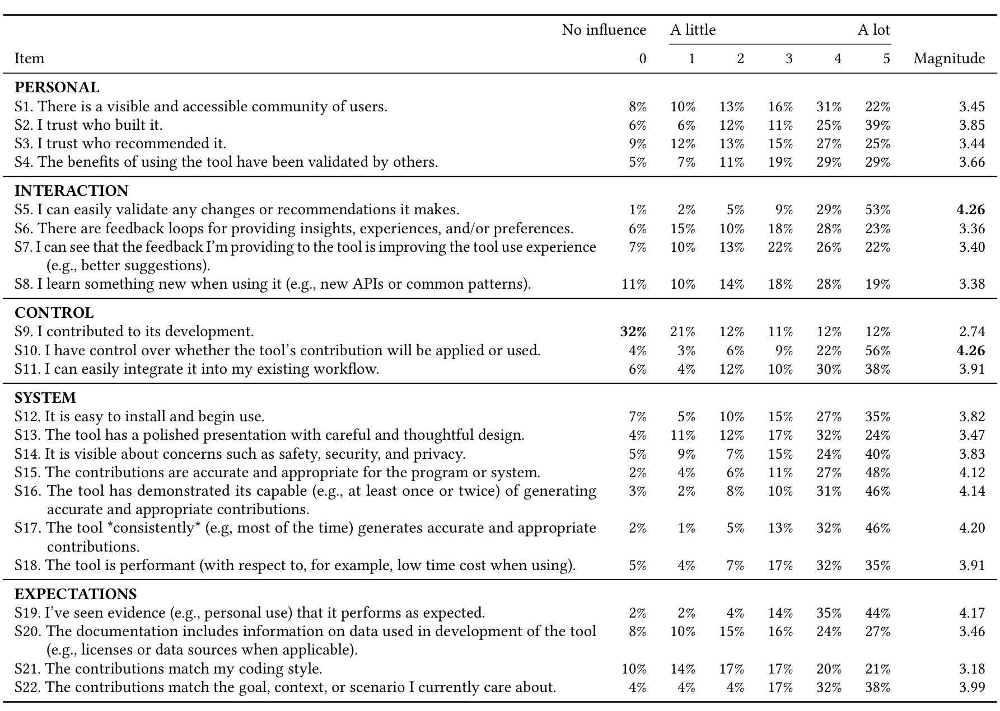

Table 4. Importance of trust factors of the PICSE framework

> “That’s certainly something when thinking about the design or how to just give verbiage that describes how the tool will work. You want to be cognizant of making sure that you’re very accurate with those expectations.” (P8)

Put it plainly, and in the words of P4, any given tool “should really be good at one thing.” Our findings suggest tools should be explicit and upfront about what the tool can and cannot do in order to build trust.

### 3.2 Factor Importance (RQ2)

We analyzed data from our survey to identify the importance of the factors in the PICSE framework (RQ2). We asked “On a scale from 0 (no influence) to 5 (influences a lot), how do the following factors influence your trust in an AI-assisted software tool” for a list of 22 factors related to the PICSE framework. To control for ordering effects, we randomized the order of factors presented within the survey.

Table 4 shows the results of our analyses grouped by the five dimensions of PICSE. For each factor (row), we report the percentage of respondents who indicated no influence (0), the distribution of influence scores (1–5), and the magnitude, which we define as the average influence score of non-zero responses.

Manuscript submitted to ACM