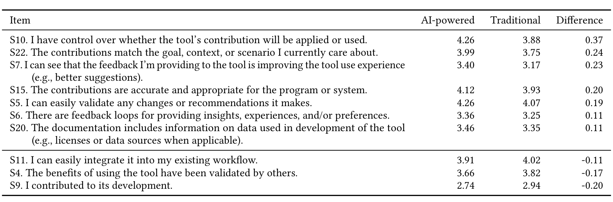

Table 5. Difference in importance of trust factors between traditional and AI-powered software tools. All differences are significant at 0.05. The table is sorted from largest difference in magnitude to smallest difference.

We can see that all factors were reported as having some influence on trust. The factor “I contributed to its development” was the only one with a substantial portion of no influence responses (32%); it also has the lowest magnitude among all factors (2.74).

The following dimensions and factors had the highest magnitude of influence among our respondents:

> “I can easily validate any changes or recommendations it makes.” (S5, 4.26)

> “I have control over whether the tool’s contribution will be applied or used.” (S10, 4.26)

> “The tool *consistently* (e.g., most of the time) generates accurate and appropriate contributions.” (S17, 4.20)

> “The tool has demonstrated its capability (e.g., at least once or twice) of generating accurate and appropriate contributions.” (S16, 4.14)

> “The contributions are accurate and appropriate for the program or system.” (S15, 4.12)

> “I’ve seen evidence (e.g., personal use) that it performs as expected.” (S19, 4.17)

These findings suggest that when building trust, it’s important for AI-powered tools to generate accurate and appropriate contributions, allow for validation and control of its recommendations, and demonstrate its reliability. They also suggest that to engender trust in AI-powered tools it is important to consider multiple dimensions, as the factors with the highest influence cut across 4 different dimensions of PICSE.

We also asked the trust question for traditional software tools: “On a scale from 0 (no influence) to 5 (influences a lot), how do the following factors influence your trust in a traditional software tool?” Table 5 shows the factors for which a paired Wilcoxon test reported statistical differences at p < 0.05.

These findings suggest that compared to traditional tools, developers find it important to have control over whether AI tool contributions are applied and to ensure these contributions match their current goals and contexts. Additionally, they value seeing that their feedback improves the tool, that contributions are accurate and appropriate, that changes are easily validated, that feedback loops exist, and that documentation includes information on data used in tool development.

On the other hand, it is less important for AI-powered tools to easily integrate into workflows, to have been validated by others, and for developers to have contributed to the development.