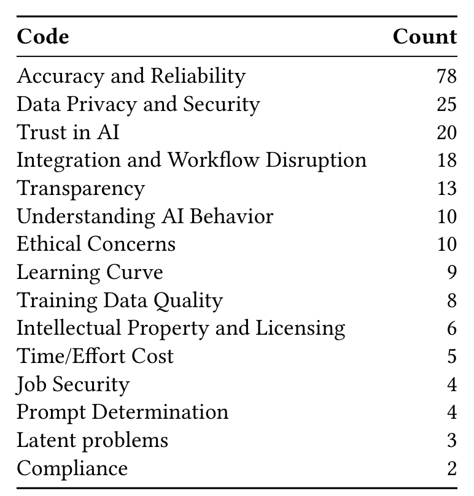

Table 6. Categories of concerns about AI-assisted tools

### 3.3 Building & Sustaining Trust in AI-Assisted Tools (RQ3)

Understanding how to build and sustain trust in AI-assisted tools is essential for tool developers, especially given the dynamic and evolving nature of AI systems. By examining survey responses, we identified several desired improvements that can enhance trust, as well as common concerns that developers face when using AI-assisted tools.

In this section, we first outline the improvements that users believe are necessary for building initial trust and increasing long-term use of AI tools. We then explore how developers’ trust in AI-assisted tools evolves over time, highlighting factors that contribute to both increases and decreases in trust. Finally, we delve into the primary concerns surrounding the use of these tools, ranging from accuracy and privacy to transparency and ethical issues. These insights are tied back to the broader PICSE framework, providing a holistic understanding of the factors that influence trust and how they can be applied in practice.

#### 3.3.1 Concerns Surrounding AI-assisted Tools

To better understand the concerns developers have regarding AI-assisted software tools, we asked the open-ended question “If you have had experience with one or more AI-assisted tools, can you share any concerns, reservations, hesitancies, etc., that you had prior to using them?” This question was answered by 143 survey respondents. Table 6 contains the full list of codes and number of responses for each code (Note that some responses map to multiple codes from the table). Given the volume and diversity of concerns, and space constraints, we limit our discussion to the most frequently reported concerns.

The most common concerns mentioned related to Accuracy and Reliability. Developers expressed significant concerns around the tendency for AI-assisted tools to generate incorrect solutions that take time to review and correct or that may not be caught at all. One participant shared:

> “LLMs [...] might even create code that appears correct to a software engineer that isn’t entirely familiar with the syntax/library/API being used, but then causes more of a time sink because the developer has to now spend their time debugging the AI-generated code.”

Additionally, it was feared that the AI could be “producing code that looks like it could land [but] is different than generating code that should [SIC] land,” illustrating the concerns around both accuracy and reliability.

Manuscript submitted to ACM