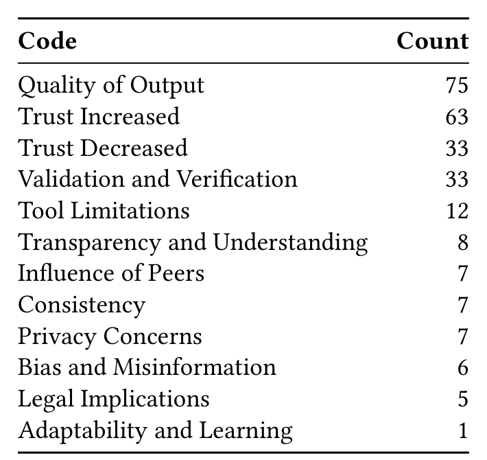

Table 7. Changes in trust when using AI-assisted tools

with thematic codes following the process described in Section 2.3. Table 7 shows the codes and how often they occurred across responses.

Almost half (75) of the responses mentioned Quality of Output of the tool they were using. Interestingly, this theme was mentioned whether the response said the trust increased, decreased, or did not change. On one hand, developers expressed increased trust in AI tools due to their ability to generate correct and useful output when performing tasks. One respondent noted, “[AI] can do it quicker and add content that I generally do not usually include (like comments for example)”. This positive sentiment was also reflected in responses about AI-assisted tools that help write scripts and provide helpful suggestions to optimize workflows. In general, these responses indicate AI as a productivity enhancer, with one stating “AI tools used to be a lot less advanced so I took everything they did with a grain of salt. Now, there are use cases where they are highly accurate.”

Conversely, other responses amplified considerable concerns about AI-assisted tools’ reliability, accuracy, and potential to fabricate results. Some respondents highlighted that they had found instances of AI producing incorrect or incomplete code, generating code with legal concerns, or confidently providing inaccurate suggestions. This response characterizes this view: “I’ve had to go back-and-forth with the tool because it would give code that had typical bugs in it... it can’t actually execute the code or understand all the compiler rules.” Another developer pointed out the subtlety and risk of AI’s strong ability to generate code, stating that “Now, their presence and failures are much more subtle and likely to go unnoticed. They are often confidently and believably incorrect.” Taken together, these findings show that whether trust increases or decreases seems to depend heavily on the AI-assisted tools’ ability to consistently output high-quality content (usually code).

Another theme that emerged was the need to Validate and Verify the output of AI-assisted tools. Again, there were mentions of this both increasing and decreasing trust. On the positive side, responses highlighted the value of AI tools as a reference and a source of suggestions and ideas even if they needed to be validated. The process of validation was seen as a way to leverage the value of the AI while still avoiding problems, with one user stating, “I can view its suggestions and not take bad ones.” Another user noted that seeing improvement in the tool over time as they validate the output contributed to their continued use: “The output has gotten better, there are fewer times I need to adjust what it gives me. This makes me want to use it more.”

Manuscript submitted to ACM