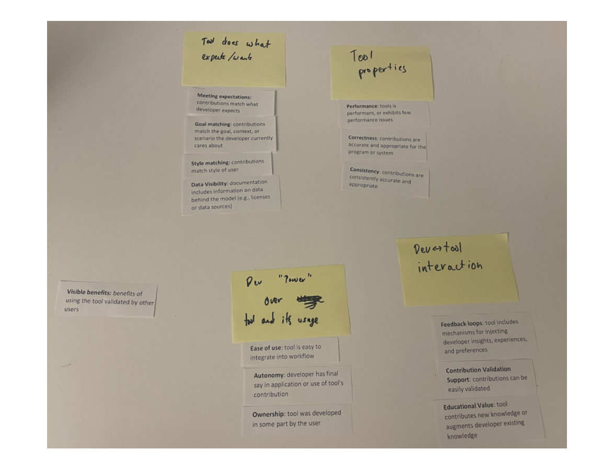

Fig. 2. Snapshot of the open card sort conducted to elicit final set of categories for the PICSE framework.

Conducted validation tasks to improve the trustworthiness of our findings. Following guidelines by Lincoln & Guba [29], we invited an outside auditor to review our methodology and developing codebook. Our external auditor is an empirical researcher that is external to Microsoft, an expert in qualitative work, and has published qualitative work in top-tier venues. They have knowledge of the space in which we are collecting data (human factors and software tools).

We provided the auditor with samples of raw, coded data along with the coding process and codebook used. We gave instructions to confirm that the initial codebook was in fact driven by the interview script, the emergent codes were properly documented, and that the inferences from the data made sense. We discussed and revised codes based on this person’s feedback, but there were no disagreements in our coding and categorizing the data. Under their advice regarding our code and category descriptions, we updated code and category descriptions, as well as corresponding examples when necessary. Our final codebook, which includes 31 codes across six categories, can be found in the supplemental materials [24].

Once we determined our final set of codes, the final step in our data analysis was to conduct a thematic analysis of the resulting codes and categories [11] to determine the high-level themes that would form the PICSE framework. This process was also led by the first author, who started by creating code groups in ATLAS.ti in order to narrow data analysis to quotations that map to trust in software tools. For example, our analysis yielded a total of 8 code groups (Background-Job, Background-Tools, Humans & AI, Tool Ideas, Traditional vs. AI-Assisted Software Tools, Trust in AI-Assisted Software Tools, Trust in Humans, and Trust in Traditional Software Tools), only two of which were specific to trust in tools.

In the first iteration through these relevant code groups, the first author went through each of the quotations and documented the higher-order themes as they emerged across quotations and groups. For example, across code regarding initial trust and building trust emerged the theme community where participants often discussed the importance of a user community surrounding a given software tool. After going through all the quotations that mapped to trust in tools, the first author made a second pass through the emergent themes to identify any potential overlap across themes.

Manuscript submitted to ACM