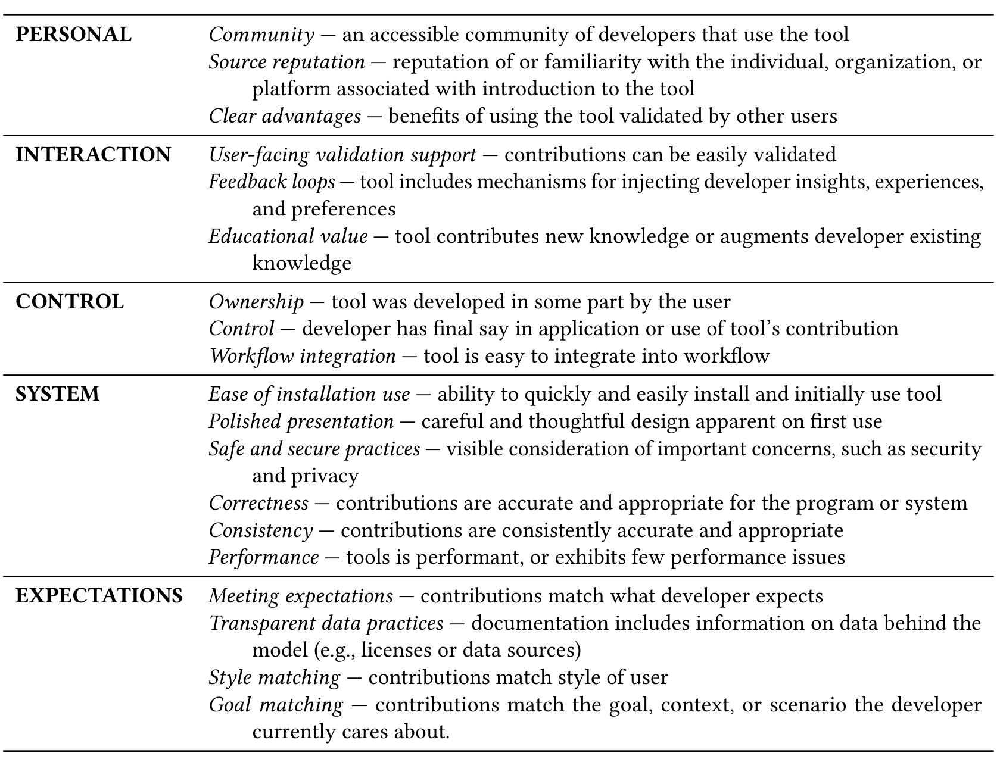

Table 3. The PICSE framework for trust in software tools.

> *I'm qualitatively analyzing responses in a survey about AI-assisted SE tools. I need help with codes for initial labeling provided responses. Please provide up to 10 labels that categorize these responses (may fall under more than one). Output both label and short description of what label represents (codebook) in JSON format <example of format>.*

The model returned a JSON file containing a list of codes. Each code included a label and a corresponding description. All anonymized survey responses easily fit within the context window of the model, allowing for effective analysis.

For each survey question, two raters were assigned to independently code the responses using the GPT-4-generated codes as a starting point. Each response could be assigned one or more codes. Throughout this process, we refined the initial set of codes to better capture the nature of the responses. This refinement included removing irrelevant codes, merging similar codes, and introducing new codes that emerged from the data.

Once both raters completed their initial round of coding for a given question, they met to discuss and finalize the set of codes for that specific question. The raters then conducted a second pass, coding the responses again using the updated codebook. After both passes were completed, we held a final meeting to merge the codings and reach a consensus on the final coding for each question. The final codebook is available in supplemental materials [24].

Manuscript submitted to ACM