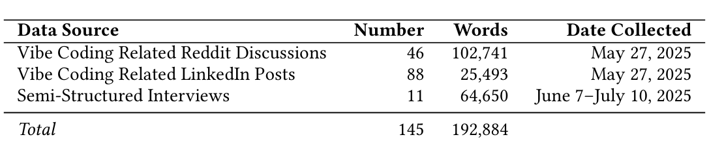
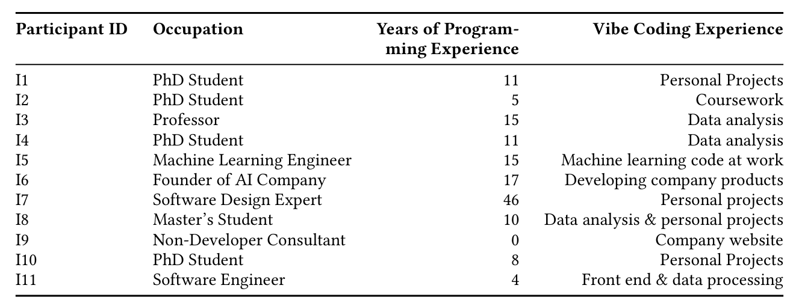

## Good Vibrations? A Qualitative Study of Co-Creation, Communication, Flow, and Trust in Vibe Coding

VERONICA PIMENOVA, University of Michigan, USA  
SARAH FAKHOURY, Microsoft Research, USA  
CHRISTIAN BIRD, Microsoft Research, USA  
MARGARET-ANNE STOREY, University of Victoria, Canada  
MADELINE ENDRES, University of Massachusetts Amherst, USA

Vibe coding, a term coined by Andrej Karpathy in February 2025, has quickly become a compelling and controversial natural language programming paradigm in AI-assisted software development. Centered on iterative co-design with an AI assistant, vibe coding emphasizes flow and experimentation over strict upfront specification. While initial studies have begun to explore this paradigm, most focus on analyzing code artifacts or proposing theories with limited empirical backing. There remains a need for a grounded understanding of vibe coding as it is perceived and experienced by developers. We present the first systematic qualitative investigation of vibe coding perceptions and practice. Drawing on 190,000+ words from semi-structured interviews, Reddit threads, and LinkedIn posts, we characterize what vibe coding is, why and how developers use it, where it breaks down, and which emerging practices aim to support it. We propose a qualitatively grounded theory of vibe coding centered on conversational interaction with AI, co-creation, and developer flow and joy. We find that AI trust regulates movement along a continuum from delegation to co-creation and supports the developer experience by sustaining flow. We surface recurring pain points and risks in areas including specification, reliability, debugging, latency, code review burden, and collaboration. We also present best practices that have been discovered and shared to mitigate these challenges. We conclude with implications for the future of AI dev tools and directions for researchers investigating vibe coding.

CCS Concepts: • Software and its engineering → Software development techniques; • Human-centered computing → Natural language interfaces.

Additional Key Words and Phrases: Vibe Coding, AI Co-creation, Flow, Trust, Qualitative Methods

## 1 Introduction

> “It’s not about chaos. It’s about flow — writing code in a rhythm where your mind is free to create, unburdened by boilerplate.” (L46)

The phrase “vibe coding” was first introduced by AI researcher Andrej Karpathy in February of 2025 and immediately became popular because it sparked imagination and captured the enthusiasm of a new style of accelerated creative programming using LLMs that frees the developer from the usual constraints of thinking about technical and engineering details before getting into the “vibes”. The term, however, has been criticized1 as it may trivialize the importance of AI-supported development. Despite these criticisms, and a lack of a formal definition or agreement of what this term means, the phrase is frequently used and may be in part responsible for steering a shift toward a new paradigm of programming that is less reliant on clarifying requirements up front.

1 See Hacker News for a discussion around this criticism, sparked by comments by Andrew Ng

---

The timing of this framing has also coincided with an industry movement towards improving the “experience” of developers. This movement recognizes that joy while programming can lead to software solutions that are not only more creative [18, 19], but also bring joy to the customers of that software. It of course also coincides with extensive research to understand the impact of Gen AI on development velocity and software quality.

The speed of this unique paradigm shift warrants an investigation to understand what “vibe coding” is evolving to “mean” and what this may signal for the future of software development and engineering practices. Our timely research seeks to understand what a community of developers mean when they use this phrase, why experts and non-developers vibe code, and how they do so. We also seek to uncover perceptions towards the software they create, and the challenges they face. In addition, we investigate the perceived risks of abandoning a traditional, principled, design-forward approach to software engineering. Specifically, we examine what it means for developers to embrace LLMs in helping them arrive at solutions they may not have anticipated when they sat down to vibe code. The importance of studying a potentially new programming paradigm is evident by emerging research on arXiv (see related work in Section 6).

To best capture the multifaceted aspects related to “vibe coding”, we perform a qualitative analysis using a mix of data sources including both social media posts and semi-structured interviews. Regarding social media, a “community of practice” [56] has formed around vibe coding on Reddit and LinkedIn social media platforms. On Reddit, the community has grown to 159K members, and posters describe their experiences, share their concerns and best practices, and seek feedback on the products they “vibe code”. For our analysis, we scraped key Reddit posts from r/vibecoding and LinkedIn, where we searched for recent and popular posts tagged with #vibecoding. We further conducted 11 interviews with practitioners to gain deeper insights on their practices, challenges, and experiences. In total, we use a flexible qualitative methodology [12] to analyze over 190,000 words on vibe coding experiences and practice.

Our integrated analysis leads to a theory that connects how vibe coding is seen by many as a new interaction paradigm for software development, that supports the co-creation of software by humans and AI agents, and captures the psychological flow experiences of developers while “vibing”. We further capture the pain points developers encounter, and the practices they have adopted to address these pain points. We also show that trust in AI mediates the co-creating experience and impacts vibe coding flow. Finally, we share the main risks that developers are concerned about in vibe coding’s emerging community of practice. Succinctly, our paper leads to the following main four contributions:

1. A definition and empirically grounded theory of vibe coding that connects interaction, co-creation, flow, and trust.
2. A characterization of practice: where and why vibe coding happens, what developers delegate, and how they guide models.
3. A synthesis of pain points and strategies, including communication, planning/abstraction, verification, code quality, and collaboration concerns.
4. Implications for tools and research: guidelines and affordances to support flow without eroding reliability or team coordination.

## 2 Background

To provide context for our study, we overview background relating to natural language programming paradigms (Section 2.1), AI co-creation (Section 2.2), and flow (Section 2.3).

---

### 2.1 Natural Language Programming Paradigms

We use natural language programming to denote approaches where developers use everyday language to specify, modify, or orchestrate software, drawing on HCI work on “natural programming” that examines how people express computational intent before learning formal syntax [36].

The ambition to program with natural language dates to early computing. Business-oriented languages such as COBOL adopted English-like syntax to broaden access [7]. The fourth-generation language (4GL) movement pushed toward declarative, task-level specification promising “programming without programmers” via high-level abstractions for data and business logic [22]. Pure natural language, however, proved insufficient without grounding, connecting language to executable semantics within well-defined domains. Classic AI systems grounded language in narrow, executable domains such as SHRDLU in a blocks world that turned commands into actions and explanations [57], and LUNAR by translating Apollo geology questions into structured database queries with checkable results [58].

Two complementary strategies emerged to manage ambiguity. Controlled natural languages (e.g., Attempto Controlled English) restrict grammar and vocabulary so sentences map deterministically to logic [15, 16]. In parallel, programming by demonstration (PBD) and by example (PBE) infer intent from concrete artifacts [11], later formalized by program synthesis methods like FlashFill [21] that solve for programs from I/O pairs or partial specifications [53]. Collectively, these show that natural language works best when paired with examples, types, tests, or partial programs.

Machine learning shifted the field from rule-based translation to learned, data-driven mappings. Early statistical semantic parsers mapped utterances to logical forms with probabilistic models [63, 64]. Deep learning then enabled sequence-to-sequence NL→code trained on parallel corpora, performing best where executable oracles provide objective verification. For example, text-to-SQL on Spider [61], Python snippets in CoNaLa [60], and model evaluations like Codex on HumanEval [6]. Pairing neural flexibility with deterministic checks proved crucial.

Large language models trained on code broadened scope and interaction. Systems like Codex moved beyond domain-specific mappings to general-purpose languages [6], enabling conversational programming where developers iteratively describe goals, request modifications, and refine implementations in natural language [47]. This elevates language from a translation interface to a primary programming surface, but without systematic specification or testing, iterations can drift and compound errors.

We organize natural language programming along three design axes:

- Interaction mode: one-shot translation vs. conversational refinement.
- Grounding strategy: pure NL vs. NL augmented with artifacts (I/O examples, tests, types, schemas, partial programs).
- Verification: ad-hoc inspection vs. systematic oracles (unit/property tests, expected outputs, formal specs).

These axes clarify trade-offs between fluid interaction and precise specification, naturalness and semantic grounding, and creative exploration and correctness guarantees.

Different paradigms occupy distinct regions of this space (Table 1). NL→code systems often use one-shot interaction with limited grounding and rely on manual verification [6]. NL→DSL [29, 61] and PBE [21] trade expressiveness for reliability via schema/DSL constraints or executable oracles. Conversational environments emphasize high-interaction dialogue [47], progressively building grounding via context [2], though verification often remains informal [54].

Vibe coding occupies the high-interaction, low-grounding corner: developers iterate in dialogue with minimal formal scaffolding, relying on improvisational verification and run–refine loops. This aligns with exploratory programming where goals evolve through programming [24]. Sections 4.2–4.5 examine how practitioners navigate these trade-offs, what this affords for rapid progress, and where it strains reliability.

Manuscript submitted to ACM

---

> **Image description:** A four-column table maps programming paradigms across three design axes: Interaction, Grounding, and Verification. Rows list example paradigms and systems (NL→Code: Codex, Copilot; Conversational: ChatGPT, Claude; NL→DSL: Spider, NL2Bash; PBE: FlashFill, Sketch) and place Vibecoding (this work) in the space. Vibecoding is contrasted with others by having High/Conversational interaction but Low/Minimal grounding and Ad-hoc/Improvisational verification, whereas NL→DSL and PBE emphasize high grounding (schemas or I/O pairs) and executable oracles for verification, and one-shot NL→Code approaches sit at lower interaction with manual/ad-hoc checks. The visual highlights that vibe coding prioritizes fluid dialogue with the model over formal grounding or systematic verification, aligning with the paper’s claim that vibe coding favors interaction fluidity over precise specification and testing.

Table 1. Natural language programming paradigms characterized by our three axes. Vibecoding prioritizes interaction fluidity over formal grounding and verification.

### 2.2 Other Paradigms of AI Co-Creation

Work on AI-assisted programming and design often makes user intent explicit and interpretable, in contrast to the intuition-driven style of vibecoding. Building on instrumental interaction theory [3], Riche et al. advocate reified controls—sliders, prompt fragments, and other manipulables—that let users externalize, adjust, and reuse intentions rather than iteratively retyping prompts [45].

Studies also underscore the value of structured collaboration. Designers report AI is most useful as an ideation partner that expands the solution space [25]. In programming, proactive assistants such as Codelleborator improve efficiency when help is timely and context-aware, but poor timing harms flow [44]. Co-creation quality thus depends not only on what the AI generates but on when and how it is invoked.

A complementary line treats code as a medium for exploration. Pail elicits and tracks goals while surfacing implicit LLM decisions, using LLM-synthesized, executable prototypes as disposable sketches to test alternatives and trade-offs [62]. Code Shaping enables direct manipulation of code via free-form sketches, arrows, pseudocode, and natural language on or around the source [59]. Together, these systems frame co-creation as iterative design that moves between problem and solution spaces, privileging executable sketches and direct manipulation over one-shot generation.

Other paradigms suit non-developers such as end-users and scientists. In a “specify-and-verify” workflow, users ground intent with concrete input/output examples and steer solutions by running code against those examples [42]. Strong examples improved task intent and code quality more than programming expertise, and outperformed model-driven clarification. Field observations of scientists show similar practices, using LLMs like searchable documentation to explore APIs, then verifying via run-and-inspect with emphasis on correctness and reproducibility [39]. Both lines illustrate co-creation through concretized intent and empirical checking.

These approaches emphasize reproducibility and clear specification. Vibecoding takes a different tack, favoring rapid, minimally formal iteration where users adjust only when outcomes diverge from goals. This immersive, flow-oriented style is the focus of our investigation.

### 2.3 Flow and Software Development

Early reports by vibecoders describe feelings of a flow state while “vibing,” and although we didn’t start our study with the intention to study flow, flow and feelings of joy emerged as salient aspects of how developers feel and what motivates them to vibe code. The original theory of flow lays out a rich set of characteristics and key conditions for flow. We use these constructs to interpret how vibecoders interact and co-create with AI in our analysis (described later in our paper).

Csikszentmihalyi coined the term flow to describe the optimal psychological experience humans feel when they are immersed in an activity that is intrinsically rewarding [8]. Flow occurs when people lack self-consciousness of their

Manuscript submitted to ACM

---

actions, lose track of time, but feel they are more in control of tasks that feel effortless with minimal conscious effort needed to guide decisions [8].

For flow to occur, certain conditions are important [8]. Tasks need to be challenging enough to increase a person’s skills but not cause stress, and for a person to feel in control they need to feel confident in their capabilities and receive ongoing feedback on progress towards clear intermediate goals. Flow experiences are enhanced when shared with others who collectively believe and trust in their shared capabilities to be creative [8, 48]. Collective flow experiences enhance creativity, learning, and motivation [9].

In software development, developers enter a flow state when immersed in coding or debugging activities, and it is an important aspect of the developer’s experience [19]. SE researchers have studied a number of barriers to flow such as interruptions [30, 46, 65], distractions [34], lack of focus time [4, 27, 46], tool friction [4, 46], or getting stuck while waiting on others [46]. Csikszentmihalyi makes less mention of these or other barriers to flow and instead emphasizes the characteristics and conditions for flow to occur. Meyer et al. touch on the importance of goal setting to facilitate flow in development [34], while other researchers touch on how fast feedback may facilitate flow [38, 41]. Finally, Ritonnummi et al. describe how not enough (or too much) challenge during development may not lead to flow [46].

More recent research on GenAI use in SE has found that developers are more likely to experience flow [5, 13, 23, 32]. In our study of vibe coding, we build on this work and find developers eloquently articulate how vibe coding supports the necessary conditions for flow. The natural language interface for vibe coding enhances creativity, and the high-iteration approach of vibing and reification of early ideas provides critical feedback to developers of their continuous progress towards intermediate goals. The characteristics and conditions for flow emerged during our analysis of vibe coding interactions and experiences.

## 3 Methodology and Research Questions

Our goal was to develop a theory of vibe coding practice and experience that is rigorous, and generalizable, while still capturing heterogeneous practitioner perspectives. We collected data from public social-media posts (Reddit and LinkedIn) and semi-structured interviews, triangulating across sources to reduce bias and strengthen validity. Using a well-established flexible qualitative methodology [12], we used iterative analysis to build consensus between authors. The rest of this section details our data collection, dataset, and analysis methodology. Our replication package contains our data, codebook, analysis documents, and survey instrument.

### 3.1 Guiding Research Questions

To guide data collection and analysis, we collectively formulated five initial research questions (RQs):

- RQ1–Definition: What is vibe coding?
- RQ2–Practice: Why do programmers vibe code and when do they do it?
- RQ3–Perceptions: What are the perceptions towards vibe coding?
- RQ4–Pain Points: What are the challenges and risks associated with vibe coding?
- RQ5–Best Practice: What best practices are emerging to handle these challenges?

These initial questions were developed via discussions between all authors over a series of weekly meetings. To aid in question construction, authors engaged in a process of prolonged engagement [20], reading hundreds of vibe coding posts across various social media platforms. In qualitative research, research questions serve as orienting tools; they help guide data collection, coding, and interpretation, but they can change over the research process and do not always lend themselves to neat, definitive answers [1]. While we consider all of these questions in our analysis, we do not

Manuscript submitted to ACM

---

> **Image description:** A three-row table listing the study’s data sources and collection details: (1) Vibe-coding Reddit discussions — 46 threads totaling 102,741 words, collected May 27, 2025; (2) Vibe-coding LinkedIn posts — 88 posts totaling 25,493 words, collected May 27, 2025; and (3) Semi-structured interviews — 11 interviews totaling 64,650 words, collected June 7–July 10, 2025. A final row shows the combined totals: 145 items and 192,884 words. The table documents the provenance and relative contribution of each source used in the paper’s qualitative analysis (Reddit provides the largest single share of words).

Table 2. Overview of data sources analyzed in this study.

We organize our findings as one-to-one answers. For clarity and coherence, we conclude the results section with a summary in Section 5 that maps each research question to the most relevant findings.

### 3.2 Data Collection

To both capture generalized perspectives and also permit data triangulation, we collected data from three sources: Reddit, LinkedIn, and semi-structured interviews. These sources represent a mix of public anonymous discussion, public identified posts, and private opinions. Table 2 overviews the size and content of each data source. Throughout this paper, textual quotes are labeled by data source (R for Reddit, L for LinkedIn, or I for Interview) and post number for clarity.

**Reddit Data:** A platform of topic-specific forums with distinct community norms, Reddit is a major venue for programming discussions and has been widely used in academic research on online communities and professional practices [14, 43]. In software engineering, Parsons et al. studied Reddit threads to understand developers’ privacy concerns, demonstrating how programming communities on Reddit surface perspectives and experiences around real work contexts [40]. The subreddit r/vibecoding was created on February 8th, 2025 (just six days after the term was coined), and has already grown to 156,000 members, ranking in the top 1% of Reddit communities2. Posters share experiences, ask for feedback, and exchange memes about vibe coding. Related discussions also appear on forums like r/ProgrammerHumor and r/cursor.

To capture a range of perspectives, we collected our data set via four Reddit queries: two across all posts on r/vibecoding (top posts of all time, most recent posts) and two across all Reddit forums via a search for “vibe coding” (most relevant posts, top of all time). From each search, we used a new incognito browser and scraped the first 20 results, resulting in 80 threads (posts plus comments). As this process could have resulted in duplicate or irrelevant posts, we manually screened all 80 threads, resulting in a final set of 66. We analyzed a random subset until saturation (46 threads, 102,741 words; see Section 3.3). All data was collected on May 27th, 2025.

**LinkedIn Data:** Unlike Reddit, LinkedIn posts are typically tied to real names and professional identities. This makes LinkedIn a valuable contrasting data source, capturing vibe coding discussions in a reputationally sensitive context. We collected 99 posts by searching for #vibecoding: 50 of the posts were the most recent (as of May 27th, 2025) and 49 were top-liked posts. After removing duplicates and manually screening for relevance, we analyzed 88 unique posts (25,493 words).

**Semi-structured Interviews:** To gain deeper insights, we conducted 11 semi-structured interviews with vibe coding practitioners. Each interview was structured around our five initial guiding research questions (see Section 3.1), with room left open to follow-up on interesting comments. We performed a pilot interview to finalize our script. Interviews were conducted via Zoom or Microsoft Teams, lasted 30–60 minutes, and were recorded and transcribed. Recruited through snowball sampling and a post on r/vibecoding, participants completed a pre-interview survey on their programming and vibe coding experience. To be eligible, participants had to have vibe coded before. Our sample

2 https://www.reddit.com/r/vibecoding/, Reported size as of September, 2025

Manuscript submitted to ACM

---

> **Image description:** A three-column table of the 11 interview participants (I1–I11) showing occupation, years of programming experience, and how they use vibe coding. Participants include four PhD students (I1, I2, I4, I10), a professor (I3), a master’s student (I8), industry roles such as a machine learning engineer (I5), a founder (I6), a software design expert with 46 years (I7), a non-developer consultant with 0 years (I9), and a software engineer (I11). Reported programming experience ranges from 0 to 46 years, and reported vibe-coding use spans personal projects, coursework, data analysis, company product development, machine‑learning work, company website building, and front-end/data-processing tasks—illustrating a broad mix of backgrounds and contexts in which participants apply vibe coding.

Table 3. Interviewee programming experience, occupation, and vibe coding experience. All participants have tried vibe coding, and many regularly vibe code for personal projects, school, or work. One participant (I9) had not had programming experience before vibe coding.

included a range of backgrounds, from computing students to professionals with over 40 years of experience (Table 3). Interviewees were not compensated, and we stopped after reaching saturation with respect to our preliminary analysis of the social media data (see Section 3.3).

### 3.3 Analysis Methodology

We followed Deterding and Waters’s flexible qualitative analysis approach [12]. Adapted from grounded theory, this approach facilitates directed but flexible analysis of a large number of texts (N > 30) using Qualitative Data Analysis (QDA) Software. Though originally developed for interviews, it has been successfully applied to programming-related social media posts [37], making it well-suited to our study. Our methodology involved three stages: (1) applying top-level index codes related to our research questions, (2) developing and applying analytic low-level codes, and (3) iterative validation and grouping of analytic codes via iterative axial coding. All stages were conducted in the QDA NVivo 15, with Miro boards supporting collaborative axial coding.

#### Analysis Stage 1 — Index Codes

In the first pass, three authors applied seven high-level index codes to broad sections of text. Five were based on our guiding research questions: Definition, Practice, Perceptions, Pain Points, and Best Practice. We added an index code for Future Desires after team discussion. Following Deterding and Waters [12], we also marked particularly concise or evocative passages as Interesting Quote. While indexing, coders wrote memos that were discussed every week. These memos served as the foundation of the analytic codes applied during stage 2.

#### Stage 2 — Developing and Applying Analytic Codes

Two authors reviewed text within each index code to develop low-level analytic codes, using in vivo coding where possible, an approach where participants’ own words become the names of codes [26]. This approach can result in a large number of low-level codes, so the authors met regularly to regroup codes and identify themes. Saturation for a data source was reached when no new codes emerged in a new document.

We did not compute inter-rater reliability (IRR). Instead, we used a negotiated agreement: researchers independently coded subsets of the data, then met to resolve differences and build consensus, repeating this iteratively during codebook development. As McDonald et al. [31] argue, IRR is not always appropriate for qualitative research as it can falsely suggest objectivity, discourage interpretive disagreement that strengthens analysis, and is often misaligned with theory-building goals. In our study, codes were not treated as fixed “labels” for quantification but as analytic tools to surface

Manuscript submitted to ACM

---

and refine emerging themes. Our emphasis on discussion, memoing, and consensus-building provides methodological rigor while remaining faithful to the interpretive aims of our work.

### Stage 3—Iterative Axial Coding
We used axial coding to synthesize key themes by merging and connecting analytic codes into abstract categories and conceptual relationships [55]. We mapped themes to vibe coding practices and experiences. We used Miro [35] for organizing codes and facilitating the axial coding process, enabling effective merging and connecting of codes into abstract categories and conceptual relationships. Reddit data was used to develop the initial codebook and groupings. We then applied this codebook to the interview and LinkedIn data, adding new codes as needed, followed by a final round of axial coding. This approach supported both cross-platform theme triangulation and identification of platform-specific differences.

In this qualitative research, our focus is on investigating diverse perspectives rather than quantifying occurrences. As a result, we do not enumerate the frequency of themes across participant responses to avoid implying statistical significance. Instead, we emphasize the richness of individual insights, highlighting patterns and offering deeper explanatory narratives.

## 4 Findings
We present the findings from our qualitative analysis of social media posts on vibe coding and interviews with vibe coders. Section 4.1 introduces a theory and a definition of vibe coding. Sections 4.2–4.5 explore the four core components of our theory: AI interaction, co-creation, flow and trust. Quotes are in dark purple italics, and are labeled with their data source (Reddit, LinkedIn, or Interview). Dark blue italics denote key code groupings from axial coding (see Section 3.3).

### 4.1 Findings—Definition: What is Vibe Coding?
When he coined the term in February 2025, Andrej Karpathy defined vibe coding as a “new kind of coding... where you fully give in to the vibes, embrace exponentials, and forget that the code even exists”.3 New terms, however, are not ultimately defined by their originator. Terms evolve indexically, meaning their social meaning depends on who uses them and how [52]. This can be especially true of phrases that become memes that are then shaped by who adopts them and how they circulate in online and cultural discourse [51]. We find that practitioners define vibe coding in a variety of ways. For instance

*“Vibe coding is the idea of using LLMs to generate code from natural language”* (L33)

*“Vibe coding is... you don’t care what the code looks like. All you care is that it behaves the way that you expect it to behave. And if you have an error, you take the error message and you feed it back into the genie.”* (I7)

Despite these varied phrasings, we find that most definitions of vibe coding share key characteristics and constructs. Figure 1 presents our proposed theory of what practitioners perceive vibe coding to be and how they experience it. We identify four core, interconnected components: Conversational Interactions with AI (the paradigm), AI Co-creation (the central activity), Flow and Joy (the developer experience), and AI Trust (a key enabling and mediating factor). While we present these four theoretical components as distinct components, it is important to acknowledge that they are closely related and cannot be completely isolated from one another. Our choice to use these specific component boundaries stems from the need to conduct and present our analysis in a structured and coherent way, despite their

---

> **Image description:** A conceptual diagram titled “Vibe Coding Practice, Experience, and Outcomes” showing three numbered core components: (1) The Paradigm — “Conversational Interaction with AI”; (2) The Central Activity — “Co‑Creation with AI” placed inside a shaded region labeled “Mediating Factor: Trust”; and (3) The Developer Experience — “Flow and Joy.” Beneath these, a “Pain Points” box feeds into a “Best Practices” box (arrow labeled “Inform”); best practices are shown to increase flow and to “decrease unverified trust” in co‑creation, whereas pain points directly “decrease” flow. An arrow from the developer experience points to a Risks column listing “Software,” “Developer,” and “Societal” to show that heightened (often unverified) trust and flow can amplify downstream risks. The diagram encodes the paper’s theory that conversational interaction and AI co‑creation enable flow mediated by trust, and that emerging practices aim to restore flow and calibrate trust while addressing pain points.

Fig. 1. Our proposed theory of the vibe coding experience. We identify four core components: Conversational Interaction with AI (the paradigm), Co-creation with AI (the central activity), Flow and Joy (the developer experience), and AI Trust (a key enabling and mediating factor). Developers co-create with AI through natural language conversation to achieve flow. Trust in AI mediates co-creation: increased trust can enable deeper co-creation, thereby enhancing flow. However, increased trust can also lead to increased risks at the software, developer, and societal levels. During both interaction and co-creation, developers experience pain points which can detract from flow. Emerging best practices often ameliorate these pain points, and increase flow.

interconnectedness. Grounded in data, we aim to meaningfully convey the complexities of vibe coding practice and experience.

Overall, we find that vibe coding is an emergent, AI-based programming paradigm grounded in natural language interaction and co-creation with an AI agent. It is as much a mindset as a method, prioritizing flow, experimentation, and joy over precision or control. AI trust acts as a mediating factor for co-creation: greater trust can amplify flow and creative freedom (or, as some practitioners call it, "just vibes" (L33)). As a result, some vibe coders treat the AI as a capable partner and co-creator, even allowing it to make architectural or design decisions with minimal oversight.

However, this same trust can also increase risk at the software, developer, and societal levels. As a result, some vibe coders prefer to delegate tasks to AI rather than co-create. As one interviewee put it, vibe coding exists on "a continuum" (I6) with other AI-powered programming paradigms, such as agentic coding. Most commenters agree that vibe coding is a distinct and "new way to build" (L81); they differ in how much trust, interaction, or co-creation is required to "count" as vibe coding.

These definitional disagreements may stem from the polarized opinions we observed across the three data sources. Some programmers praise vibe coding as (e.g., "close to magic" (L18), or say it "brings back the joy of programming" (I7)), while others harshly critique the practice and its practitioners (e.g., "So is vibe coding just the dumb-ass version of using AI" (R79), or "Dunning-Krueger Coders" (R1)). These polarized views call for a deeper exploration of the paradigm, activities, developer experience, and trust dynamics involved.

## 4.2 Findings—The Paradigm: Vibe Coding and Conversational Interaction with AI

The first of our four main aspects of vibe coding is: Conversational Interaction with AI. Participants and commenters on Reddit and LinkedIn describe vibe coding as a new programming paradigm, where programming occurs via interaction with AI through conversational natural language. "Vibe coding is when you ask ChatGPT to build software for you—spinning up code, APIs, or entire servers through conversation alone." (L32) During these natural language conversations with generative AI, the programmer iteratively tries to communicate and refine their intent and goals to the agent. As one

Manuscript submitted to ACM

---

interviewee said, “vibe coding... is just conveying language through language, what you want to happen, or what you want to be done” (I1).

The focus on natural language often extends to how the vibe coder engages with code artifacts. Vibe coding interactions are characterized by little to no code reading and writing. “Ideally, you should not have to interact with the code at all, ... you’re just guiding the tool” (I8). At times when, during traditional programming the programmer would read or modify the program, the vibe coder instead would ask the AI. “I think it’s basically telling, [the agent]... what you want to code, ... You want to fix something, maybe you’ll ask it again instead of, you know, fixing it yourself.” (I10)

Vibe coding also has frequent fine-grained AI interactions, setting it apart from other AI-assisted programming paradigms. One interviewee contrasted it with agentic programming, explaining, “the distinction I make is how much interaction I need to have with the genie... The less I need to interact with the genie, the more agentic it becomes” (I7).

### Paradigm Benefits

Vibe coders perceive several benefits of high-interaction, natural language programming, including reduced cognitive effort, reduced unnecessary learning, increased software development accessibility, and increased flow and joy. Natural language interactions help reduce cognitive effort by offloading low-level concerns. “Having AI deal with the syntax and specifics frees up brain space for the more important work” (R2). This can also reduce unnecessary learning, of tools or languages they would rather not learn. One programmer, tasked with making a timer app in React, stated: “sometimes I literally do not want anything to do with learning how to program something... I fucking hate JavaScript in all [its] forms” (R63).

As vibe coding often involves limited code reading or writing, it can increase accessibility to software development for those without formal programming training. For instance “vibe coding is dramatically lowering the barrier for non-technical users to create full web apps.” (L6). Another interviewee described showing this potential to a non-programmer: “When I explained... [that] you can just build an app on your phone that’s just like every other app, except it does exactly what you tell it to. That was a heavens opening up moment” (I7). This increase in accessibility enables a broader demographic to engage in development, democratizing the ability to innovate and create software.

Finally, natural language programming combined with the short interaction feedback loop can help developers achieve and maintain flow and joy (a defining characteristic of the vibe coding developer experience, see Figure 1). We explore this further in section 4.4.

### Interaction Pain Points and Barriers

Vibe coding AI interaction is not without its challenges. As shown in Figure 2, we find that interviewees and commenters report five primary pain points relating to AI interaction and conversation when vibe coding with current platforms and tools.

First, vibe coders can struggle to accurately specify their intent to the model as natural language is inherently imprecise. Mismatched abstractions can lead the model to “totally misinterpret[e] what I was saying” (I4). In addition, minor changes in phrasing or personas can have unexpected results. For example, one commenter noted “I put in my rules something along the line of being the best senior programmer... and the Agent stopped doing endpoints and session test and... acted like an arrogant know-it-all dev. That was... a problem” (R43). Conveying intent can be particularly challenging for those new to software development.

Vibe coding agents can also suffer from inconsistent conversational memory, causing the agent to repeat incorrect suggestions and get stuck, resulting in a long, useless “prompt spiral” (L51) where “it will just keep re-giving you the same approach, again, and again... Yeah, I would say that’s frustrating” (I10). Vibe coders also report frustration when the agent responds with inaccurate self-assessments of its ability or past actions. “My personal favorite is discovering that what you’re asking relies on essential information from after [its] knowledge cutoff date despite it acting as if it’s an expert on the matter when you ask at the start” (R63).

Manuscript submitted to ACM

---

Commenters also note that vibe coding tools such as Claude or Loveable can have slow or costly responses, exacerbated by model API rate limits, quotas, and server load. “I had issues trying to test Claude with Roo because of these rate limits. It definitely slowed me down” (R75). As put by one interviewee who regularly vibe codes, “just the whole thing needs to be 10 times faster. It doesn't need to be 100 times faster than I can think of, but 10 times faster” (I7).

Finally, some vibe coders report overbearing AI company oversight, where the AI enforces company-imposed behavioral norms or refuses to assist based on tone. One commenter noted, “if you tell Copilot it isn't listening, it gives you the ‘help is available; you're not alone’ suicide spiel” (R63). Others describe the model refusing requests or scolding users for being impolite: “the model said something like ‘You cannot speak to me that way. When you have calmed down, let's try again’” (R36). In general, commenters found company-imposed guardrails to be intrusive and frustrating.

All of these pain points can increase frustration and decrease flow. We discuss how these pain points relate to flow, and the best practices developing to overcome them, in Section 4.4. These pain points also indicate potential directions for future tool support (see our discussion in Section 5).

### 4.3 Findings—The Activity: Vibe Coding and Software Co-Creation

Interviewees and commenters predominantly characterize vibe coding as true co-creation where, rather than solving predefined implementation tasks, the AI often makes higher-order decisions about features and design. As put by one interviewee, vibe coding involves “using an LLM as sort of a co-pilot... You're actively letting that LLM have a hand in critical high-level decisions... [as] a thought partner” (I11). This co-creation is characterized by AI personification, with many describing the LLM as a partner or pair programmer, ascribing the LLM agency and autonomy. In vibe coding, “the LLM is leading the process, as opposed to you leading the process” (I3).

While software co-creation is the primary cited activity in vibe coding, we observe a spectrum from full co-creation to task delegation. For some, vibe coding allows the programmer to better focus on design and architecture while delegating implementation-heavy tasks to AI. “I've been experimenting with ‘vibecoding’, letting AI handle the coding while I focus on steering the ship” (L83). In addition, for a small number of commenters, vibe coding starts the moment the developer uses and trusts AI-generated code that they do not understand. As shown in Figure 1, we propose that this spectrum between delegation and co-creation is primarily mediated by AI trust. We investigate the interaction between co-creation and trust, along with the potential risks of that trust, in Section 4.5.

#### Co-Creation Benefits

Vibe coders report experiencing many benefits relating to software co-creation with AI. Some vibe coders report that co-creation can enhance learning and brainstorming when building software, finding benefits in using AI as a sounding board to ask questions. As mentioned by one interviewee, “every time I say, I wonder, I have the option of finding out” (I7).

Co-creation may also facilitate increased efficiency and productivity. For one commenter, vibe coding “has gotten me to build some pretty complex stuff in 1/4 of the time” (47). Others found the productivity boost particularly apparent when working with unfamiliar frameworks. During their job as a machine learning engineer, one interviewee talked about vibe coding with a framework that was relatively new to them: “Almost all of the PyTest functions I write, I start with having Claude take a crack at it, because... I'm just not fluent enough with that framework yet” (I5). In these cases, co-creation helps reduce ramp-up time and maintain development momentum.

Finally, many commenters described AI co-creation as a source of substantial joy, and sometimes even addictive. One interviewee noted that vibe coding involves “ceding a lot of decision-making authority to the agent” (I6), making it “sort of intoxicating, because normally, you have to make tons of decisions... about everything” (I6). We explore how co-creation supports flow and joy in Section 4.4.

Manuscript submitted to ACM

---

> **Image description:** A two-part diagram that links reported vibe-coding pain points (left) to recommended best practices (right), with annotations showing which flow conditions each practice supports. The top blue section (Conversational Interaction with AI) lists five interaction pain points—AI company oversight; inaccurate self-assessment; specifying intent; inconsistent conversational memory; and slow/costly responses—and maps them to green practices such as mindset management, using AI to refine intent, personas and prompt engineering, external memory aids, proactive conversation management, and intentional API/plan selection (practices are labeled with letter tags like [A,H]). The bottom purple section (Co‑Creation with AI) lists eight co‑creation pain points—large code‑review burden; version control; poor structure/planning; knowledge cutoffs; incorrect solutions; low reliability; debugging/refactoring; and poor code quality—and maps them to practices including AI code review, external version control and AI change logs, planning-first and modular task breakup, tests and well‑documented technologies, rubberducking/AI support, and explicit quality instructions. A legend at top‑right defines the letter codes for flow: Conditions for Flow (A–C: clear goals, balance of challenge/skill, immediate feedback) and Characteristics of Flow (D–H: sense of control, rewarding process, altered time, in‑the‑moment, effortlessness), showing how each practice is intended to bolster specific aspects of flow.

Fig. 2. Mapping between vibe coding pain points, best practices, and characteristics of flow

## Co-Creation Pain Points

However, vibe coding co-creation has its challenges. As shown in Figure 2, we identify eight primary co-creation-related pain points for vibe coders.

Co-creation can break down when the vibe coder encounters technical limitations related to knowledge cut-offs. Some tasks may require working with libraries that were made or modified after the model’s training knowledge-cutoff, making co-creation challenging. These issues can be particularly pronounced when working with a private code base or integrating with legacy code systems. “Since almost every solution we use to common problems is a custom private lib, the LLMs simply have no way of providing value because they know jackshit about my specific issues” (R68).

Technical limitations can lead to low reliability during co-creation. “Planning is boring—until you waste 37+ hours fixing AI hallucinations” (14R). Vibe coding models make mistakes and provide incorrect solutions. Sometimes, these responses may also be incomplete or superficial. Some vibe coders report experiencing the model secretly modifying tests or just deleting code without warning. “The agent will tell me, like, ‘oh, you know, I fixed the tests’ or ‘the tests all passed, except for one which isn’t our fault’. I’m like, no, it’s totally our fault. Like, the tests worked before you started, right?” (I5).

A solution may be correct but may lead to poor code quality, slow or inefficient code, or poor style such as “lengthy solution[s] that violate core principles of the language” (R63). Low response quality during vibe coding is particularly apparent with structure and planning. As reported by one commenter, “if the chat is very big, it will forget everything earlier, it will forget any patterns, design and will start to produce bad outputs” (R4). These structural breakdowns can derail co-creation and increase the burden on the programmer.

Vibe coding also complicates version control; tools often make large code changes that touch many files, for example: “I got too deep in the vibe, took my eye off the ball, and the whole thing spun out of control. I had 30 files in my change log with hours of work uncommitted. It was a fuckup cascade” (R35). These large changes can further lead to challenges with debugging or refactoring; “Vibe coding is one thing, vibe debugging is chaos” (R14).

Manuscript submitted to ACM

---

Vibe coders try to improve quality through manual review. However, large amounts of code review can cause its own problems; “I’m more mentally exhausted at the end of the day these days because... I’m working so damn fast and am in constant code review mode” (R43). This can even break the core paradigm, requiring programmers to return to traditional modes of reading and writing code. We consider the tradeoffs between trust, flow, and vibe in Section 4.5.

### 4.4 Findings—Developer Experience: Vibe Coding and Flow

We find that vibe coding is characterized by a developer experience focused on achieving flow and feeling joy. As put by one commenter, vibe coding is about “the art of feeling the flow of a system rather than rigidly adhering to predefined structures” (R41). As introduced in Section 2.3, flow is a state of deep, effortless engagement, characterized by intense focus, a sense of control, intrinsic motivation, and merging of action and awareness. Csikszentmihalyi identified three conditions that support flow: clear goals, a balance between challenge and skill, and immediate feedback [10]. During flow, the process can be just as rewarding as the outcome of the work.

As shown in Figure 1, we propose that interaction and co-creation enable flow and joy in vibe coding. This theme appeared across all data sources. One commenter even used the term “flow-code” (41) to describe co-creating while vibe coding. Others highlighted how natural language itself fosters flow: “I specifically tried to avoid all direct code writing. vibe all the way” (L25).

This flow state is often accompanied by a feeling of joy. According to an experienced programmer with over 40 years of experience, vibe coding “brings back the joy of programming” (I7), a joy that had been lost through the tedium of software managing dependencies and other software pain points: “Oh, you need to update this Library... no, that doesn’t work because this other library... So I just gave up. And [that’s] part of what makes the Genie magic for me” (I7). For some, this combination of flow and joy causes vibe coding to not be just a paradigm, but instead “a lifestyle” (R13).

While interaction and co-creation enable flow, current pain points (see Sections 4.2 and 4.3) can act as barriers to flow, leading to frustration and breaking concentration. We find, however, that emerging vibe coding “best practices” help re-establish and reinforce the conditions necessary for flow. Figure 2 summarizes how specific practices relate to pain points and key flow characteristics. These practices are relevant not only for end users but also for tool designers and researchers seeking to support effective human–AI co-programming. In the rest of this section, we describe these best practices, and the (possibly multiple) pain points they address while enabling flow. A complete visual mapping from best practices to pain points is available in our replication package.

#### Flow and Interaction Best Practices

As shown in Figure 2, we identified eight best practice categories primarily used by vibe coders to improve conversational AI interactions. We describe these practices, organized by the primary pain point they address, and how they support flow.

To address challenges in accurately specifying intent, vibe coders use prompt engineering tactics and personas to create clearer, more structured prompts. One interviewee advised treating prompts as instructions to a competent teammate: “how much would I need to tell, like, another developer... who is qualified and competent... but not a world expert?” (I2) These strategies support flow by fostering a sense of control and adjusting the perceived balance between challenges and skills. Some vibe coders also recommend using AI to refine intent, such as asking about best practices before composing prompts: “ask about software security best practices, and then... use the results to create another prompt” (R3). This can increase flow by increasing both perceived control and effortlessness.

To mitigate inconsistent conversational memory, some recommend proactive conversation management, like ending chats when quality drops: “I ‘fire’ conversations before they start to lose their mind and start a new one... they give ‘hints’ that they’re losing it” (R1). For those who want a more effortless solution to memory mistakes, external memory aids,

Manuscript submitted to ACM

---

such as cursor rules or documentation, can be automatically added to request context. “I ended up building a small tool for myself. It generates a code map of the whole project... so AI tools can actually follow what's going on” (R14).

To handle slow and costly API responses, some vibe coders are intentional with API and plan selection, choosing tools based on task and cost. “Claude 3.7... will use up your Cursor credits whereas Deepseek will not... Depending on the task I will select a specific LLM” (R16). Actively making decisions may increase the developer’s sense of control over the quality of vibe coding co-creation.

Finally, to manage frustration some coders practice mindset management. Commenters recommend vibe coders “take a Deep Breath” (R35) or use strategies such as persona-based prompting that can make the vibe coding process more rewarding, moment to moment; “honestly it's more for me and keeping my inner monologue in a good head space... while working” (R36).

### Flow and Co-creation Best Practices:

As shown in Figure 2, we identified 20 best practices for co-creation. We summarize key strategies aligned with the eight pain points identified in Section 4.3.

When encountering technical limitations such as knowledge cutoffs, vibe coders will sometimes try different models, apply selective AI use, or adapt task design to better fit model capabilities. “I have the most success when designing tasks such that each problem fits inside the context window... It's like having a scalable team of engineers that... need hand holding to tie it all together” (R2). These strategies can lead the developer to experience a better balance between challenge and skill.

To improve code quality, some vibe coders use prompts that include specific quality-focused instructions, amplifying a sense of control. Others prefer a more effortless solution, instead adding documents with general best-practice guidance in their context window (e.g., coding style guidelines or internal standards) that can be automatically referenced for all future requests. “I gave mine rules for best practices and file formats and other rules for what requirements I need it to follow... it DOES follow all rules” (R75). These two strategies reflect a broader dichotomy in emerging best practices: one favors hands-on, prompt-by-prompt control, while the other seeks effortlessness through one-shot instructions. We hypothesize that developer preference between these two approaches may be related to AI trust. We consider the role of trust in vibe coding in more depth in Section 4.5.

To support debugging and refactoring, vibe coders recommend rubberducking, building proactive AI-powered workflows, and maintaining a strong mental model of the codebase; when debugging, “judgement and meta knowledge is key” (R10). These techniques enhance flow by specifying a clear set of goals, and with rubberducking, fostering a tight, moment-to-moment feedback loop.

To mitigate for vibe coding’s characteristic large and sometimes chaotic code changes, vibe coders recommend using external version control, as well as asking the AI to log its changes. “Have it write to a file for Git names and version control... Makes it easy to roll back when things go off the rails” (R14). This explicit tracking offers clear and immediate feedback, supporting flow.

To combat poor structure and planning, some commenters recommend planning first before vibe coding. This planning phase can involve individual or AI-assisted reflection on potential features, and the desired software architecture. Some vibe coders also recommend actively managing structure and abstractions, guiding the model toward modular or reusable designs. These practices promote a clear set of goals and sustain a sense of control, both of which are central to flow-based co-creation.

For low reliability and incomplete solutions, best practices include breaking tasks into smaller steps, and writing or generating tests. These practices create the conditions necessary for flow by providing clear and immediate feedback. Others recommend choosing well-documented technologies. “AI models are trained on public data. The more common

Manuscript submitted to ACM

---

the stack, the better the AI can help you write high-quality code” (R4). Some commenters also emphasize the need to manually validate code to increase trust in generated code, though others reject this as antithetical to the vibe coding practice of avoiding direct code reading (see Section 4.2). We discuss the diverging opinions around code review in 4.5, where we consider trust as a mediating factor of vibe and flow.

## 4.5 Findings: Trust as a Mediating Factor of Vibe and Flow

In our proposed theory of vibe coding (see Figure 1), we identify trust as a key mediating factor that enables co-creation and facilitates flow. Discussions of trust were both explicit (“...you can basically set [roo] to auto-approve everything it does if you trust it. It can make prototyping very fast” (R15)), and implicit (“Vibe coding is just approving pull requests you don’t understand” (R41)). Trust shapes how much authority a coder is willing to cede to the AI, influencing where they fall on the delegation–co-creation spectrum (Section 4.3). Trust also supports flow by enhancing perceived control and effortlessness [10]. However, high trust can also introduce risk. In this section, we explore how trust interacts with vibe coding through a deeper dive on code review during vibe coding, followed by exploring associated risks and how developers regulate trust in context.

### Co-creation, Flow, and Trust — A Deep Dive on Vibe Coding and Code Review

We observe a complex, sometimes conflicting, relationship between best practices, flow, and AI trust when we look more closely at code review of vibe coding. To mitigate for incomplete solutions and low reliability, some vibe coders recommend manual review to increase trust: “The best two tools you have in your toolbox to vibe code well are read the code line by line, and test what the code does” (I11). However, this strategy is not universal. As noted in Section 4.3, extensive code review is itself a pain point: “My 400-line code is now 3000 lines and neither of us can read it anymore” (R63). Reviewing generated code can be tedious, undermining the very flow and effortlessness vibe coders seek.

As a result, some vibe coders recommend delegating review back to the AI by asking it to audit its own code. “Once you have finished building, take your code and pass it through a leading reasoning model with the following prompt: Please review for production readiness: check for common vulnerabilities, ... and ensure adherence to industry best practices” (R41). This strategy supports flow by preserving a sense of control while enabling effortless review. However, it also signals high trust in model ability; it is unclear how effective these strategies are compared to traditional code review.

### 4.5.1 Vibe Coding Risks

Trust can amplify risks at software, developer, and societal level.

#### Risks For Vibe Coded Software

Commenters report that vibe coding can lead to technical debt, unmaintainable code, and buggy or insecure products. “[Vibe coding] can introduce a lot of technical debt, especially if you’re not super familiar with, like, the framework or language that it’s writing in” (I2). Security risks are especially concerning: “I once tried using ChatGPT to get a simple Spring Boot app... [passwords] got stored in plain text” (R75). Some fear that software-related risks make it hard to transition from prototype to product when relying on vibe coding. “Don’t try to deploy it... That requires engineering, not vibes. Sorry for gatekeeping but it’s true.” (L31)

Reliance on vibe coding may also lead to issues with software team collaboration. For example, one commenter mentioned “on the AI team [there] is a, like, prompt engineer. He doesn’t have a formal coding background... sometimes responding to their PRs, I feel like I’m just talking to Claude through a person, which is not efficient for anybody” (I5).

#### Risks to the Developer

Commenters also discussed risks for the developer. Some commenters worry that vibe coders who do not critically trust generated code may face legal repercussions due to their applications leaking sensitive data or ignoring data protection laws. “Regulators don’t care about your ‘vibes’. Laws don’t care about your feelings.”

Manuscript submitted to ACM

---

(L3). Others worry that over-reliance on vibe coding could cause programmers, especially junior programmers, to insufficiently learn key programming concepts, a risk that can facilitate knowledge-related mistakes in vibe-coded projects.

Some commenters even worry they are addicted to vibe coding, a risk that can lead to negative mental health. "If I could go back in time, I would stop myself from using ChatGPT 3.5 for coding... I am literally addicted to it... Whenever I get stuck on a piece of code, I immediately go to AI. It's also a horrible feeling like you are living a lie when people think you're an amazing coder, but it is all AI" (R43). While we do not perform a thorough investigation of developer-centered risks, we believe that these potential negative side effects of vibe coding are an important direction for future study.

Societal Risks: Commenters also speculate about potential societal risks. These include: climate impact: "I am conflicted over the environmental impacts. Certainly, vibe coding itself, where you just waste the agent’s time... and tell it to make random changes until bugs go away... feels even more wasteful, right?" (I5); the potential rise in data leaks and scams: "The new way to phish is actually to vibe code an entire functional app. You don't even have to hack anything, you can build a real app as a scammer now" (R3); and threats to trustworthy OSS: "Used to be you find a GitHub repo with 100 stars, thorough documentation, tests, 100 commits, responsive to bug reports, and you plausibly could trust it. Now it's just some shmo with an LLM who has no idea what they're doing" (R3).

Calibrating Trust: Finally, while increased trust can lead to risk, it is important to note that in practice, trust is contextual. We find evidence that vibe coders already regulate their trust depending on the specific coding project and its level of risk. Across all data sources, interviewees and commenters distinguish between scenarios when they would or would not vibe code. For example, many commenters report using vibe coding for weekend projects or for building personalized productivity tools: "Right now I’ve got like five different tools running on localhost doing things... Not one of them is remotely shippable but all of them were coded with prompts and are solving problems" (R2). On the other hand, some commenters caution against using vibe coding when dealing with safety-critical systems or sensitive data: "Soon as you get to password security and data. Or people’s time on the line. Then you gotta think about the serious ramifications" (R2). This pattern suggests self-regulation and indicates that many developers recognize the trust and risk trade-offs in vibe coding and mitigate risk by carefully choosing both when and how they use it.

## 5 Summary of Findings, Implications, and Discussion

We summarize our findings in relation to our initial research questions (Section 3.1), and discuss the implications of our results as well as directions for future work and next steps.

RQ1—Definition: What is vibe coding? We find that vibe coding is a new paradigm for natural language programming that involves a high level of conversational interaction and co-creation with AI. We further find that the vibe coding developer experience is characterized by flow and joy. Figure 1 gives an overview of our proposed theory relating AI interaction, co-creation, flow, and trust in a vibe coding context.

RQ2—Practice: Why do programmers vibe code and when do they do it? We find that vibe coding is often motivated by a desire to achieve flow and joy, decrease cognitive effort, increase productivity, and work fluently with unfamiliar programming tools. Commenters report using vibe coding while building weekend projects, to make custom programming tools for personal use, or for rapid prototyping. Commenters sometimes caution against vibe coding in professional settings, for safety-critical systems, or for esoteric or specialized tasks.

RQ3—Perceptions: What are the perceptions towards vibe coding? Perceptions are varied and highly context dependent, depending on the individual's past experiences and trust in AI.

---

### RQ4 — Pain Points

What are the challenges and risks associated with vibe coding? As shown in Figure 2, we identify 13 vibe coding pain points experienced by vibe coders. These pain points include challenges with accurately specifying intent, incomplete solutions from models, and dissatisfaction with the large amount of code review. We also identify several risks that may result from vibe coding. These risks can affect vibe-coded software, vibe-coding developers, or even society at large.

### RQ5 — Best Practice

What best practices are emerging to handle these challenges? Figure 2 overviews the large number of vibe coding best practices that are emerging. Many of these best practices help support the conditions necessary for flow.

### Implications and Future Directions

Is vibe coding a passing trend or the start of a significant paradigm shift? Our study cannot settle this definitively. At a minimum, it is a distinct practice with its own community, tools, challenges, and best practices calling for our attention to the potential important implications for education, practice, tooling, and research.

#### Education

If programming increasingly centers on specifying intent in natural language, then curricula should teach students effective GenAI collaboration alongside core CS fundamentals (algorithmic understanding, testing, theory). Educators should also address professional upskilling and guard against skill atrophy.

#### Practice

Participants used vibe coding effectively for personal work, prototyping, and custom tools, but were cautious for production or safety-critical code. Review load is substantial and risks to quality notable. Teams need processes for this and cannot outsource verification to the same models that generate code. Sustained flow can, however, bolster morale and motivation.

#### Tooling

Next-generation tools should address pain points (version-control and provenance integration, longer-horizon conversational memory, reproducible runs) while preserving conditions for flow (responsiveness, a sense of control, low-friction iteration). Design for trust calibration and for reviewability/handoffs must also be considered.

> "I think there's some new kind of IDE that's gonna come out that's not gonna look like VS Code at all. And, 1,000 people need to start these... one that really has the genie baked into the bones of it is gonna be amazing." (I7)

#### Research

Examples of next step studies include: (i) empirical tests of reported pain points and real world impact of best practices; (ii) longitudinal studies of skill and trust development with GenAI; (iii) evaluations in industrial settings with complex dependencies and teams; and (iv) systematic security/privacy assessments of vibe-coded artifacts.

#### Risks

While the societal risks in section 4.5.1 are fairly speculative, they are important for contextualizing future directions and research regarding vibe coding. We consider efforts into understanding and mitigating such risks as a promising direction for future work.

## 6 Related Work

While vibe coding emerged recently, several concurrent studies have begun investigating this paradigm. Studies contrast vibe coding with other AI-assisted approaches, propose formal framings of intent and collaboration, and report empirical observations in lab settings. Our work contributes the first comprehensive qualitative investigation of practitioner experiences and perceptions.

Closest to our work, Sarkar and Drosos analyzed think-aloud recordings of vibe coding sessions to investigate developers’ goals, workflows, prompting techniques, debugging approaches and challenges [50]. Their analysis found that vibe coding follows an iterative prompt-and-evaluate cycle: developers alternate between writing natural language prompts, rapidly scanning or testing generated code, and then making occasional manual edits, building trust through

Manuscript submitted to ACM

---

iterative verification. The work highlights that conventional programming expertise is still required, but refocused on managing context and verifying AI outputs, indicating that vibe coding augments, rather than replaces, developer skills. The work provides a theory of vibe coding through material disengagement and “gestalt theory of vibe”, where programmers disengage from direct code manipulation and rely on holistic perception rather than line-by-line analysis. Our work takes a different theoretical approach by grounding vibe coding in flow theory, yet we similarly find that trust functions as the key mediating factor that enables the extent of this disengagement from direct code interaction.

Sapkota et al. present a comparative review of vibe coding versus a fully autonomous agentic coding paradigm [49]. They characterize vibe coding as a human-in-the-loop conversational mode of development that support creative exploration, in contrast to agentic coding’s goal-driven automation with minimal human intervention. Their taxonomy and use cases indicate that vibe coding excels at early-stage prototyping and educational scenarios, whereas agentic coding shines in enterprise-level tasks like large-scale refactoring and continuous integration. The work argues that future AI-assisted software engineering should harmonize between the two paradigms, combining the strengths of interactive programming and autonomous agents.

Meske et al. take an intent-driven perspective, formally defining vibe coding as a collaborative human-AI flow, where natural language dialogue replaces code editing, thereby shifting the mediation of developer intent from deterministic instructions to probabilistic inference [33]. According to their analysis, this reconfiguration redistributes cognitive labor between the developer and the AI, potentially democratizing software creation and accelerating development. However, this also introduces risks such as opaque “black-box” codebases. Our study complements this by grounding how such human-AI flow is actually attained and lost in practice: we show that interaction and co-creation enable flow and joy (clear goals, balanced challenge/skill, immediate feedback), yet common pain points disrupt it (planning drift, large untracked changes, verification burden).

Geng et al. explore vibe coding in education by observing students using an AI coding platform [17]. They find that students seldom wrote or inspected code directly; most interactions involved testing or debugging AI-generated prototypes, with experienced students crafting richer context-aware prompts. Li et al. present a case study of using an AI-in-the-loop vibe coding approach to rapidly prototype a user interface for data analytics [28]. Developers and domain experts worked together by conversing with an LLM-based tool to generate interface code from natural language prompts. They found that vibe coding significantly accelerated prototyping and enabled richer feedback in real time. However, the authors also note pitfalls of this approach (e.g., challenges in aligning AI-generated solutions with expert expectations), underscoring that human design expertise and oversight remain critical even when “coding by vibe”.

Across these studies, the literature either 1) contrasts vibe coding with autonomous agents, 2) theorizes its intent-driven mediation, or 3) documents local workflows in specific contexts. Our work complements and extends these studies by providing the first systematic analysis of subjective practitioner experiences across diverse contexts, identifying the central role of flow and trust, and synthesizing emerging best-practices for addressing common pain points.

## 7 Limitations and Threats to Validity

Our findings reflect a snapshot window in time (data collected May–July, 2025) and patterns may shift as vibe coding practices evolve. For social media, our sampling strategy (e.g., emphasizing top/most-recent posts and using a cap) may over-represent high-engagement and early-adopter members of their respective communities. Because platform norms and audience incentives differ (e.g., Reddit’s relative anonymity vs. LinkedIn’s real-name reputation) we synthesize across data sources and interpret patterns in light of those norms. Our interview pool consisted of 11 individuals, ranging from PhD students to professional software developers with varying programming and vibe coding experience. Future

Manuscript submitted to ACM

---

work could focus on more targeted populations, such as novice developers or senior developers, to better understand the role of expertise.

Recall bias may have influenced interviewees’ responses, as they were asked to describe previous experiences. Future work could include in-depth longitudinal or observational studies of developers vibe coding. Since we collected data based on explicit use of the “vibe coding” label, instances of this practice that are not identified with this label may be under-represented.

We did not offer monetary compensation to our interview participants, which may have limited the individuals who participated. Additionally, we recruited participants through snowball sampling, outreach via community Slack channels, mailing lists, and Reddit groups.

## 8 Conclusion

AI use in software development has surged, with developers coining the term “vibe coding” to describe AI interaction in development. We provide a qualitative analysis of developer interviews and Reddit and LinkedIn data, proposing a theory on vibe coding definitions, experiences, and perspectives. Our findings suggest that vibe coding may be less defined by technical formalities and rather emphasizes flow, joy, and conversational co-creation with AI. Developers use it for prototyping, personal projects, and exploratory work. However, perceptions of vibe coding as a practice remain polarized, with both acceptance and skepticism based on prior experience and trust in AI.

Vibe coding raises risks such as unclear intent, low quality code, and review fatigue. These challenges extend to reliability, developer education, and trust. Developers are adopting best practices that include using tests and planning to supplement AI and reserving vibe coding for personal or low-stakes projects. The approach signals a shift toward fluid collaboration and creative flow, with the potential to support well-being and productivity if balanced against overreliance. Future work should examine how vibe coding scales and how best practices can be formalized.

### Data Availability

All data used in this study will be made publicly available, along with our qualitative codebook, analysis documents, and survey instrument. Should the paper be accepted, we will post the replication package on OSF (associated with the Center for Open Science) and GitHub. For submission, we have uploaded a de-identified version of the replication package to the submission portal.

## References

[1] Jane Agee. 2009. Developing qualitative research questions: A reflective process. International Journal of Qualitative Studies in Education 22, 4 (2009), 431–447.

[2] Shraddha Barke, Michael B. James, and Nadia Polikarpova. 2023. Grounded copilot: How programmers interact with code-generating models. Proceedings of the ACM on Programming Languages 7, OOPSLA1 (2023), 85–111.

[3] Michel Beaudouin-Lafon. 2000. Instrumental interaction: An interaction model for designing post-WIMP user interfaces. In Proceedings of the SIGCHI Conference on Human Factors in Computing Systems. 446–453.

[4] Andrew Brown, Amanda Chang, Brian Holtz, and Salvatore D’Angelo. 2023. Developer Productivity for Humans, Part 6: Measuring Flow, Focus, and Friction for Developers. IEEE Software 40, 5 (2023), 16–21. https://doi.org/10.1109/MS.2023.3305718

[5] Jenna Butler, Jina Suh, Sankeerti Haniyur, and Constance Hadley. 2024. Dear Diary: A randomized controlled trial of Generative AI coding tools in the workplace. arXiv preprint arXiv:2410.18334 (October 2024). https://doi.org/10.48550/arXiv.2410.18334. Submitted on 24 Oct 2024.

[6] Mark Chen, Jerry Tworek, Heewoo Jun, Qiming Yuan, Henrique Ponde de Oliveira Pinto, Jared Kaplan, Harri Edwards, Yuri Burda, Nicholas Joseph, Greg Brockman, Alex Ray, Raul Puri, Gretchen Krueger, Michael Petrov, Heidy Khlaaf, Girish Sastry, Pamela Mishkin, Brooke Chan, Scott Gray, Nick Ryder, Mikhail Pavlov, Alethea Power, Lukasz Kaiser, Mohammad Bavarian, Clemens Winter, Philippe Tillet, Felipe Petroski Such, Dave Cummings, Matthias Plappert, Fotios Chantzis, Elizabeth Barnes, Ariel Herbert-Voss, William Hebgen Guss, Alex Nichol, Alex Paino, Nikolas Tezak, Jie Tang, Igor Babuschkin, Suchir Balaji, Shantanu Jain, William Saunders, Christopher Hesse, Andrew N. Carr, Jan Leike, Josh Achiam, Vedant Misra, Evan. Manuscript submitted to ACM.

---

Morikawa, Alec Radford, Matthew Knight, Miles Brundage, Mira Murati, Katie Mayer, Peter Welinder, Bob McGrew, Dario Amodei, Sam McCandlish, Ilya Sutskever, and Wojciech Zaremba. 2021. Evaluating Large Language Models Trained on Code. arXiv preprint arXiv:2107.03374 (2021).

[7] COBOL Committee. 1960. COBOL Report. Technical Report. Department of Defense. First standard/specification.

[8] Mihaly Csikszentmihalyi. 1990. Flow: The Psychology of Optimal Experience. Harper & Row, New York.

[9] Mihaly Csikszentmihalyi. 1996. Creativity: Flow and the Psychology of Discovery and Invention. HarperCollins, New York.

[10] Mihaly Csikszentmihalyi, Reed Larson, et al. 2014. Flow and the foundations of positive psychology. Vol. 10. Springer.

[11] Allen Cypher (Ed.). 1993. Watch What I Do: Programming by Demonstration. MIT Press.

[12] Nicole M. Deterding and Mary C. Waters. 2021. Flexible coding of in-depth interviews: A twenty-first-century approach. Sociological Methods & Research 50, 2 (2021), 708–739.

[13] DORA Team. 2024. 2024 State of DevOps Report. Technical Report. Google Cloud. Report on developer productivity and GenAI impact.

[14] Casey Fiesler, Michael Zimmer, Nicholas Proferes, Sarah Gilbert, and Naiyan Jones. 2024. Remember the human: A systematic review of ethical considerations in reddit research. Proceedings of the ACM on Human-Computer Interaction 8, GROUP (2024), 1–33.

[15] Norbert E. Fuchs, Kaarel Kaljurand, and Tobias Kuhn. 2008. Attempto Controlled English for Knowledge Representation. Reasoning Web (2008), 104–124.

[16] Norbert E. Fuchs and Rolf Schwitter. 1996. Attempto Controlled English (ACE). In Proceedings of the First International Workshop on Controlled Language Applications.

[17] Francis Geng, Anshul Shah, Haolin Li, Nawab Mulla, Steven Swanson, Gerald Soosai Raj, Daniel Zingaro, and Leo Porter. 2025. Exploring Student-AI Interactions in Vibe Coding. arXiv:2507.22614 [cs.HC]. https://arxiv.org/abs/2507.22614

[18] Daniel Graziotin, Xiaofeng Wang, and Pekka Abrahamsson. 2014. Happy software developers solve problems better: psychological measurements in empirical software engineering. PeerJ 2 (03 2014), e289. https://doi.org/10.7717/peerj.289

[19] Michaela Greiler, Margaret-Anne Storey, and Abi Noda. 2022. An Actionable Framework for Understanding and Improving Developer Experience. IEEE Transactions on Software Engineering 49, 4 (May 2022), 1411–1425. https://doi.org/10.1109/TSE.2022.3177992. ArXiv preprint: arXiv:2205.06352.

[20] Egon G. Guba and Yvonna S. Lincoln. 1989. Fourth generation evaluation. Sage.

[21] Sumit Gulwani. 2011. Automating String Processing in Spreadsheets Using Input-Output Examples. In Proceedings of the 38th Annual ACM SIGPLAN-SIGACT Symposium on Principles of Programming Languages. ACM, 317–330.

[22] David Harel. 2002. Biting the silver bullet: Toward a brighter future for system development. Computer 25, 1 (2002), 8–20.

[23] Eirini Kalliamvakou et al. 2021. The SPACE of Developer Productivity: There’s More to it than You Think. ACM Queue 19, 1 (2021).

[24] Mary Beth Kery and Brad A. Myers. 2017. Exploring exploratory programming. In 2017 IEEE Symposium on Visual Languages and Human-Centric Computing (VL/HCC). IEEE, 25–29.

[25] Abidullah Khan, Atefah Shokrizadeh, and Jinghui Cheng. 2025. Beyond Automation: How Designers Perceive AI as a Creative Partner in the Divergent Thinking Stages of UI/UX Design. In Proceedings of the 2025 CHI Conference on Human Factors in Computing Systems. 1–12.

[26] Shahedul Huq Khandkar. 2009. Open coding. University of Calgary 23, 2009 (2009), 2009.

[27] Mansi Khemka and Brian Houck. 2024. Toward Effective AI Support for Developers: A Survey of Desires and Concerns. Commun. ACM 67, 11 (October 2024), 42–49. https://doi.org/10.1145/3690928

[28] Tianyi Li, Tanay Maheshwari, and Alex Voelker. 2025. User-Centered Design with AI in the Loop: A Case Study of Rapid User Interface Prototyping with "Vibe Coding". arXiv:2507.21012 [cs.HC]. https://arxiv.org/abs/2507.21012

[29] Xi Victoria Lin, Chenglong Wang, Luke Zettlemoyer, and Michael D. Ernst. 2018. NL2Bash: A Corpus and Semantic Parser for Natural Language Interface to the Linux Operating System. In Proceedings of the Eleventh International Conference on Language Resources and Evaluation (LREC 2018). European Language Resources Association (ELRA), Miyazaki, Japan.

[30] Yimeng Ma, Yu Huang, and Kevin Leach. 2024. Breaking the Flow: A Study of Interruptions During Software Engineering Activities. In Proceedings of the IEEE/ACM 46th International Conference on Software Engineering (ICSE ’24). Association for Computing Machinery, New York, NY, USA, 1–12. https://doi.org/10.1145/3597503.3639079. ACM SIGSOFT Distinguished Paper Award winner.

[31] Nora McDonald, Sarita Schoenebeck, and Andrea Forte. 2019. Reliability and inter-rater reliability in qualitative research: Norms and guidelines for CSCW and HCI practice. Proceedings of the ACM on human-computer interaction 3, CSCW (2019), 1–23.

[32] McKinsey & Company. 2023. Unleashing Developer Productivity with Generative AI. Technical Report. McKinsey Digital. https://www.mckinsey.com/capabilities/mckinsey-digital/our-insights/unleashing-developer-productivity-with-generative-ai

[33] Christian Meske, Tobias Hermanns, Esther von der Weiden, Kai-Uwe Loser, and Thorsten Berger. 2025. Vibe Coding as a Reconfiguration of Intent Mediation in Software Development: Definition, Implications, and Research Agenda. arXiv:2507.21928 [cs.SE]. https://arxiv.org/abs/2507.21928

[34] André N. Meyer. 2019. Fostering Software Developer Productivity through Awareness Increase and Goal-Setting. Doctoral dissertation. University of Zurich, Zurich, Switzerland. https://doi.org/10.5167/UZH-174312. Available at University of Zurich Open Repository and Archive (ZORA).

[35] Miro. 2025. Miro: Online Whiteboard for Visual Collaboration. https://miro.com Accessed: 2025-09-10.

[36] Brad A. Myers, John F. Pane, and Andy Ko. 2004. Natural Programming Languages and Environments. Commun. ACM 47, 9 (2004), 47–52.

[37] Kaia Newman, Sarah Snay, Madeline Endres, Manasvi Parikh, and Andrew Begel. 2025. "Get Me in the Groove": a Mixed Methods Study on Supporting ADHD Professional Programmers. In 47th IEEE/ACM International Conference on Software Engineering, ICSE 2025, Ottawa, ON, Canada, April 26 - May 6, 2025. IEEE, 1217–1229. https://doi.org/10.1109/ICSE55347.2025.00242

---

[38] Abi Noda, Margaret-Anne Storey, Nicole Forsgren, and Michaela Greiler. 2023. DevEx: What Actually Drives Productivity. ACM Queue 21, 2 (2023). https://doi.org/10.1145/3595878. Originally published in Queue vol. 21, no. 2.

[39] Gabrielle O’Brien. 2025. How Scientists Use Large Language Models to Program. In Proceedings of the 2025 CHI Conference on Human Factors in Computing Systems. 1–16.

[40] Jonathan Parsons, Michael Schrider, Oyebanjo Ogunlela, and Sepideh Ghanavati. 2023. Understanding developers’ privacy concerns through reddit thread analysis. arXiv preprint arXiv:2304.07650 (2023).

[41] Kai Petersen and Claes Wohlin. 2011. Measuring the Flow in Lean Software Development. Software: Practice and Experience 41, 9 (August 2011), 975–996. https://doi.org/10.1002/spe.975

[42] Madison Pickering, Helena Williams, Alison Gan, Weijia He, Hyojae Park, Francisco Piedrahita Velez, Michael L. Littman, and Blase Ur. 2025. How Humans Communicate Programming Tasks in Natural Language and Implications For End-User Programming with LLMs. In Proceedings of the 2025 CHI Conference on Human Factors in Computing Systems. 1–34.

[43] Nicholas Proferes, Naiyan Jones, Sarah Gilbert, Casey Fiesler, and Michael Zimmer. 2021. Studying reddit: A systematic overview of disciplines, approaches, methods, and ethics. Social Media + Society 7, 2 (2021), 20563051211019004.

[44] Kevin Pu, Daniel Lazaro, Ian Arawjo, Haijun Xia, Ziang Xiao, Tovi Grossman, and Yan Chen. 2025. Assistance or disruption? Exploring and evaluating the design and trade-offs of proactive AI programming support. In Proceedings of the 2025 CHI Conference on Human Factors in Computing Systems. 1–21.

[45] Nathalie Riche, Anna Offenwanger, Frederic Gmeiner, David Brown, Hugo Romat, Michel Pahud, Nicolai Marquardt, Kori Inkpen, and Ken Hinckley. 2025. AI-Instruments: Embodying Prompts as Instruments to Abstract & Reflect Graphical Interface Commands as General-Purpose Tools. In Proceedings of the 2025 CHI Conference on Human Factors in Computing Systems. 1–18.

[46] Saima Ritonummi, Valtteri Siitonen, Markus Salo, and Henri Pirkkalainen. 2024. Exploring Barriers That Prevent Employees from Experiencing Flow in the Software Industry. Journal of Workplace Learning 36, 3 (April 2024), 223–238. https://doi.org/10.1108/JWL-11-2022-0146. Article publication date: 15 August 2023; Issue publication date: 30 April 2024.

[47] Steven I. Ross, Fernando Martinez, Stephanie Houde, Michael Muller, and Justin D. Weisz. 2023. The programmer’s assistant: Conversational interaction with a large language model for software development. In Proceedings of the 28th International Conference on Intelligent User Interfaces. 491–514.

[48] Marisa Salanova, Alma M. Rodríguez-Sánchez, Wilmar B. Schaufeli, and Eva Cifre. 2014. Flowing Together: A Longitudinal Study of Collective Efficacy and Collective Flow Among Workgroups. Journal of Psychology 148, 4 (2014), 435–455. https://doi.org/10.1080/00223980.2013.806290

[49] Ranjan Sapkota, Konstantinos I. Roumeliotis, and Manoj Karkee. 2025. Vibe Coding vs. Agentic Coding: Fundamentals and Practical Implications of Agentic AI. arXiv:2505.19443 [cs.SE]. https://arxiv.org/abs/2505.19443

[50] Advait Sarkar and Ian Drosos. 2025. Vibecoding: programming through conversation with artificial intelligence. arXiv:2506.23253 [cs.HC]. https://arxiv.org/abs/2506.23253

[51] Limor Shifman. 2013. Memes in a digital world: Reconciling with a conceptual troublemaker. Journal of Computer‑Mediated Communication 18, 3 (2013), 362–377.

[52] Michael Silverstein. 2003. Indexical order and the dialectics of sociolinguistic life. Language & Communication 23, 3–4 (2003), 193–229.

[53] Armando Solar‑Lezama. 2008. Program Synthesis by Sketching. Ph.D. Dissertation. UC Berkeley.

[54] Priyan Vaithilingam, Tianyi Zhang, and Elena L. Glassman. 2022. Expectation vs. experience: Evaluating the usability of code generation tools powered by large language models. In CHI Conference on Human Factors in Computing Systems Extended Abstracts. 1–7.

[55] Maike Vollstedt and Sebastian Rezat. 2019. An introduction to grounded theory with a special focus on axial coding and the coding paradigm. Compendium for Early Career Researchers in Mathematics Education 13, 1 (2019), 81–100.

[56] Etienne Wenger. 1998. Communities of Practice: Learning, Meaning, and Identity. Cambridge University Press, Cambridge. https://doi.org/10.1017/CBO9780511803932

[57] Terry Winograd. 1972. Procedures as a Representation for Data in a Computer Program for Understanding Natural Language. Ph.D. Dissertation. MIT. MIT AI Technical Report 235, published in Cognitive Psychology Vol. 3.

[58] William A. Woods. 1973. Progress in Natural Language Understanding: An Application to Lunar Geology. In AFIPS Conference Proceedings, Vol. 42. 441–450. National Computer Conference and Exposition.

[59] Ryan Yen, Jian Zhao, and Daniel Vogel. 2025. Code Shaping: Iterative Code Editing with Free‑form AI‑Interpreted Sketching. In Proceedings of the 2025 CHI Conference on Human Factors in Computing Systems. 1–17.

[60] Pengcheng Yin, Bowen Deng, Edgar Chen, Bogdan Vasilescu, and Graham Neubig. 2018. Learning to Mine Aligned Code and Natural Language Pairs from Stack Overflow. In Proceedings of the 15th International Conference on Mining Software Repositories. ACM, 476–486.

[61] Tao Yu, Rui Zhang, Kai Yang, Michihiro Yasunaga, Dongxu Wang, Zifan Li, James Ma, Irene Li, Qingning Yao, Shanelle Roman, Zilin Zhang, and Dragomir Radev. 2018. Spider: A Large‑Scale Human‑Labeled Dataset for Complex and Cross‑Domain Semantic Parsing and Text‑to‑SQL Task. In Proceedings of the 2018 Conference on Empirical Methods in Natural Language Processing. Association for Computational Linguistics, 3911–3921.

[62] JD Zamfirescu‑Pereira, Eunice Jun, Michael Terry, Qian Yang, and Björn Hartmann. 2025. Beyond code generation: LLM‑supported exploration of the program design space. In Proceedings of the 2025 CHI Conference on Human Factors in Computing Systems. 1–17.

[63] Luke S. Zettlemoyer and Michael Collins. 2005. Learning to Map Sentences to Logical Form: Structured Classification with Probabilistic Categorial Grammars. In Proceedings of the Twenty‑First Conference on Uncertainty in Artificial Intelligence. 658–666.

Manuscript submitted to ACM

---

[64] Luke S. Zettlemoyer and Michael Collins. 2007. Online Learning of Relaxed CCG Grammars for Parsing to Logical Form. In Proceedings of the 2007 Joint Conference on Empirical Methods in Natural Language Processing and Computational Natural Language Learning. 678–687.

[65] Manuela Züger, Will Snipes, Christopher Corley, André Meyer, Boyang Li, Thomas Fritz, David Shepherd, Vinay Augustine, Patrick Francis, and Nicholas Kraft. 2017. Reducing Interruptions at Work: A Large-Scale Field Study of FlowLight. 61–72. https://doi.org/10.1145/3025453.3025662

Received 20 February 2007; revised 12 March 2009; accepted 5 June 2009