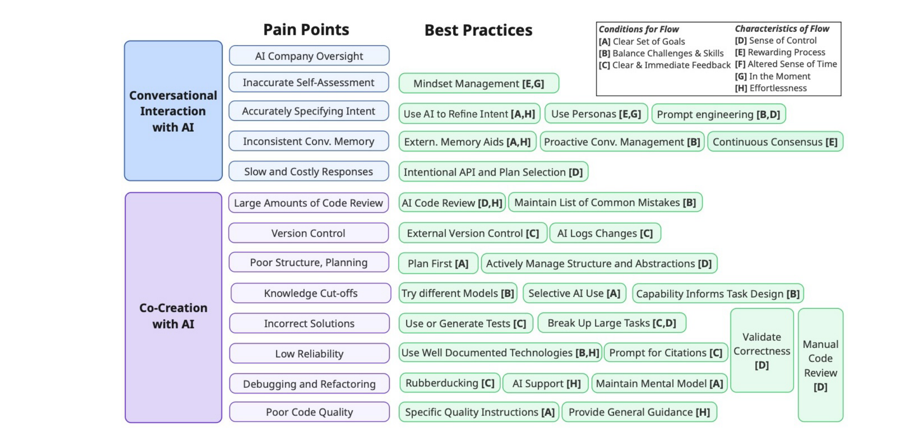

Fig. 2. Mapping between vibe coding pain points, best practices, and characteristics of flow

## Co-Creation Pain Points

However, vibe coding co-creation has its challenges. As shown in Figure 2, we identify eight primary co-creation-related pain points for vibe coders.

Co-creation can break down when the vibe coder encounters technical limitations related to knowledge cut-offs. Some tasks may require working with libraries that were made or modified after the model’s training knowledge-cutoff, making co-creation challenging. These issues can be particularly pronounced when working with a private code base or integrating with legacy code systems. “Since almost every solution we use to common problems is a custom private lib, the LLMs simply have no way of providing value because they know jackshit about my specific issues” (R68).

Technical limitations can lead to low reliability during co-creation. “Planning is boring—until you waste 37+ hours fixing AI hallucinations” (14R). Vibe coding models make mistakes and provide incorrect solutions. Sometimes, these responses may also be incomplete or superficial. Some vibe coders report experiencing the model secretly modifying tests or just deleting code without warning. “The agent will tell me, like, ‘oh, you know, I fixed the tests’ or ‘the tests all passed, except for one which isn’t our fault’. I’m like, no, it’s totally our fault. Like, the tests worked before you started, right?” (I5).

A solution may be correct but may lead to poor code quality, slow or inefficient code, or poor style such as “lengthy solution[s] that violate core principles of the language” (R63). Low response quality during vibe coding is particularly apparent with structure and planning. As reported by one commenter, “if the chat is very big, it will forget everything earlier, it will forget any patterns, design and will start to produce bad outputs” (R4). These structural breakdowns can derail co-creation and increase the burden on the programmer.

Vibe coding also complicates version control; tools often make large code changes that touch many files, for example: “I got too deep in the vibe, took my eye off the ball, and the whole thing spun out of control. I had 30 files in my change log with hours of work uncommitted. It was a fuckup cascade” (R35). These large changes can further lead to challenges with debugging or refactoring; “Vibe coding is one thing, vibe debugging is chaos” (R14).

Manuscript submitted to ACM