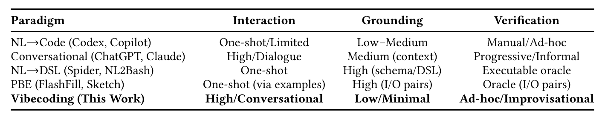

Table 1. Natural language programming paradigms characterized by our three axes. Vibecoding prioritizes interaction fluidity over formal grounding and verification.

### 2.2 Other Paradigms of AI Co-Creation

Work on AI-assisted programming and design often makes user intent explicit and interpretable, in contrast to the intuition-driven style of vibecoding. Building on instrumental interaction theory [3], Riche et al. advocate reified controls—sliders, prompt fragments, and other manipulables—that let users externalize, adjust, and reuse intentions rather than iteratively retyping prompts [45].

Studies also underscore the value of structured collaboration. Designers report AI is most useful as an ideation partner that expands the solution space [25]. In programming, proactive assistants such as Codelleborator improve efficiency when help is timely and context-aware, but poor timing harms flow [44]. Co-creation quality thus depends not only on what the AI generates but on when and how it is invoked.

A complementary line treats code as a medium for exploration. Pail elicits and tracks goals while surfacing implicit LLM decisions, using LLM-synthesized, executable prototypes as disposable sketches to test alternatives and trade-offs [62]. Code Shaping enables direct manipulation of code via free-form sketches, arrows, pseudocode, and natural language on or around the source [59]. Together, these systems frame co-creation as iterative design that moves between problem and solution spaces, privileging executable sketches and direct manipulation over one-shot generation.

Other paradigms suit non-developers such as end-users and scientists. In a “specify-and-verify” workflow, users ground intent with concrete input/output examples and steer solutions by running code against those examples [42]. Strong examples improved task intent and code quality more than programming expertise, and outperformed model-driven clarification. Field observations of scientists show similar practices, using LLMs like searchable documentation to explore APIs, then verifying via run-and-inspect with emphasis on correctness and reproducibility [39]. Both lines illustrate co-creation through concretized intent and empirical checking.

These approaches emphasize reproducibility and clear specification. Vibecoding takes a different tack, favoring rapid, minimally formal iteration where users adjust only when outcomes diverge from goals. This immersive, flow-oriented style is the focus of our investigation.

### 2.3 Flow and Software Development

Early reports by vibecoders describe feelings of a flow state while “vibing,” and although we didn’t start our study with the intention to study flow, flow and feelings of joy emerged as salient aspects of how developers feel and what motivates them to vibe code. The original theory of flow lays out a rich set of characteristics and key conditions for flow. We use these constructs to interpret how vibecoders interact and co-create with AI in our analysis (described later in our paper).

Csikszentmihalyi coined the term flow to describe the optimal psychological experience humans feel when they are immersed in an activity that is intrinsically rewarding [8]. Flow occurs when people lack self-consciousness of their

Manuscript submitted to ACM