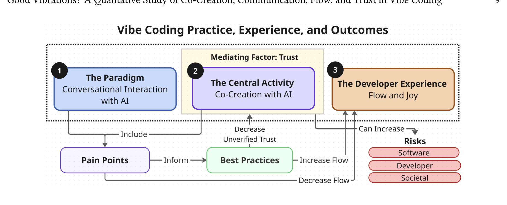

Fig. 1. Our proposed theory of the vibe coding experience. We identify four core components: Conversational Interaction with AI (the paradigm), Co-creation with AI (the central activity), Flow and Joy (the developer experience), and AI Trust (a key enabling and mediating factor). Developers co-create with AI through natural language conversation to achieve flow. Trust in AI mediates co-creation: increased trust can enable deeper co-creation, thereby enhancing flow. However, increased trust can also lead to increased risks at the software, developer, and societal levels. During both interaction and co-creation, developers experience pain points which can detract from flow. Emerging best practices often ameliorate these pain points, and increase flow.

interconnectedness. Grounded in data, we aim to meaningfully convey the complexities of vibe coding practice and experience.

Overall, we find that vibe coding is an emergent, AI-based programming paradigm grounded in natural language interaction and co-creation with an AI agent. It is as much a mindset as a method, prioritizing flow, experimentation, and joy over precision or control. AI trust acts as a mediating factor for co-creation: greater trust can amplify flow and creative freedom (or, as some practitioners call it, "just vibes" (L33)). As a result, some vibe coders treat the AI as a capable partner and co-creator, even allowing it to make architectural or design decisions with minimal oversight.

However, this same trust can also increase risk at the software, developer, and societal levels. As a result, some vibe coders prefer to delegate tasks to AI rather than co-create. As one interviewee put it, vibe coding exists on "a continuum" (I6) with other AI-powered programming paradigms, such as agentic coding. Most commenters agree that vibe coding is a distinct and "new way to build" (L81); they differ in how much trust, interaction, or co-creation is required to "count" as vibe coding.

These definitional disagreements may stem from the polarized opinions we observed across the three data sources. Some programmers praise vibe coding as (e.g., "close to magic" (L18), or say it "brings back the joy of programming" (I7)), while others harshly critique the practice and its practitioners (e.g., "So is vibe coding just the dumb-ass version of using AI" (R79), or "Dunning-Krueger Coders" (R1)). These polarized views call for a deeper exploration of the paradigm, activities, developer experience, and trust dynamics involved.

## 4.2 Findings—The Paradigm: Vibe Coding and Conversational Interaction with AI

The first of our four main aspects of vibe coding is: Conversational Interaction with AI. Participants and commenters on Reddit and LinkedIn describe vibe coding as a new programming paradigm, where programming occurs via interaction with AI through conversational natural language. "Vibe coding is when you ask ChatGPT to build software for you—spinning up code, APIs, or entire servers through conversation alone." (L32) During these natural language conversations with generative AI, the programmer iteratively tries to communicate and refine their intent and goals to the agent. As one

Manuscript submitted to ACM